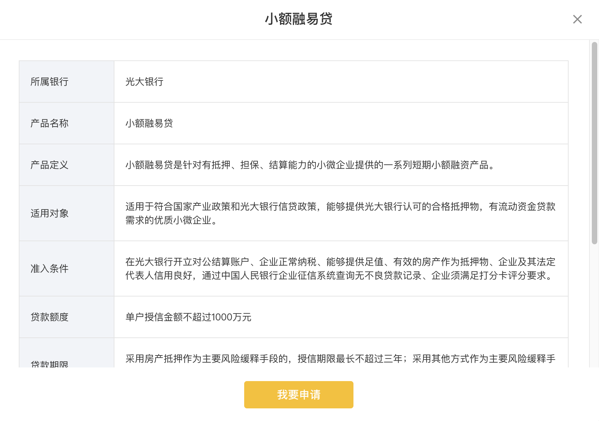

# Note 5

## 表格详情页样式



```vue
<template>
  <div class="m-dialog-mask">
    <div class="m-modal">
      <div class="m-modal-content">
        <div @click="onClose" class="u-close">×</div>
        <div class="m-header">
          <div class="u-head">{{ title }}</div>
        </div>
        <div class="m-modal-body">
          <div class="m-detail-wrap">
            <table class="m-detail" cellspacing="0">
              <tr class="m-content">
                <th class="u1">所属银行</th>
                <td class="u2">{{ detailData.bankName }}</td>
              </tr>
              <tr class="m-content">
                <th class="u1">产品名称</th>
                <td class="u2">{{ detailData.productName }}</td>
              </tr>
              <tr class="m-content">
                <th class="u1">产品定义</th>
                <td class="u2">{{ detailData.productDefinition }}</td>
              </tr>
              <tr class="m-content">
                <th class="u1">适用对象</th>
                <td class="u2">{{ detailData.applicableObject }}</td>
              </tr>
              <tr class="m-content">
                <th class="u1">准入条件</th>
                <td class="u2">{{ detailData.entryCriteria }}</td>
              </tr>
              <tr class="m-content">
                <th class="u1">贷款额度</th>
                <td class="u2">{{ detailData.loanLimit }}</td>
              </tr>
              <tr class="m-content">
                <th class="u1">贷款期限</th>
                <td class="u2">{{ detailData.loanTerm }}</td>
              </tr>
              <tr class="m-content">
                <th class="u1">贷款利率</th>
                <td class="u2">{{ detailData.loanRate }}</td>
              </tr>
              <tr class="m-content">
                <th class="u1">贷款用途</th>
                <td class="u2">{{ detailData.loanPurpose }}</td>
              </tr>
              <tr class="m-content">
                <th class="u1">担保方式</th>
                <td class="u2">{{ detailData.guaranteeMethod }}</td>
              </tr>
              <tr class="m-content">
                <th class="u1">还款方式</th>
                <td class="u2">{{ detailData.repaymentMethod }}</td>
              </tr>
            </table>
          </div>
          <button class="u-confirm" @click="onConfirm">{{ btnTxt }}</button>
        </div>
      </div>
    </div>
  </div>
</template>
<script>
export default {
  name: 'DetailModal',
  props: {
    title: { // 标题
      type: String,
      default: '温馨提示'
    },
    btnTxt: { // 标题
      type: String,
      default: '我知道了'
    },
    content: {
      type: String,
      default: ''
    },
    mode: {
      type: String,
      default: 'default'
    },
    detailData: {
      type: Object,
      default: () => {
        return {}
      }
    }
  },
  data () {
    return {
    }
  },
  methods: {
    onClose () {
      this.$emit('close')
    },
    onConfirm () {
      this.$emit('close')
    }
  }
}
</script>
<style lang="less" scoped>
.m-dialog-mask {
  position: fixed;
  top: 0;
  right: 0;
  bottom: 0;
  left: 0;
  width: 100%;
  height: 100%;
  z-index: 100000;
  background: rgba(0,0,0,0.45);
  display: flex;
  justify-content: center;
  align-items: center;
  .m-modal {
    width: 880px;
    margin: 0 auto;
    color: rgba(0,0,0,.65);
    .m-modal-content {
      position: relative;
      background: #fff;
      border-radius: 4px;
      text-align: center;
      box-shadow: 0 4px 12px rgba(0,0,0,.1);
      .u-close {
        position: absolute;
        top: 20px;
        right: 24px;
        color: rgba(0,0,0,.45);
        font-size: 26.5px;
        line-height: 16px;
        cursor: pointer;
        transition: color .3s;
        &:hover {
          color: rgba(0,0,0,.75);
        }
      }
      .m-header {
        padding: 16px 24px;
        background: #fff;
        border-bottom: 1px solid #EDEDED;
        border-radius: 4px 4px 0 0;
        .u-head {
          margin: 0;
          height: 28px;
          font-size: 20px;
          font-weight: 500;
          color: #333333;
          line-height: 28px;
        }
      }
      .m-modal-body {
        padding-bottom: 20px;
        .m-detail-wrap {
          padding: 30px 30px 0;
          max-height: 450px;
          overflow-y: auto;
          overflow-x: hidden;
        }
        .m-detail {
          border: 1px solid #E3E3E3;
          border-bottom: none;
          .m-content {
            .u1 {
              font-size: 14px;
              font-weight: 400;
              color: #333333;
              line-height: 20px;
              text-align: left;
              width: 108px;
              padding: 20px 16px;
              background: #F2F4F8;
              border-right: 1px solid #E3E3E3;
              border-bottom: 1px solid #E3E3E3;
            }
            .u2 {
              font-size: 14px;
              font-weight: 400;
              color: #333333;
              line-height: 20px;
              text-align: left;
              width: 645px;
              padding: 20px 16px;
              border-bottom: 1px solid #E3E3E3;
            }
          }
        }
        .u-confirm {
          margin-top: 20px;
          width: 160px;
          height: 40px;
          border-radius: 4px;
          background: @mainColor;
          border: none;
          line-height: 40px;
          font-size: 16px;
          font-weight: 500;
          color: #FFFFFF;
          transition: all .3s cubic-bezier(.645,.045,.355,1);
          cursor: pointer;
          &:hover {
            opacity: 0.8;
          }
        }
      }
    }
  }
}
</style>
```

```vue
<template>
  <ApplyModal
    :title="title"
    :mode="mode"
    :btnTxt="btnTxt"
    :detailData="detailData"
    @close="onCloseModal"
    v-show="showModal" />
</template>
<script>
import ApplyModal from '@/components/ApplyModal'
export default {
  components: {
    ApplyModal  
  },
  data () {
    return {
      showModal: false
    }
  },
  methods: {
    onCloseModal () {
      this.showModal = false
    }
  }
}
</script>
```

## 整块区域或卡片添加跳转链接

```html
<router-link class="m-detail" :to="{ path: '/newsCenter/Details', query: { id: item.id, tab: 7 } }">
</router-link>
```

```css
.m-detail {
  height: 100%;
  display: block;
}
```

## CSS单位：`em，rem，%，vh，vw，vmin，vmax，px`

- `em`：相对于应用在当前元素的字体尺寸，一般浏览器字体大小默认为 `16px`，则 `2em == 32px`；
  - 如果元素自身设置了 `font-size`，那参考文本大小就是自身的 `font-size` 大小
  - 如果元素自身没有设置 `font-size`，那参考文本大小就是父元素的 `font-size` 大小
  - 为元素设置 `font-size` 时，如果使用 `em` 作为单位，那么参考文本大小是父元素的 `font-size` 大小
  - 子元素中除了 `font-size` 的 `em` 是根据父元素的 `font-size` 确定的，其他所有 `em` 都是根据自身的 `font-size` 确定的

  例如：

  ```html
  <div>
    <p></p>
  </div>
  ```

  ```less
  div {
    font-size: 12px;
  }
  p {
    font-size: 2em; // 2em = 2 * 12px = 24px
    width: 10em; // 10em = 10 * 24px = 240px
  }
  ```

  - `rem`：**rem 是根 em（root em）的缩写**
    - 使用 `rem` 为元素设定字体大小时，仍然是相对大小，但**相对的只是HTML（document.documentElement）根元素**。
    - `rem` 作用于非根元素时，相对于根元素字体大小；`rem` 作用于根元素字体大小时，相对于其出初始字体大小。
  - `vw`：`viewpoint width`，视窗宽度，**1vw = 视窗宽度的1%**
  - `vh`：`viewpoint height`，视窗高度，**1vh = 视窗高度的1%**
  - `vmin`：`vw` 和 `vh` 中较小的那个
  - `vmax`：`vw` 和 `vh` 中较大的那个
  - `%`：百分比，相对长度单位，相对于父元素的百分比值，**使用时必须从根容器就设置好百分比**

## `currentColor` 关键字

[`currentColor` 参考文档](https://developer.mozilla.org/zh-CN/docs/Web/CSS/color_value#currentcolor_%E5%85%B3%E9%94%AE%E5%AD%97)

::: tip
常见于 `<svg width="1em" height="1em" fill="currentColor"></svg>`

**`currentColor` 是 CSS3的一个关键字，用于描述当前元素的颜色，默认继承当前元素的 `color` 颜色，如果当前元素未显式指明 `color`，则继承父元素的 `color` 颜色**

`currentColor` 关键字代表原始的 `color` 属性的计算值。它允许让继承自属性或子元素的属性颜色属性以默认值不再继承。

它也能用于那些继承了元素的 `color` 属性计算值的属性，相当于在这些元素上使用 `inherit` 关键字，如果这些元素有该关键字的话。
:::
