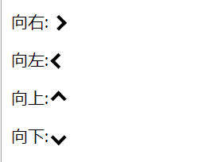

# Note 2

<BackTop />

## 水平垂直居中

```html
<div class="parent">
  <div class="child"></div>
<div>
```

- 弹性布局 `display: flex; justify-content: center; align-items: center;`

```less
.parent {
  display: flex;
  justify-content: center;
  align-items: center;
  width: 300px;
  height: 300px;
  background: lightgray;
  .child {
    width: 30px;
    height: 30px;
    background: forestgreen;
  }
}
```

- 绝对定位 `position: absolute; inset: 0; margin: auto;`

```less
.parent {
  position: relative;
  width: 300px;
  height: 300px;
  background: lightgray;
  .child {
    position: absolute;
    right: 0;
    left: 0;
    top: 0;
    bottom: 0;
    margin: auto;
    width: 30px;
    height: 30px;
    background: forestgreen;
  }
}
```

- 绝对定位 `position: absolute; transform: translate(-50%, -50%);`

```less
.parent {
  position: relative;
  width: 300px;
  height: 300px;
  background: lightgray;
  .child {
    position: absolute;
    left: 50%;
    top: 50%;
    transform: translate(-50%, -50%);
    width: 30px;
    height: 30px;
    background: forestgreen;
  }
}
```

## 消除 `` 标签底部的5px

```html
<div class="p-img">
  
</div>
```

- 给父元素设置 `font-size: 0;`（消除元素空隙）

```css
.p-img {
  font-size: 0;
}
.c-img {
  width: 100%;
}
```

- 将 `` 设置为 `display: block;`

```css
.c-img {
	width: 100%;
	display: block;
}
```

- 给父元素设置 `line-height: 5px;`

```css
.p-img {
  line-height: 5px;
}
```

- 将 `` 设置 `vertical-align: bottom;`

```css
.c-img {
  width: 100%;
  vertical-align: bottom;
}
```

## 视口单位

根据CSS3规范，视口单位主要包括以下4个：

- `vw`：`1vw` 等于视口宽度的 1%
- `vh`：`1vh` 等于视口高度的 1%
- `vmin`：选取 `vw` 和 `vh` 中最小的那个
- `vmax`：选取 `vw` 和 `vh` 中最大的那个

:::tip 提示
`vh` & `vw`：相对于视口的高度和宽度，而不是父元素的（CSS百分比是相对于包含它的最近的父元素的高度和宽度）。
:::

```html
<div class="parent">
  <div class="child"></div>
</div>
```

```css
.child {
  width: 100%;
  height: 100vh;
}
```

## 三角形

- 普通三角形

```html
<div class="triangle bottom"></div>
<div class="triangle top"></div>
<div class="triangle left"></div>
<div class="triangle right"></div>
```

```css
/* 基础样式 */
.triangle {
  display: inline-block;
  border: solid 30px transparent;
}
/* 朝下 */
.bottom {
  border-top-color: #0097a7;
}
/* 朝上 */
.top {
  border-bottom-color: #b2ebf2;
}
/* 朝左 */
.left {
  border-right-color: #00bcd4;
}
/* 朝右 */
.right {
  border-left-color: #009688;
}
```

- 等边三角形

```html
<div class="triangle"></div>
```

```css
.triangle {
  display: inline-block;
  height: 0;
  width: 0;
  border-bottom: calc(30px * sqrt(3)) solid #1677FF;
  border-left: 30px solid transparent;
  border-right: 30px solid transparent;
}
```

## 箭头



[在线预览](https://c.runoob.com/codedemo/3151/)

```html
<p>向右: <i class="right"></i></p>
<p>向左: <i class="left"></i></p>
<p>向上: <i class="up"></i></p>
<p>向下: <i class="down"></i></p>
```

```css
i {
  border: solid black;
  border-width: 0 3px 3px 0;
  display: inline-block;
  padding: 3px;
}
.right {
  transform: rotate(-45deg);
  -webkit-transform: rotate(-45deg);
}
.left {
  transform: rotate(135deg);
  -webkit-transform: rotate(135deg);
}
.up {
  transform: rotate(-135deg);
  -webkit-transform: rotate(-135deg);
}
.down {
  transform: rotate(45deg);
  -webkit-transform: rotate(45deg);
}
```

## 表格`<table>`标签设置`height`属性无效

```html
<!-- 添加 display: block / inline-block; -->
<table :style="`display: block; height: 600px; overflow: hidden;`" cellspacing="0"></table>
```

## `flex` 布局各种水平等分居中排列

[justify-content MDN](https://developer.mozilla.org/zh-CN/docs/Web/CSS/justify-content)

- 均匀排列每个元素，**每个元素周围分配相同的空间**

```css
display: flex;
justify-content: space-around;
```


- 均匀排列每个元素，**首个元素放置于起点，末尾元素放置于终点**

```css
display: flex;
justify-content: space-between;
```


- 均匀排列每个元素，**每个元素之间的间隔相等**

```css
display: flex;
justify-content: space-evenly;
```


## CSS网格排列布局

- [`display: grid;`](https://www.runoob.com/cssref/css-pr-grid.html)

```html
<div class="m-area">
  <div class="m-card" v-for="(data, index) in cardData" :key="index"></div>
</div>
```

```less
.m-area {
  width: 1200px;
  margin: 0 auto;
  display: grid;
  grid-template-columns: 360px 360px 360px; // 列宽度，3列各360px宽
  grid-template-rows: 400px; // 行高度
  grid-gap: 60px; // 行间距 列间距
  .m-card {
    width: 360px;
    height: 400px;
  }
}
```

- `display: inline-table;`

```less
.m-area {
  width: 1200px;
  margin: 0 auto;
  .m-card:not(:nth-child(3n)) { // 除去第3个及3的倍数的child，其余右边距均为60
    margin-right: 60px;
  }
  .m-card {
    display: inline-table;
    width: 360px;
    height: 400px;
  }
}
```
