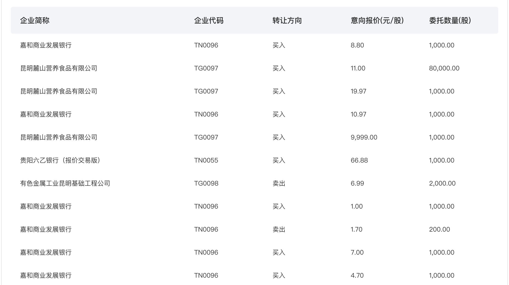

# Note 4

<BackTop />

## 背景图等比放大或缩小

```html
<div class="m-panel">
```

```css
.m-panel {
  width: 1200px;
  height: 540px;
  background-color: rgba(0, 0, 0, 0.44);
  background-image: url('background-image.png');
  background-position: center;
  background-repeat: no-repeat;
  background-size: cover; /* 或 contain */
  border-radius: 6px;
}
```

## 元素垂直自适应均分排列 `flex-direction: column;`

```html
<div class="m-tab">
  <p class="u-tab"></p>
  <p class="u-tab"></p>
  <p class="u-tab"></p>
  <p class="u-tab"></p>
  <p class="u-tab"></p>
</div>
```

```less
.m-tab {
  width: 240px;
  height: 600px; // 只设置总高度，子元素在垂直方向上均分排列
  display: flex;
  flex-direction: column;
  .u-tab {
    background: rgba(81, 84, 87, 0.79);
    transition: background 0.3s;
    flex: 1; // 让所有弹性盒模型对象的子元素都有相同的长度，且忽略它们内部的内容
    text-align: center;
    cursor: pointer;
  }
}
```

## CSS垂直居中

```html
<div class="m-parent">
  <div class="u-child"></div>
</div>
```

- 使用 `vertical-align` 设置行内元素（`inline-block` 或 `inline`）在垂直方向居中

```less
.m-parent { // 外层父元素
  width: 500px;
  height: 400px;
  background: #1890FF;
  &:before { // 利用伪元素，设置一个高度100%的参考 或者after也一样
    content: '';
    display: inline-block;
    vertical-align: middle;
    height: 100%;
  }
  .u-child { // 目标垂直居中的子元素
    width: 50px;
    height: 40px;
    background: #FBBF00;
    display: inline-block;
    vertical-align: middle;
  }
}
```

- 使用 `calc()` 计算属性配合 `position: relative;` 和 `top` 属性，垂直居中

```css
.m-parent {
  width: 500px;
  height: 400px;
  background: #1890FF;
}
.u-child {
  width: 50px;
  height: 40px;
  background: #FBBF00;
  position: relative;
  top: calc(50% - 20px);
}
```

- 使用 `position: relative;` 和 `transform` 属性，垂直居中

```css
.m-parent {
  width: 500px;
  height: 400px;
  background: #1890FF;
}
.u-child {
  width: 50px;
  height: 40px;
  background: #FBBF00;
  position: relative;
  top: 50%;
  transform: translateY(-50%);
}
```

- 使用 `display: flex;` 设置水平垂直居中

```css
.m-parent {
  width: 500px;
  height: 400px;
  background: #1890FF;
  display: flex;
  align-items: center;
  justify-content: center;
}
.u-child {
  width: 50px;
  height: 40px;
  background: #FBBF00;
}
```

- 使用 `position: absolute; margin: auto;` 设置水平垂直居中

```css
.m-parent {
  width: 500px;
  height: 400px;
  background: #1890FF;
  position: relative;
}
.u-child {
  width: 50px;
  height: 40px;
  background: #FBBF00;
  position: absolute;
  top: 0;
  right: 0;
  bottom: 0;
  left: 0;
  margin: 0 auto; /* 水平居中 */
  margin: auto 0; /* 垂直居中 */
  margin: auto; /* 水平垂直居中 */
}
```

## 表格样式



```html
<div class="m-table-wrap">
  <table class="m-table" cellspacing="0">
    <tr class="m-title">
      <th width="338">企业简称</th>
      <th width="130">企业代码</th>
      <th width="130">转让方向</th>
      <th width="130">意向报价(元/股)</th>
      <th width="130">委托数量(股)</th>
    </tr>
    <template v-if="tableData.length">
      <tr v-for="(item, index) in tableData" :key="index">
        <td>
          <div class="m-ellipsis">
            <router-link :to="{path: '/listingService/EnterpriseDetail', query: { fundCode: item.companyCode, tab: 1 }}" :title="item.companyName">{{ item.companyName || '--' }}</router-link>
          </div>
        </td>
        <td>
          <router-link :to="{path: '/listingService/EnterpriseDetail', query: { fundCode: item.companyCode, tab: 1 }}">{{ item.showCode || '--' }}</router-link>
        </td>
        <td>{{ item.transDirection === '1' ? '买入':'卖出' }}</td>
        <td>{{ item.intentionPrice | moneyFormat }}</td>
        <td>{{ item.entrustShare | moneyFormat }}</td>
      </tr>
    </template>
    <template v-else>
      <tr>
        <td colspan="5">
          <div class="m-loading" v-if="loading">
            
          </div>
          <div class="m-nodata-box ta-center" v-if="!tableData.length&&!loading">
            
            <p class="c9 f18 mt10">暂无数据</p>
          </div>
        </td>
      </tr>
    </template>
  </table>
</div>
```

```less
.m-table-wrap {
  width: 1058px;
  background: #FFFFFF;
  border-radius: 4px;
  padding: 0 20px 16px;
}
.m-table {
  .m-title {
    height: 58px;
    background: #F2F4F8;
    font-size: 16px;
    font-weight: 500;
    color: #333333;
  }
  tr th {
    &:first-child {
      border-top-left-radius: 4px;
      border-bottom-left-radius: 4px;
    }
    &:last-child {
      border-top-right-radius: 4px;
      border-bottom-right-radius: 4px;
    }
  }
  tr {
    th, td {
      padding-left: 20px;
      padding-right: 20px;
      text-align: left;
    }
    td {
      height: 22px;
      font-size: 14px;
      padding-top: 14px;
      padding-bottom: 14px;
      white-space: nowrap; // 列表所有数据不换行
    }
  }
  .m-ellipsis {
    width: 338px;
    overflow: hidden;
    text-overflow: ellipsis;
    white-space: nowrap;
    color: #333;
    &:hover {
      color: @linkColor;
    }
  }
}
```
