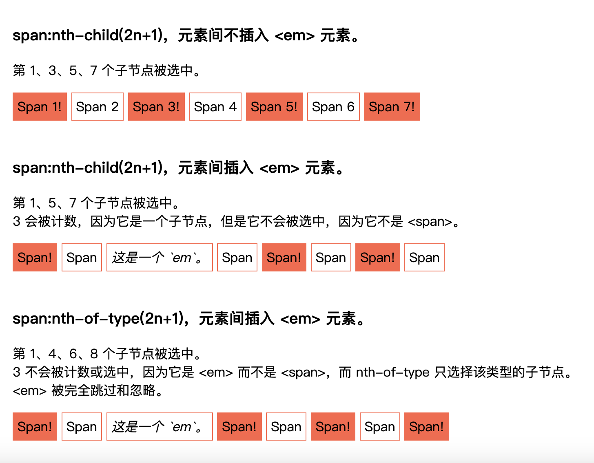
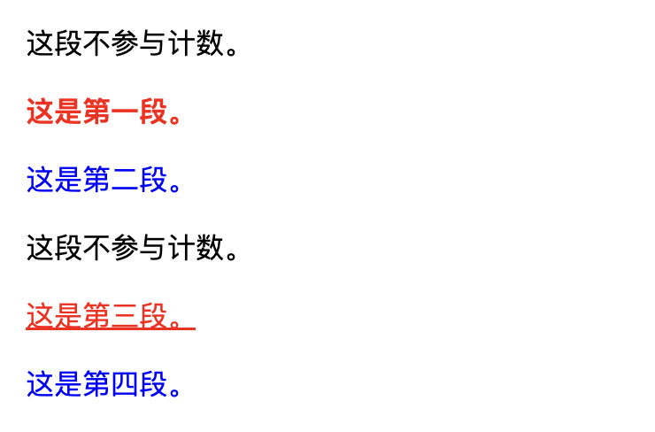

# Note 7

<BackTop />

## `scoped` & `:deep()` & `:slotted` & `:global()` & 动态 `CSS（v-bind）` & `CSS module`

vue中的 `scoped` 通过在 `DOM` 结构以及 `CSS` 样式上加唯一不重复的标记 `:data-v-hash` 的方式，以保证唯一（而这个工作是由过`PostCSS`转译实现的），达到样式私有化模块化的目的。

### `scoped` 三条渲染规则

- 给 `HTML` 的 `DOM` 节点加一个不重复 `data` 属性(形如：`data-v-123`)来表示他的唯一性
- 在每句 `CSS` 选择器的末尾（编译后生成的 `CSS` 语句）加一个当前组件的 `data` 属性选择器（如[`data-v-123`]）来私有化样式
- 如果组件内部包含有其他组件，只会给其他组件的最外层标签加上当前组件的 `data` 属性

### `:deep()` 改变 `CSS` 解析时私有属性的位置

常用于修改组件库样式

```vue
<template>
  <a-button type="primary">Primary Button</a-button>
</template>
<style lang="less" scoped>
.ant-btn {
  // span { // 样式不生效
  //   color: cyan;
  // }
  :deep(span) { // 样式生效
    color: cyan;
    /*
      此时css解析为:
      .ant-btn[data-v-f9e8f20e] span {
        color: cyan;
      }
    */
  }
}
</style>
```

### `:slotted()` 在子组件定义样式插槽内容样式

默认情况下，作用域样式不会影响到 `<slot></slot>` 渲染出来的内容，因为它们被认为是父组件所持有并传递进来的。

```vue
<template>
  <div>
    <slot>插槽</slot>
  </div>
</template>
<style lang="less" scoped>
:slotted(.red) {
  color: red;
}
</style>
```

### `:global()` 全局选择器，定义全局样式，不用单开一个没有 `scoped` 的 `style`

```css
<style scoped>
:global(p) {
  color: red;
}
</style>
/* 等效于 */
<style>
p {
  color: red;
}
</style>
```

### 动态 `CSS（v-bind）`

```vue
<script setup lang="ts">
const redColor = ref('red')
const color = ref({
  green: 'green'
})
</script>
<style lang="less" scoped>
.box {
  color: v-bind(redColor);
  background: v-bind('color.green'); // 对象要加 ''
}
</style>
```

### `CSS moudle` 一般用于TSX和渲染函数

- `<style module>` 标签会被编译为 `CSS Modules` 并且将生成的 `CSS` 类作为 `$style` 对象的键暴露给组件

```vue
<template>
  <p :class="$style.red">文字</p>
</template>
<style module>
.red {
  color: red;
  font-size: 20px;
}
</style>
```

- 自定义注入名称（多个可以用数组）

```vue
<script lang="ts" setup>
import { useCssModule } from 'vue'
const css = useCssModule('style')
</script>
<template>
  <p :class="[style.box, style.back]">文字</p>
</template>
<style module="style">
.box {
  color: red;
  font-size: 20px;
}
.back {
  background: green;
}
</style>
```

## [:nth-child()](https://developer.mozilla.org/zh-CN/docs/Web/CSS/:nth-child)

CSS `:nth-child()` 伪类根据元素在父元素的子元素列表中的索引来选择元素。换言之，`:nth-child()` 选择器**根据父元素内的所有兄弟元素的位置来选择子元素**。

::: tip 备注
在 `element:nth-child()` 的语法中，**子元素的计数包括任何元素类型的兄弟子元素**；但是只有当该子元素位置上的元素与选择器的其他组件匹配时，才被视为匹配。
:::

### 语法

`:nth-child()` 以一个参数来描述匹配兄弟元素列表中元素索引的模式。元素索引从 `1` 开始。

```css
:nth-child(<nth> [of <complex-selector-list>]?) {
  /* ... */
}
```

### 关键字值

- `odd`（奇数）：表示**元素在兄弟元素列表中的位置是奇数**：1、3、5……。
- `even`（偶数）：表示**元素在兄弟元素列表中的位置是偶数**：2、4、6……。
- 函数符号`<An+B>`：
  表示元素在兄弟元素列表中的位置是 An+B 模式的元素，其中 n 为正整数或 0，A 和 B 为整数，且 A 不为 0。其中：
  - `A` 是整数步长
  - `B` 是整数偏移量，
  - `n` 是从 `0` 开始的所有非负整数。
它可以被理解为列表中的第 `An+B` 个元素。`A` 和 `B` 必须都是 `<integer>` 值。

### `of <selector>` 语法

通过传递一个选择器参数，我们可以选择与该选择器匹配的第 `n` 个元素。
例如，下面的选择器匹配前三个设置了 `class="important"` 的列表项。

```css
:nth-child(-n + 3 of li.important) {
}
```

这与将选择器移到函数之外不同，如：

```css
li.important:nth-child(-n + 3) {
}
```

该选择器会匹配属于前三个子元素，且与选择器 `li.important` 匹配的列表项。

### 示例

选择器示例

`tr:nth-child(odd)` or `tr:nth-child(2n+1)`
表示 HTML 表格中的奇数行：`1、3、5……`。

`tr:nth-child(even)` or `tr:nth-child(2n)`
表示 HTML 表格中的偶数行：`2、4、6……`。

`:nth-child(7)`
表示第 `7` 个元素。

`:nth-child(5n)`
表示第 `5、10、15……`个元素。第一个匹配的元素是 `0 [=5x0]`，但由于元素的索引是从 `1` 开始的而 `n` 从 `0` 开始，所以不会匹配任何元素。这乍一看可能有点奇怪，但是当公式中的 `B` 部分为 `>0` 的值时，就会变得更有意义，就像下面的示例一样。

`:nth-child(n+7)`
表示第`七`个及其之后的元素：`7 [=0+7]`、`8 [=1+7]`、`9 [=2+7]`，等等。

`:nth-child(3n+4)`
表示第 `4 [=(3×0)+4]`、`7 [=(3×1)+4]`、`10 [=(3×2)+4]`、`13 [=(3×3)+4]`……个元素。

`:nth-child(-n+3)`
表示`前三`个元素。`[=-0+3、-1+3、-2+3]`

`p:nth-child(n)`
表示兄弟元素列表中的每个 `<p>` 元素。这与简单的 `p` 选择器选择的元素相同（尽管具有更高的优先级）。

`p:nth-child(1)` 或 `p:nth-child(0n+1)`
表示每一个兄弟元素列表中的第一个 `<p>` 元素。这与 `:first-child` 选择器相同（并且具有相同的优先级）。

`p:nth-child(n+8):nth-child(-n+15)`
表示兄弟元素列表中的第 `8` 到第 `15` 个，且为 `<p>` 元素的元素。

### 详细示例

```html
<h3>
  <code>span:nth-child(2n+1)</code>，元素间不插入 <code>&lt;em&gt;</code> 元素。
</h3>
<p>第 1、3、5、7 个子节点被选中。</p>
<div class="first">
  <span>Span 1!</span>
  <span>Span 2</span>
  <span>Span 3!</span>
  <span>Span 4</span>
  <span>Span 5!</span>
  <span>Span 6</span>
  <span>Span 7!</span>
</div>

<br />

<h3>
  <code>span:nth-child(2n+1)</code>，元素间插入 <code>&lt;em&gt;</code> 元素。
</h3>
<p>
  第 1、5、7 个子节点被选中。<br />
  3 会被计数，因为它是一个子节点，但是它不会被选中，因为它不是
  <code>&lt;span&gt;</code>。
</p>
<div class="second">
  <span>Span!</span>
  <span>Span</span>
  <em>这是一个 `em`。</em>
  <span>Span</span>
  <span>Span!</span>
  <span>Span</span>
  <span>Span!</span>
  <span>Span</span>
</div>

<br />

<h3>
  <code>span:nth-of-type(2n+1)</code>，元素间插入 <code>&lt;em&gt;</code> 元素。
</h3>
<p>
  第 1、4、6、8 个子节点被选中。<br />
  3 不会被计数或选中，因为它是 <code>&lt;em&gt;</code> 而不是
  <code>&lt;span&gt;</code>，而 <code>nth-of-type</code> 只选择该类型的子节点。
  <code>&lt;em&gt;</code> 被完全跳过和忽略。
</p>
<div class="third">
  <span>Span!</span>
  <span>Span</span>
  <em>这是一个 `em`。</em>
  <span>Span!</span>
  <span>Span</span>
  <span>Span!</span>
  <span>Span</span>
  <span>Span!</span>
</div>
```

```css
.first span:nth-child(2n + 1),
.second span:nth-child(2n + 1),
.third span:nth-of-type(2n + 1) {
  background-color: tomato;
}
```



...

## [:nth-of-type](https://developer.mozilla.org/zh-CN/docs/Web/CSS/:nth-of-type)

`:nth-of-type()` CSS 伪类基于相同类型（标签名称）的兄弟元素中的位置来匹配元素。

### 语法

`nth-of-type` 伪类用单个参数指定，该参数表示匹配元素的模式。

```css
:nth-of-type(<an-plus-b> | even | odd) {
  /* ... */
}
```

### 示例

```html
<div>
  <div>这段不参与计数。</div>
  <p>这是第一段。</p>
  <p class="fancy">这是第二段。</p>
  <div>这段不参与计数。</div>
  <p class="fancy">这是第三段。</p>
  <p>这是第四段。</p>
</div>
```

```css
/* 奇数段 */
p:nth-of-type(2n + 1) {
  color: red;
}
/* 偶数段 */
p:nth-of-type(2n) {
  color: blue;
}
/* 第一段 */
p:nth-of-type(1) {
  font-weight: bold;
}
/* 这将匹配第三个段落，因为它匹配的元素是 2n+1 并且具有 fancy 类。
   第二个段落具有 fancy 类，但不匹配，因为它不是:nth-of-type(2n+1)。
*/
p.fancy:nth-of-type(2n + 1) {
  text-decoration: underline;
}
```



::: tip 备注
使用此选择器无法选择 `nth-of-class`。选择器仅在创建匹配列表时查找类型。但是你可以基于 `:nth-of-type` 的位置和类名为元素应用 `CSS`，就像上面的示例中所示。
:::
