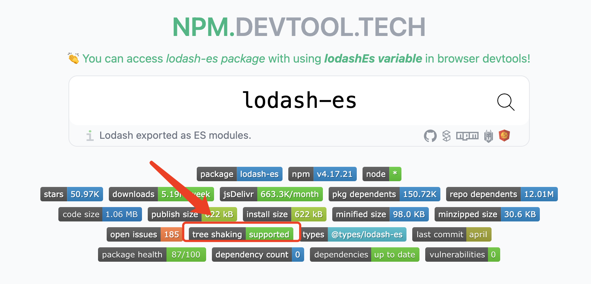

# Note 1

<BackTop />

## `JS` 代码编译和解析过程

`JavaScript` 代码的编译和解析过程是一个复杂但高度优化的流程，涉及多个阶段。以下以现代 `JS` 引擎（如 `V8`）为例，详细说明其核心步骤：

### 1. 代码解析（Parsing）

<br/>

**目标**：将 JS 文本转换为可执行的中间表示形式。

#### 1.1 词法分析（Lexical Analysis）

- **过程**：将代码字符串拆分为 **词法单元（Tokens）**。
- **示例**：

  ```js
  const a = 1 + 2
  ```

  → 拆分为 `const`, `a`, `=`, `1`, `+`, `2`, `;` 等 Tokens。
- **作用**：识别关键字、变量名、运算符等。

#### 1.2 语法分析（Syntax Analysis）

- **过程**：将 `Tokens` 转换为 **抽象语法树（AST，Abstract Syntax Tree）**。
- **示例**：

  ```js
  a = 1 + 2
  ```
  → 生成类似以下结构的 `AST`：

  ```json
  {
    "type": "AssignmentExpression",
    "left": { "type": "Identifier", "name": "a" },
    "right": {
      "type": "BinaryExpression",
      "operator": "+",
      "left": { "type": "Literal", "value": 1 },
      "right": { "type": "Literal", "value": 2 }
    }
  }
  ```

- **作用**：描述代码的层级结构和语义。

---

### 2. 编译与优化（Compilation & Optimization）

<br/>

现代 `JS` 引擎采用 **即时编译（JIT，Just-In-Time）** 技术，结合解释器和编译器。

#### 2.1 解释器（Interpreter）

- **过程**：将 `AST` 转换为 **字节码（Bytecode）**（如 `V8` 的 `Ignition` 解释器）。
- **示例**：

  ```js
  function add(a, b) { return a + b; }
  ```

  → 生成类似以下字节码：

  ```
  LdaNamedProperty a1, [0]  // 加载参数 a
  Add a1, a2                // 执行 a + b
  Return                    // 返回结果
  ```

- **特点**：快速生成，但执行效率较低。

#### 2.2 编译器（Compiler）

- **过程**：对热点代码（频繁执行的代码）进行 **优化编译**（如 `V8` 的 `TurboFan` 编译器）。
- **优化策略**：
  - **内联缓存（Inline Caching）**：缓存对象属性的访问路径。
  - **隐藏类（Hidden Class）**：为对象创建内部结构描述，加速属性访问。
  - **类型特化（Type Specialization）**：基于运行时的类型信息生成高效机器码。
- **示例**：将 `a + b` 优化为直接执行整数加法（而非类型检查后的通用加法）。

#### 2.3 反优化（Deoptimization）

- **触发条件**：当假设失效时（如变量类型变化），回退到字节码或重新编译。
- **示例**：

  ```js
  function add(a, b) { return a + b }
  add(1, 2)     // 编译为整数加法
  add('1', '2') // 触发反优化，回退到通用加法逻辑
  ```

---

### 3. 执行（Execution）

- **过程**：执行字节码或优化后的机器码。
- **内存管理**：
  - **栈（Stack）**：存储原始类型和函数调用栈帧。
  - **堆（Heap）**：存储对象、闭包等复杂数据。
- **垃圾回收（GC）**：通过标记-清除、分代回收等算法自动管理内存。

---

### 4. 运行时优化示例

#### 代码示例与优化

```js
// 未优化代码（动态类型导致性能下降）
function sum(arr) {
  let total = 0;
  for (let i = 0; i < arr.length; i++) {
    total += arr[i] // 类型不确定，需多次检查
  }
  return total
}

// 优化后代码（明确类型，避免检查）
function sumOptimized(arr) {
  let total = 0
  for (let i = 0; i < arr.length; i++) {
    total += arr[i] | 0 // 强制转为整数，减少类型检查
  }
  return total
}
```

---

### 关键优化策略

1. **隐藏类（Hidden Class）**
   - 避免动态添加属性：
     ```javascript
     // 不推荐（破坏隐藏类）
     const obj = {};
     obj.a = 1;
     obj.b = 2;

     // 推荐（一次性初始化）
     const obj = { a: 1, b: 2 };
     ```

2. **内联缓存（Inline Caching）**
   - 保持对象结构稳定，避免频繁修改属性顺序。

3. **避免类型混淆**
   - 使用一致的类型（如始终用 `Number` 而非混合 `Number` 和 `String`）。

---

### 工具与调试

- **查看字节码**：使用 Node.js 的 `--print-bytecode` 标志。
- **分析优化/反优化**：使用 `--trace-opt` 和 `--trace-deopt` 标志。
- **性能分析**：Chrome DevTools 的 **Performance** 和 **Memory** 面板。

---

### 总结

`JavaScript` 的编译解析过程通过 **词法分析 → 语法分析 → 解释执行 → JIT 优化** 的流程，结合高效的垃圾回收和运行时优化，平衡了开发灵活性与执行性能。理解这一过程有助于编写高性能代码，避免触发反优化或内存泄漏。

## Tree Shaking

`Tree Shaking` 指基于 `ES Module` 进行静态分析，通过 `AST` 将用不到的函数进行移除，从而减小打包体积。

如下示例：

```js
/* TREE-SHAKING */
import { sum } from './maths.js'
console.log(sum(5, 5)) // 10
```

```js
// maths.js
export function sum(x, y) {
  return x + y
}
// 由于 sub 函数没有引用到，最终将不会对它进行打包
export function sub(x, y) {
  return x - y
}
```

最终打包过程中，`sub` 没有被引用到，将不会对它进行打包。以下为打包后代码。

```js
// maths.js
function sum(x, y) {
  return x + y
}
/* TREE-SHAKING */
console.log(sum(5, 5))
```

### `import *`

<br/>

当使用语法 `import *` 时，`Tree Shaking` 依然生效。

```js
import * as maths from './maths'
 
// Tree Shaking 依然生效
maths.sum(3, 4)
maths['sum'](3, 4)
```

`import * as maths`，其中 `maths` 的数据结构是固定的，无复杂数据，通过 `AST` 分析可查知其引用关系。

```js
const maths = {
  sum() {},
  sub() {}
}
```

### `JSON TreeShaking`

<br/>

`Tree Shaking` 甚至可对 `JSON` 进行优化。原理是因为 `JSON` 格式简单，通过 `AST` 容易预测结果，不像 `JS` 对象有复杂的类型与副作用。

```json
{
  "a": 3,
  "b": 4
}
```

```js
import obj from './main.json'
 
// obj.b 由于未使用到，仍旧不会被打包
console.log(obj.a)
```

### 引入支持 `Tree Shaking` 的 `Package`

<br/>

为了减小生产环境体积，我们可以使用一些支持 `ES` 的 `package`，比如使用 `lodash-es` 替代 `lodash`。

我们可以在 [`npm.devtool.tech`](https://npm.devtool.tech/) 中查看某个库是否支持 `Tree Shaking`。

<br/>



### 注意事项

<br/>

`Tree shaking` 是一种有效的代码优化手段，但并非绝对可靠，其效果受多种因素影响。以下是常见问题及原因分析：

#### 1. 副作用（Side Effects）
  - 问题：若模块或函数存在副作用（如修改全局变量、立即执行操作等），打包工具可能无法安全移除代码。
  - 示例：
  
    ```js
    // utils.js
    export function used() { /*...*/ }
    export function unused() {
      console.log('副作用') // 副作用导致未被使用的函数仍保留
    }
    ```
  - 解决方案：在 `package.json` 中标记 `"sideEffects": false`，或通过注释 `/*#__PURE__*/` 标记无副作用的函数调用。

#### 2. 动态导入或访问
  - 问题：动态语法（如 `import()`、`obj[method]()`）导致静态分析困难，工具无法确定实际使用的代码。
  - 示例：

    ```js
    // 动态方法调用
    const methods = ['methodA', 'methodB']
    methods.forEach(m => obj[m]()) // 无法确定具体调用哪些方法
    ```

#### 3. 模块导出方式
  - 问题：导出对象或默认导出可能阻碍精确分析。
  - 示例：

    ```js
    // 导出对象
    export default { a, b, c }
    // 导入时解构
    import lib from './lib'
    use(lib.a) // 工具可能保留整个对象
    ```
    
  - 改进：优先使用具名导出（`Named Exports`）以提高可分析性。

#### 4. 第三方库支持
  - 问题：未适配 `ES6` 模块或未正确配置 `sideEffects` 的库（如 `CommonJS` 模块）无法被优化。
  - 检查：确认第三方库提供 `ES` 版本（如 `lodash-es` 替代 `lodash`）。

#### 5. 工具链配置
  - `Babel` 预设：错误配置（如 `@babel/preset-env` 转换 `ES` 模块为 `CommonJS`）会破坏静态结构。
  - 正确配置：
    <br/>
    禁用模块语法转换：
  
    ```json
    // babel.config.json
    {
      "presets": [["@babel/preset-env", { "modules": false }]]
    }
    ```

#### 6. 循环依赖与复杂重构

  - 问题：代码中存在循环依赖或复杂重构时，依赖关系分析可能失效，导致 `Tree shaking` 不彻底。

#### 7. 代码结构问题
  - 重新导出：通过 `index.js` 聚合导出子模块时，若导出方式不当，可能保留未使用的子模块。
  - 优化建议：直接导出具体内容，避免间接引用。

### 最佳实践

- 使用 `ES6` 模块：确保项目模块语法为 `import/export`。
- 标记副作用：明确声明无副作用的模块或文件。
- 选择优化友好的库：优先使用支持 `Tree shaking` 的第三方库。
- 定期检查打包结果：通过分析工具（如 `Webpack Bundle Analyzer`）验证优化效果。

### 结论

`Tree shaking` 虽能显著减少代码体积，但其效果受代码结构、工具配置及第三方依赖的影响。通过遵循模块化最佳实践、合理配置工具链，可最大化优化效果，但仍需结合实际场景验证和调整。
