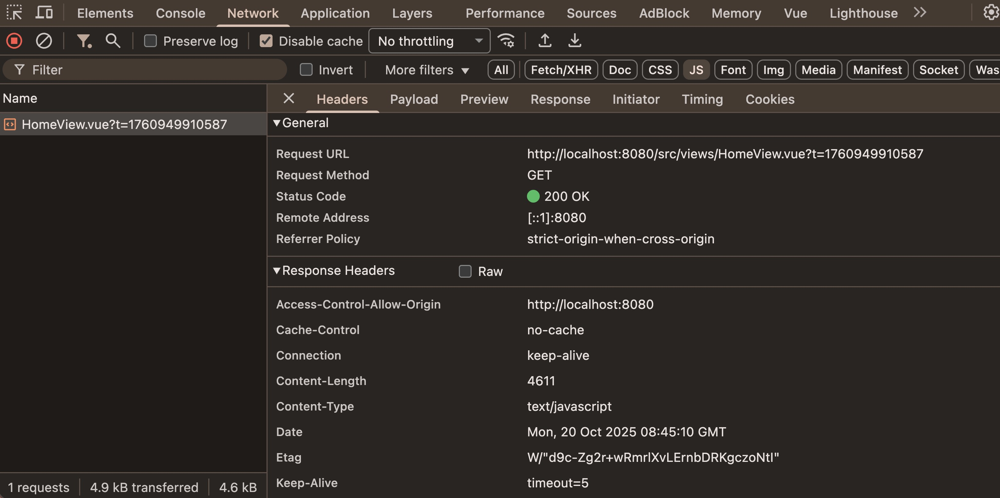
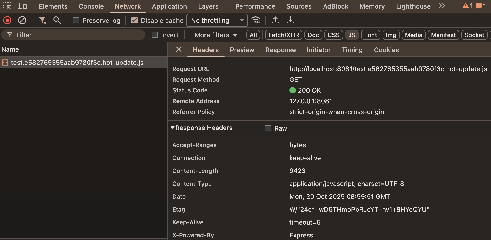

# Note 2

## 为什么 `Vite` 比 `Webpack` 更快？

- 开发模式的差异<br/>
  在开发环境中， `Webpack` 是先打包再启动开发服务器，而 `Vite` 则是直接启动，然后再按需编译依赖文件。这意味着，当使用 `Webpack` 时，所有的模块都需要在开发前进行打包，这会增加启动时间和构建时间。而 `Vite` 采用了不同的策略，它会在浏览器请求模块时再进行实时编译，这种按需动态编译的模式极大地缩短了编译时间，特别是在大型项目中，文件数量众多，`Vite` 的优势更为明显。
- 对 `ES Module` 的支持<br/>
  现代浏览器本身就支持 `ES Module`，会主动发起请求去获取所需文件，`Vite` 充分利用了这一点，将开发环境下的模块文件直接作为浏览器要执行的文件，而不是像 `Webpack` 那样先打包，再交给浏览器执行，这种方式减少了中间环节，提高了效率。<br/>
  **ES Module**：通过使用 `export` 和 `import` 语句，`ES Module` 允许在浏览器端导入和导出模块。当使用 `ES Module` 进行开发时，开发者实际上是在构建一个依赖关系图，不同依赖项之间通过导入语句进行关联。
  主流浏览器（除 IE 外）均支持 `ES Module`，并且可以通过在 `<script>` 标签中设置 `type = "module"` 来加载模块，默认情况下，模块会延迟加载，执行时机在文档解析之后，触发 `DOMContentLoaded` 事件前。
- 低层语言的差异
  - `Webpack` 是基于 `Node.js` 构建的，而 `Vite` 是基于 `esbuild` 进行预构建依赖，`esbuild` 是采用 `Go` 语言编写的，`Go` 语言是纳秒级别的，而 `Node.js` 是毫秒级别的。因此，`Vite` 在打包速度上相比 `Webpack` 有 `10-100` 倍的提升。
  - `Vite` 的预构建依赖：将散落的第三方包（如 `lodash-es` 的数百个文件）合并为单个 `ES` 模块，同时将 `CommonJS` 格式的包转换为 `ESM` 格式。这一过程大幅减少了浏览器请求数量，解决了网络拥塞问题，并确保了所有依赖在浏览器中的兼容性，从而显著提升了开发服务器的启动和运行性能。
- 热更新的处理<br/>
  在 `Webpack` 中，当一个模块或其依赖的模块内容改变时，需要重新编译这些模块。而在 `Vite` 中，当某个模块内容改变时，只需要让浏览器重新请求该模块即可，这大大减少了热更新的时间。

::: tip 总结
总的来说，`Vite` 之所以比 `Webpack` 快，主要是因为它采用了不同的开发模式、充分利用了现代浏览器的对 `ES Module` 支持、使用了更高效的底层语言、并优化了热更新的处理。这些特点使得 `Vite` 在大型项目中具有显著的优势，能够快速启动和构建，提高开发效率。
:::

## `Webpack` 与 `Vite` 的核心差异

1. 开发模式
  - `Webpack`：基于传统打包机制，启动时需分析所有模块依赖并打包成一个或多个 `Bundle`（如 `app.js`），导致冷启动时间较长，尤其在大型项目中可能需数分钟。
  - `Vite`：利用现代浏览器原生支持的 `ES Modules（ESM）`，按需编译模块。开发服务器直接启动，仅在浏览器请求时编译对应文件，冷启动时间通常仅需几百毫秒。
2. 构建效率
  - `Webpack`：全量打包所有模块，生成单一 `Bundle`，初次加载时间较长；热更新（`HMR`）需重新编译依赖链，更新延迟随项目规模增大而增加。
  - `Vite`：仅编译改动的模块，利用浏览器缓存机制（如强缓存依赖、协商缓存源码），`HMR` 更新速度几乎即时（`<100ms`），且生产环境使用 `Rollup` 生成扁平化代码。
3. 生态系统与配置
  - `Webpack`：插件生态极其丰富（如 `Loader`、`Code Splitting`、`Tree Shaking`），支持高度定制化，但配置复杂，学习曲线陡峭。
  - `Vite`：配置简洁，开箱即用（如内置 `TypeScript`、`CSS` 预处理器支持），但插件生态尚不成熟，部分功能依赖社区插件。
4. 底层语言与工具链
  - `Webpack`：基于 `Node.js` 实现，依赖 `JS` 生态工具链，编译速度受限于 `JS` 性能（毫秒级）。
  - `Vite`：预构建依赖使用 `Go` 语言编写的 `esbuild`（纳秒级速度），编译效率提升 `10-100` 倍。

## Vite 为何比 Webpack 快？

1. 原生 `ESM` 支持<br/>
  现代浏览器支持直接解析 `ES` 模块，`Vite` 开发环境下无需打包，直接返回源码，省去传统构建的打包时间。
2. 按需编译与缓存优化<br/>
  仅在浏览器请求时编译对应模块，结合强缓存（依赖文件，指安装的第三方库，如 `vue`、`react`、`lodash` 等）与协商缓存（源码文件，是开发者自己编写的代码，通常位于 `src` 目录下），减少重复编译和网络请求。
3. 高性能工具链<br/>
  依赖预构建采用 `esbuild`（`Go` 语言编写），编译速度远超 `Webpack` 的 `JS` 工具链，例如预构建依赖耗时从秒级降至毫秒级。
4. 高效热更新<br/>
  `HMR` 基于原生 `ESM`，仅需更新修改的模块及其依赖链，避免 `Webpack` 的全量重新打包。

## Vite 是如何利用浏览器缓存的？

在 `Vite` 中，浏览器缓存的利用是其热更新（HMR）高效运行的关键机制之一，具体体现在以下几个方面：

1. 原生 `ESM` 的模块缓存
<br/>
浏览器在加载原生 `ES` 模块（`ESM`）时，会默认缓存已请求的模块文件。这种缓存机制在常规开发中可能导致代码更新后浏览器仍使用旧版本。`Vite` 通过以下策略解决这一问题：

  - 缓存破坏（Cache Busting）：
    `Vite` 在开发模式下为每个模块的导入 `URL` 附加唯一标识符（如时间戳或哈希值），例如：

    ```js
    import module from './module.js?t=1623987623457'
    ```
    
    每次文件修改后，`URL` 的查询参数会变化，强制浏览器重新请求最新代码，绕过缓存。

2. `HTTP` 缓存控制
<br/>
`Vite` 的开发服务器（vite serve）通过设置 `HTTP` 响应头，明确控制浏览器缓存行为：
  - `Cache-Control`: （`no-cache` 或 `max-age=0`）：
    告知浏览器可以缓存资源，但每次使用前必须向服务器验证内容是否过期（即“协商缓存”）。
  - `ETag` 与 `Last-Modified`（均由服务器提供）：
    服务器为每个模块生成唯一标识符（如文件哈希 `ETag` 或 最后修改时间 `Last-Modified`），浏览器后续请求时会携带这些信息，服务器据此判断是否返回新内容（`304 Not Modified` 或 `200 OK` 和新的资源）。
  
### Last-Modified

<br/>

表示资源最后修改的时间，浏览器在请求时会通过 `If-Modified-Since` 头将这个时间发送给服务器，服务器会对比本地资源的最后修改时间，如果时间未改变，就返回 `304` 状态码，告知浏览器可以使用本地缓存；如果时间改变了，就返回 `200` 状态码、新的资源和响应的 `Last-Modified`。

### ETag

<br/>

是服务器为资源生成的一个唯一标识符，类似于资源的指纹。浏览器在请求时通过 `If-None-Match` 头发送 `ETag` 值，服务器对比本地资源的 `ETag`，如果相同就返回 `304`，否则返回 `200` 状态码、新的资源和对应的资源 `ETag`。

  - 强缓存：浏览器直接使用本地缓存，不向服务器发送请求，常见 `HTTP` 头：`Expires`、`Cache-Control: max-age=秒数`
  - 协商缓存：浏览器向服务器发送请求验证缓存有效性，若缓存有效则返回 `304`，否则返回新资源，常见 `HTTP` 头：`ETag`、`Last-Modified`、`Cache-Control: no-cache`

3. 模块热替换（HMR）的协作

当文件发生修改时，`Vite` 的 `HMR` 流程会精准更新模块，同时利用缓存优化性能：
  - 监听文件变化：`Vite` 通过文件系统监听（如 `chokidar`）实时检测代码变更。
  - 推送更新信号：通过 `WebSocket` 通知浏览器哪些模块需要更新。
  - 按需获取新模块：浏览器仅重新请求发生变更的模块（而非整个应用），新模块的 `URL` 因唯一标识符变化而绕过缓存。
  - 保留有效缓存：未修改的模块仍从浏览器缓存读取，减少网络请求，提升加载速度。

4. 开发与生产环境的差异

  - 开发环境：
    缓存破坏和 `Cache-Control: no-cache` 策略确保实时性，牺牲缓存效率换取即时更新。
  - 生产环境：
    `Vite` 构建时会为文件生成哈希文件名，如 `main.abc123.js`，利用强缓存（`Cache-Control: max-age=31536000`）长期缓存未修改的文件，提升性能。

### 总结

<br/>

`Vite` 中的“浏览器缓存”具体指：

1. 通过唯一 `URL` 标识符绕过浏览器对 `ESM` 的旧版本缓存。
2. 利用 `HTTP` 缓存控制头精细化管理缓存策略。
3. 在 `HMR` 过程中按需更新模块，结合缓存机制实现高效的热更新。

这种设计既保障了开发时的实时性，又能在生产环境中利用缓存优化加载速度。

## `Vite` 中的依赖文件和源码文件的缓存策略

在 `Vite` 中，**依赖文件**和**源码文件**的缓存策略设计是其高效开发的核心机制之一，具体含义和缓存逻辑如下：

### 一、依赖文件（强缓存）

#### 1. 依赖文件是什么？

   - 定义：依赖文件指的是通过 `npm`/`yarn` 安装的第三方库（如 `vue`、`react`、`lodash` 等），通常位于 `node_modules` 目录中。
   - 特点：
     - 代码稳定，开发过程中**极少频繁修改**。
     - 体积较大（尤其大型库），重复编译会影响性能。

#### 2. 为何使用强缓存？

   - **减少编译开销**：`Vite` 在首次启动时会对依赖进行**预构建**（`Pre-Bundling`），将分散的 `CommonJS/UMD` 模块转换为 `ESM` 格式，并打包成单个文件（如 `vue.js`）。这些预构建的依赖文件会被标记为**强缓存**。
   - **避免重复请求**：通过 `Cache-Control: max-age=31536000,immutable` 等响应头，浏览器会长期缓存这些文件，**直接使用本地副本，不发送网络请求**。

#### 3. 强缓存的实际表现

   - **HTTP 响应头示例**：

     ```http
     HTTP/1.1 200 OK
     Cache-Control: max-age=31536000, immutable
     ```

   - **行为**：
     - 浏览器在缓存过期前（如 `1年`）直接使用本地文件，**不向服务器发起请求**。
     - 即使刷新页面或重启开发服务器，依赖文件也不会重新编译或加载。

---

### 二、源码文件（协商缓存）

#### 1. 源码文件是什么？

   - **定义**：源码文件是开发者自己编写的代码，通常位于 `src` 目录下，包括：
     - 业务逻辑文件（`.js`/`.ts`）。
     - 组件文件（`.vue`/`.jsx`/`.tsx`）。
     - 样式文件（`.css`/`.scss`）。
     - 其他静态资源（如图片、`JSON` 等）。
   - **特点**：
     - 代码**频繁修改**，需要实时更新到浏览器。
     - 体积较小，按需编译。

#### 2. 为何使用协商缓存？

   - **实时更新**：源码文件修改后，`Vite` 需确保浏览器立即获取最新版本。
   - **减少重复编译**：仅当文件内容变化时重新编译，未修改的文件沿用缓存。

#### 3. 协商缓存的实际实现

   - **HTTP 响应头示例**：

     ```http
     HTTP/1.1 200 OK
     Cache-Control: no-cache
     Etag: W/"1229-/TPeOk2hkmwSPZqpJVk2pOQyQ2g"
     ```

   - **行为**：
     1. 浏览器请求源码文件时，携带 `If-None-Match`（`ETag` 值）或 `If-Modified-Since`（`Last-Modified` 最后修改时间）。
     2. `Vite` 服务器检查文件是否变化：
       - **未变化** → 返回 `304 Not Modified`，浏览器使用本地缓存。
       - **已变化** → 返回 `200 OK`、新的文件、新的 `ETag` 值，同时浏览器更新缓存。
   - **Vite 的优化**：
     - **按需编译**：仅在浏览器请求某个源码文件时，`Vite` 才编译它（如访问 `/src/App.vue` 时编译该组件）。
     - **HMR 热更新**：文件修改后，通过 `WebSocket` 通知浏览器精确更新模块，而非刷新整个页面。

---

### 三、缓存策略对开发效率的影响

| 文件类型 | 缓存策略 | 优势 | 示例场景 |
|--|--|--|--|
| 依赖文件 | 强缓存 | 避免重复预构建，减少冷启动时间，提升加载速度 | 安装 `lodash` 后，首次加载后不再请求 |
| 源码文件 | 协商缓存 | 按需编译 + 即时更新，保留未修改文件的缓存，减少编译和网络开销 | 修改 `App.vue` 后，仅该文件重新编译加载 |

### 四、生产环境与开发环境的区别

1. **生产环境**：
   - 所有文件（依赖和源码）经过构建打包，生成带有哈希的文件名（如 `vendor.abcd123.js`）。
   - 使用强缓存（`Cache-Control: max-age=31536000,immutable`），利用浏览器长期缓存。
   - 文件内容变化时，哈希值变化，自动触发缓存失效。

2. **开发环境**：
   - 依赖文件强缓存，源码文件协商缓存，保持高效的热更新（`HMR`）。
   - 源码文件通过 `URL` 参数（如 `?t=1623987623457`）或 `ETag` 控制缓存，确保实时性。

---

### 五、总结

- **依赖文件（强缓存）**：第三方库代码，预构建后长期缓存，避免重复加载和编译。
- **源码文件（协商缓存）**：开发者编写的代码，按需编译 + 即时更新，平衡实时性和性能。

这种设计使得 `Vite` 在开发模式下既能**快速冷启动**，又能通过 `HMR` 实现**毫秒级的热更新**，同时减少不必要的网络请求和编译开销。

## 冷启动和热更新

1. 冷启动（Cold Start）定义：冷启动指从零开始启动开发服务器（如运行 `npm run dev`）的过程，此时没有任何缓存或预构建的代码。

  - `Vite` 的冷启动：
    - 原理：基于原生 `ES Modules`（`ESM`），直接利用浏览器解析模块，无需预先打包所有代码。<br/>
    优势： 
    - 快速冷启动：仅需启动开发服务器和预构建少量依赖（如 `CommonJS` 包）。  
    - 按需编译：浏览器根据路由动态请求源码，`Vite` 仅编译当前页面所需的模块。
    - 适用场景：适合大型项目，启动时间几乎与项目规模无关。

  - `Webpack` 的冷启动
    - 原理：需先打包整个应用的所有模块（生成 `bundle`），再启动开发服务器。<br/>
    劣势：  
    - 启动慢：项目越大，打包时间越长。  
    - 内存占用高：需在内存中生成完整依赖图。
    - 适用场景：小型项目影响小，大型项目启动时间线性增长。

2. 热启动（`Hot Start`）/ 热更新（`HMR`）定义：热启动（通常指热模块替换，`HMR`）指在代码修改后，仅更新修改的模块，无需刷新页面或重启服务。

  - `Vite` 的热更新（`HMR`）：
    - 原理：基于原生 `ESM` 和浏览器缓存，利用轻量级的 `HMR` 协议。<br/>
    优势：  
    - 更新快：仅重编译修改的单个文件，通过浏览器缓存避免重复请求。  
    - 低开销：无需重新构建依赖图。
    - 示例：修改一个 `Vue` 组件，仅该组件重新加载，页面状态保留。

  - `Webpack` 的热更新（`HMR`）：
    - 原理：需重新构建模块依赖链，通过 `WebSocket` 推送更新后的代码块（`chunk`）。<br/>
    劣势：  
    - 更新较慢：需重新打包修改模块及其依赖链。  
    - 内存消耗：维护完整的模块依赖图。
    - 示例：修改一个 `CSS` 文件，`Webpack` 需重新计算样式依赖链。

3. 核心差异总结

| 特性 | Vite | Webpack |
| -- | -- | -- |
| 冷启动| 秒级启动（按需编译） | 分钟级启动（全量打包） |
| 热更新 | 毫秒级更新（基于 `ESM`） | 秒级更新（依赖链分析） |
| 构建理念 | 开发环境用 `ESM`，生产用 `Rollup` | 开发和生产均基于打包（`bundle`） |
| 适用场景 | 大型项目、现代浏览器 | 兼容旧浏览器、复杂构建需求 |

4. 选择建议

- 追求开发速度：选 `Vite`（尤其 `React/Vue` 项目）。  
- 需要深度定制：选 `Webpack`（如复杂代码分割、旧浏览器支持）。  
- 混合使用：开发用 `Vite`，生产用 `Webpack`（需额外配置）。

`Vite` 通过利用现代浏览器特性（`ESM`）解决了传统打包工具（如 `Webpack`）在开发阶段的性能瓶颈，而 `Webpack` 在生态和兼容性上仍有不可替代性。

## `Vite` 和 `Webpack` 热更新（HMR）

`Vite` 和 `Webpack` 都支持热更新（`HMR`），但两者的实现原理和性能表现存在显著差异。

### 一、基础机制

1. **Vite**  
   - **原生 ESM 动态加载**：在开发模式下直接以原生 `ESM` 格式向浏览器提供源码，浏览器按需请求模块，无需预打包。这种设计使得文件修改时只需重新加载受影响的模块，而非全量更新。
   - **模块依赖图**：通过 `ModuleGraph`（包含 `URL`、`ID`、文件路径的映射关系）快速定位变更模块的依赖边界，仅更新相关模块。
   - **WebSocket 通信**：开发服务器与浏览器通过 `WebSocket` 实时通信，变更后直接通知浏览器重新请求特定模块。如下图所示文件变更后：
  
2. **Webpack**  
   - **打包后热更新**：开发模式下仍需打包代码，生成 `hot-update.js` 增量文件，通过 `WebSocket` 通知浏览器替换旧模块。
   - **依赖全量分析**：文件修改后需重新编译模块并计算依赖链，生成包含更新代码的 `hot-update.js`，再由浏览器加载替换。
   如下图所示文件变更后：
   

### 二、热更新流程对比

| 步骤 | Webpack HMR 流程 | Vite HMR 流程 |
|------|------------------|---------------|
| 1. 文件更改检测 | 通过文件系统监听器（如 `chokidar`）检测到源文件更改 | 通过文件系统监听器（如 `chokidar`）检测到源文件更改 |
| 2. 编译处理 | **启动增量编译，重新构建更改的模块及其依赖图**，生成新的 `chunk` | 无需打包编译，服务器直接解析更改的模块，利用 `ES` 模块处理依赖 |
| 3. 更新生成 | 编译后生成更新补丁（如 `hot-update.json` 和 `.js` 文件），包含模块变化信息 | 服务器生成 `HMR` 更新消息，包含模块 `ID` 和更新内容，无需生成额外文件 |
| 4. 服务器推送 | `Webpack Dev Server` 通过 `WebSocket` 连接向客户端发送 `HMR` 更新通知 | `Vite` 服务器通过 `WebSocket` 连接向客户端发送 `HMR` 更新通知 |
| 5. 客户端接收 | 客户端 `HMR` 运行时（如 `webpack/hot/dev-server`）接收更新消息 | 客户端 `HMR` 运行时（如 `vite/client`）接收更新消息 |
| 6. 更新检查 | 客户端检查更新模块是否支持热替换，并验证依赖关系 | 客户端检查更新模块是否支持热替换，基于 `ES` 模块动态导入 |
| 7. 更新获取 | 客户端通过 `AJAX` 请求下载更新补丁文件（如 `.js`  `chunk`） | 客户端直接通过 `HTTP` 请求获取更新的 `ES` 模块代码 |
| 8. 更新应用 | 客户端执行更新逻辑，替换或更新模块实例，触发相关回调；如失败则回退到完整重载 | 客户端执行热更新逻辑，替换 `ES` 模块导出，并触发模块更新；如失败则回退到完整重载 |
| 9. 界面反馈 | 更新后，可能通过 `HMR API` 显示成功或错误状态 | 更新后，可能通过 `HMR API` 显示成功或错误状态 |

### 三、性能差异

1. **速度**  
   - **Vite**：冷启动极快（数秒内），热更新几乎即时。得益于原生 `ESM` 和按需加载，仅处理变更文件，无打包开销。  
   - **Webpack**：冷启动较慢（需全量打包），热更新延迟较高（需重新编译并生成增量文件）。

2. **资源消耗**  
   - **Vite**：`CPU` 计算量低，浏览器承担模块解析任务，减少服务端负载。  
   - **Webpack**：频繁的编译和依赖分析导致 `CPU` 占用较高，大项目可能性能衰减。

### 四、配置与生态

1. **配置复杂度**  
   - **Vite**：开箱即用，内置 `HMR` 支持，框架插件（如 `Vue、React`）自动处理模块更新逻辑。  
   - **Webpack**：需手动配置 `webpack-dev-server` 和 `HotModuleReplacementPlugin`，模块需支持 `HMR` 接口。

2. **生态支持**  
   - **Vite**：依赖现代浏览器 `ESM` 支持，对旧浏览器兼容性差，但社区插件逐渐丰富。  
   - **Webpack**：生态成熟，支持复杂项目定制（如自定义 `Loader`、`Plugin`），兼容性更广。

### 五、适用场景

- **Vite**：适合现代前端框架（`Vue/React`）、中小型项目及需要快速迭代的开发环境。  
- **Webpack**：适合大型复杂项目、需要深度定制构建流程或兼容旧浏览器的场景。

### WebSocket 的核心作用

<br/>

在 `Vite` 和 `Webpack` 中，`WebSocket` 均用于**实现服务端与客户端的实时通信，传递文件变更通知和更新内容**。差异在于：

- `Vite`：依赖原生 `ESM` 动态加载，`WebSocket` 仅传递变更路径，浏览器直接重新请求模块。
- `Webpack`：需传输增量文件（`hot-update.js`），客户端通过 `HMR` 运行时替换模块。

### 总结

| **维度** | **Vite** | **Webpack** |
|--|--|--|
| **核心原理** | 原生 `ESM` + 按需加载 | 打包后增量更新 + 依赖分析 |
| **更新速度** | 极快（无打包开销）| 较慢（需重新编译）|
| **配置复杂度** | 低（开箱即用）| 高（需手动配置插件）|
| **生态成熟度** | 新兴，适合现代项目 | 成熟，适合复杂需求 |

选择建议：**追求开发效率选 Vite，需要深度定制或兼容性选 Webpack**。

- 增量编译<br/>
  增量编译 是指 `Webpack` 在开发模式下，只重新编译发生变化的部分模块，而不是每次都进行全量构建的过程。

- 增量文件<br/>
  增量文件 是指热更新过程中生成的、只包含变更内容的文件块，用于在浏览器中动态更新应用。

## 为何仍有大量项目使用 `Webpack` ？

1. 成熟生态与插件支持
  `Webpack` 拥有庞大的社区和插件库（如 `Babel`、`Sass` 等），覆盖复杂场景（如微前端、`SSR`），而 `Vite` 生态仍在发展中。
2. 生产环境优化能力
  `Webpack` 的代码分割、`Tree Shaking`、缓存策略等生产优化功能更成熟，`Vite` 生产构建依赖 `Rollup`，部分场景（如复杂 `CSS` 处理）仍需额外配置。
3. 历史项目兼容性
  旧项目基于 `CommonJS` 或非 `ESM` 规范，迁移至 `Vite` 需改造模块系统，成本较高。
4. 企业级需求适配
  大型企业项目需要高度定制化构建流程（如多入口、动态 `Polyfill`），`Webpack` 的灵活性更适配此类需求。

### 总结与选型建议

- `Vite` 适用场景：中小型项目、快速原型开发、`Vue/React` 现代框架项目，追求极速启动与热更新。
- `Webpack` 适用场景：大型复杂项目、需要深度定制化构建流程、依赖丰富插件生态的场景
