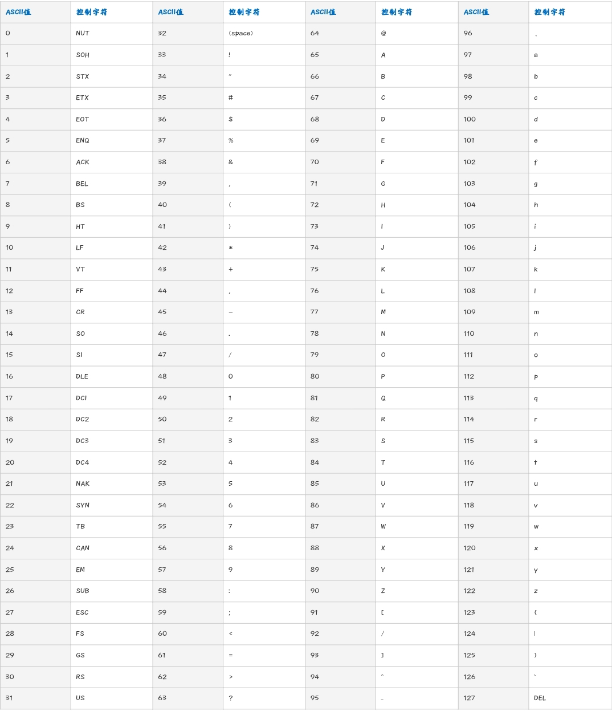

# Note 1

## 数组去重

```js
var values = [1, 1, 2, 3, 3, 4]
var mySet = new Set(values)
values = [...mySet]
console.log(values) // [1, 2, 3, 4]
```

## 监听滚动条变化

```js
// 防抖
function throttle (fn, delay = 300) {
  var valid = true
  return function () {
    if (valid) {
      valid = false // 将函数置为无效
      setTimeout(() => {
        fn()
        valid = true
      }, delay)
    }
    return false // valid为false时，函数不执行
  }
}
function showTop () {
  var scrollTop = document.body.scrollTop || document.documentElement.scrollTop
  console.log('滚动条位置：' + scrollTop)
}
window.onscroll = throttle(showTop, 300)
```

## 复制文本到剪切板

```html
<p id="text">待复制文本</p>
<a @click="onCopy">{{ copyText }}</a>
```

```js
var copyText = 'copy'
onCopy () {
  const text = document.getElementById('text')
  navigator.clipboard.writeText(text.innerText || '').then(() => {
    /* clipboard successfully set */
    copyTxt = 'Copied'
  }, (err) => {
    /* clipboard write failed */
    copyTxt = err
  })
}
```

[Clipboard API](https://developer.mozilla.org/zh-CN/docs/Web/API/Clipboard_API)

剪贴板 `Clipboard API` 提供了响应剪贴板命令（剪切、复制和粘贴）与异步读写系统剪贴板的能力。从权限 Permissions API 获取权限之后，才能访问剪贴板内容；如果用户没有授予权限，则不允许读取或更改剪贴板内容。

- 访问剪贴板

  除了在实例化中创建一个 Clipboard 对象，你还可以使用全局的 `Navigator.clipboard` 来访问系统剪贴板。

- `read()`

  从剪贴板读取数据（比如图片），返回一个 Promise 对象。在检索到数据后，promise 将兑现一个 `ClipboardItem` 对象的数组来提供剪切板数据。
- `Clipboard.readeText()`

  从操作系统读取文本；返回一个 Promise，在从剪切板中检索到文本后，promise 将兑现一个包含剪切板文本数据的 DOMString。<br>
  解析系统剪贴板的文本内容返回一个Promise 。

  ```js
  // 粘贴（读取剪贴板）
  // 检索剪贴板的文本内容，并将返回的文本插入元素的内容中
  navigator.clipboard.readText().then(
    clipText => document.querySelector('.editor').innerText += clipText
  )
  ```

  上述代码提取了剪贴板的文本并将其附在 class 为 editor 的第一个元素后面。因为当剪贴板中不是文本时， readText() (and read(), for that matter) 会返回一个空字符串，所以这段代码是安全的。

- `write()`

  写入任意数据至操作系统剪贴板。这是一个异步操作，在操作完成后，返回的 promise 的将被兑现。<br>
  写入图片等任意的数据到剪贴板。这个方法可以用于实现剪切和复制的功能。

  ```js
  // 这个例子展示了如何将当前剪贴板的内容替换为给定的内容。
  function setClipboard(text) {
    let data = new DataTransfer()

    data.items.add("text/plain", text)
    navigator.clipboard.write(data).then(() => {
        /* success */
      }, () => {
        /* failure */
      })
  }
  ```

- `Clipboard.writeText()`

  写入文本至操作系统剪贴板。返回一个 Promise，在文本被完全写入剪切板后，返回的 promise 将被兑现。<br>
  可以写入特定字符串到操作系统的剪切板

  ```js
  // 复制（写入剪贴板）
  // 此示例将剪贴板的内容设置为字符串“<empty clipboard>”
  navigator.clipboard.writeText('<empty clipboard>').then(() => {
      /* clipboard successfully set */
    }, () => {
      /* clipboard write failed */
    })
  ```

## `<video>` 标签相关事件

```js
const video = document.getElementById('veo')
video.addEventListener('pause', () => { // 播放暂停时触发，视频播放完时也会触发
  this.vplay = true
  var current = Math.floor(video.currentTime) // 播放暂停时获取已播放时长并向下取整
  console.log('播放暂停时的已播放时长:', current)
})
video.addEventListener('playing', () => { // 开始播放时触发，包括暂停重新播放，快进到某个时间点开始播放
  this.vplay = false
  var current = Math.floor(video.currentTime) // 开始播放时获取已播放时长并向下取整
  console.log('开始播放时的已播放时长:', current)
})
video.addEventListener('timeupdate', () => { // 播放时触发，即与视频播放同步触发，播放时大约1s内触发4次
  var current = Math.floor(video.currentTime) // 播放时获取已播放时长并向下取整
  console.log('播放时的已播放时长:', current)
})
video.addEventListener('ended', () => { // 播放完成时触发
  var current = Math.floor(video.currentTime) // 播放完成时获取已播放时长并向下取整
  console.log('播放完成时的已播放时长:', current)
})
console.log('视频时长:', video.duration)
// 设置视频的播放开始时间点，单位 s
video.currentTime = 10
video.play() // 播放
video.pause() // 暂停
```

## 字母和ASCII码转换

- ASCII码转字符

```js
String.fromCharCode(65) // 'A'
String.fromCharCode(97) // 'a'
```

- 字符转ASCII码

```js
var str1 = 'A'
str1.charCodeAt() // 65
var str2 = 'a'
str2.charCodeAt() // 97
```

- ASCII表



## [scrollIntoView()](https://developer.mozilla.org/zh-CN/docs/Web/API/Element/scrollIntoView)将指定元素滚动到浏览器窗口的可视区域

*`Element` 接口的 `scrollIntoView()` 方法会滚动元素的父容器，使被调用 `scrollIntoView()` 的元素对用户可见。*

### 语法

```js
scrollIntoView()
scrollIntoView(alignToTop)
scrollIntoView(scrollIntoViewOptions)
```

### 参数

- `alignToTop` <Badge type="tip" text="可选" /> 一个布尔值：
  - `true`，元素的*顶端将和其所在滚动区的可视区域的顶端对齐*。相应的 `scrollIntoViewOptions: {block: 'start', inline: 'nearest'}` 这是这个参数的*默认值*。
  - `false`，元素的*底端将和其所在滚动区的可视区域的底端对齐*。相应的 `scrollIntoViewOptions: {block: 'end', inline: 'nearest'}`。

- `scrollIntoViewOptions` <Badge type="tip" text="可选" /> 一个包含下列属性的对象：
  - `behavior` <Badge type="tip" text="可选" />
    定义滚动是立即的还是平滑的动画。该选项是一个字符串，必须采用以下值之一：
    - `smooth`：滚动应该是*平滑的动画*。
    - `instant`：滚动应该通过*一次跳跃立刻发生*。
    - `auto`：滚动行为由 `scroll-behavior` 的计算值决定。
  - `block` <Badge type="tip" text="可选" />
    定义*垂直方向的对齐*，start、center、end 或 nearest 之一。默认为 start。
  - `inline` <Badge type="tip" text="可选" />
    定义*水平方向的对齐*，start、center、end 或 nearest 之一。默认为 nearest。

### 返回值

无（undefined）

### 示例

```js
const element = document.getElementById('box')

element.scrollIntoView()
element.scrollIntoView(false)
element.scrollIntoView({ block: 'end' })
element.scrollIntoView({ behavior: 'smooth', block: 'end', inline: 'nearest' })
```

### 场景1：将 id 为 content 的元素，滚动到可视窗口

```html
<a @click="onScroll"></a>
```

```js
onScroll () {
  const el = document.getElementById('content')
  el.scrollIntoView()
}
```

### 场景2：滚动到指定锚点

```html
<!-- (必须用id选择器) -->
<a href="#content"></a>
```

### 场景3：进入页面后，将指定元素显示在视口中

```html
<div id="content"></div>
```

```js
goTop () {
  const el = document.getElementById('content')
  el.scrollIntoView()
}
```

## 原生js相关BOM和DOM操作

- 获取DOM元素

```html
<input
  id="upload"
  class="upload"
  name="upload"
  ref="upload"
  type="file"
  accept="image/*" />
```

`getElementBy...` 获取DOM元素：

```js
const el = document.getElementById('upload') // 返回DOM对象
const el = document.getElementsByClassName('upload') // 返回key为0，1，2…的object，value为DOM对象
const el = document.getElementsByTagName('div') // 返回key为0，1，2…的object，value为DOM对象
const el = document.getElementsByName('upload') // NodeList对象，key为0，1，2…，value为DOM对象
console.log('upload:', this.$refs.upload) // vue的ref模板引用获取DOM元素
```

`querySelector` 使用 `CSS选择符` 获取DOM元素

```js
var upType = document.querySelector('input[type="file"]')
var upName = document.querySelector('input[name="upload"]')
var upId = document.querySelector('#upload')
var upClass = document.querySelector('.upload')
```

- 设置DOM元素的样式style

```html

```

```js
// 使用ref修改特定元素的样式：
this.$refs.animateRef.style.top = 0
this.$refs.animateRef.style.opacity = 1
// 等价于使用原生JS修改：
const el = document.getElementById('animate')
el.style.top = 0
el.style.opacity = 1
```

- 获取DOM元素各边缘距离浏览器可视窗口的距离（不包括滚动条）

[`Element.getBoundingClientRect()`](https://developer.mozilla.org/zh-CN/docs/Web/API/Element/getBoundingClientRect) 方法

```js{1,4,6,8,10-11}
const el = document.getElementById('animate') // 获取DOM元素
// 或者 const el = this.$refs.animateRef
// 元素上边缘距浏览器窗口上边界的距离，可正，可负，可为0
console.log('distance:', el.getBoundingClientRect().top) 
// 元素下边缘距浏览器窗口上边界的距离，可正，可负，可为0
console.log('distance:', el.getBoundingClientRect().bottom) 
// 元素左边缘距浏览器窗口左边界的距离，可正，可负，可为0
console.log('distance:', el.getBoundingClientRect().left) 
// 元素右边缘距浏览器窗口左边界的距离，可正，可负，可为0
console.log('distance:', el.getBoundingClientRect().right) 
console.log('distance:', el.getBoundingClientRect())
// x，y：即元素左上角的像素点相对于浏览器显示窗口左上角点的坐标
```


- [`window`](https://developer.mozilla.org/zh-CN/docs/Web/API/Window) 对象表示一个包含 DOM 文档的窗口，其 document 属性指向窗口中载入的 DOM 文档

```js{2,4,6,8,13,18}
// 浏览器窗口可视区域的高度
window.innerHeight
// 浏览器窗口可视区域的宽度
window.innerWidth
// 获取/设置当前页面地址（URL）或把浏览器重定向到新页面
window.location
// 打开一个新的页面
window.open()
/*
  window.scrollX的别名，
  页面的水平滚动距离，即浏览器窗口左边界离页面左端的距离（页面水平滚动的距离）
*/
window.pageXOffset
/*
  window.scrollY的别名，
  页面的垂直滚动距离，即浏览器窗口上边界离页面顶端的距离（页面垂直滚动的距离）
*/
window.pageYOffset
```

- 判断一个元素是否在浏览器视口中：

```html
<div id="slider" ref="slider"></div>
```

```js
isInViewport () {
  const el = this.$refs.slider
  const rect = el.getBoundingClientRect()
  const viewWidth = window.innerWidth || document.documentElement.clientWidth
  const viewHeight = window.innerHeight || document.documentElement.clientHeight
  if (rect.right < 0 || rect.bottom < 0 || rect.left > viewWidth || rect.top > viewHeight) {
    return false
  }
  return true
}
```
