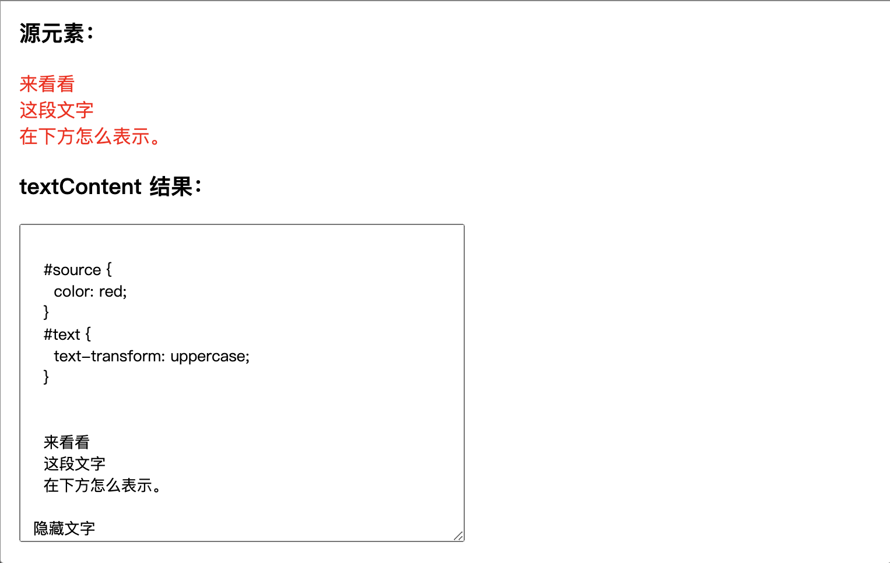

# Note 10

## [innerText](https://developer.mozilla.org/zh-CN/docs/Web/API/HTMLElement/innerText)

`HTMLElement` 接口的 `innerText` 属性表示一个节点及其后代所渲染文本的内容。

- 作为一个 `getter`，它**近似于用户用光标突出该元素的内容，然后将其复制到剪贴板上所得到的文本**。
- 作为一个 `setter`，这将用给定的值替换该元素的子元素，并将任何换行符转换为 `<br>` 元素。

::: tip 备注
`innerText` 很容易与 `Node.textContent` 混淆，但这两个属性间实际上有很重要的区别。大体来说，`innerText` 知道文本的渲染外观，而 `textContent` 不知道。
:::

### 输出

一个字符串，代表元素的渲染文本内容。

如果元素本身没有被渲染（例如，从文档中分离出来或从视图中隐藏起来），返回值与 `Node.textContent` 属性相同。

### 示例

这个示例对比了 `innerText` 和 `Node.textContent`。请注意 `innerText` 是如何意识到像 `<br>` 这样的元素，并忽略了隐藏的元素的。

```html
<h3>源元素：</h3>
<p id="source">
  <style>
    #source {
      color: red;
    }
    #text {
      text-transform: uppercase;
    }
  </style>
  <span id="text">
    来看看<br />
    这段文字<br />
    在下方怎么表示。
  </span>
  <span style="display:none">隐藏文字</span>
</p>
<h3>textContent 结果：</h3>
<textarea id="textContentOutput" rows="6" cols="30" readonly>…</textarea>
<h3>innerText 结果：</h3>
<textarea id="innerTextOutput" rows="6" cols="30" readonly>…</textarea>
```

```js
const source = document.getElementById("source")
const textContentOutput = document.getElementById("textContentOutput")
const innerTextOutput = document.getElementById("innerTextOutput")

textContentOutput.value = source.textContent
innerTextOutput.value = source.innerText
```




## [Node.textContent](https://developer.mozilla.org/zh-CN/docs/Web/API/Node/textContent)

`Node` 接口的 `textContent` 属性表示一个节点及其后代的文本内容。

::: tip 备注
`textContent` 和 `HTMLElement.innerText` 容易混淆，但这两个属性在重要方面有不同之处 。
:::

### 语法

```js
let text = someNode.textContent
someOtherNode.textContent = string
```

### 返回值

一个字符串或 `null`.

### 描述

`textContent` 的值取决于具体情况：

- 如果节点是一个 `document`，或者一个 `DOCTYPE` ，则 `textContent` 返回 `null`。

  ::: tip 备注
  如果你要获取整个文档的文本以及 CDATA data ，可以使用 `document.documentElement.textContent`。
  :::

- 如果节点是个 CDATA section、注释、processing instruction (en-US) 或者 text node，`textContent` 返回节点内部的文本内容，例如 `Node.nodeValue`。
- 对于其他节点类型，`textContent` 将所有子节点的 `textContent` 合并后返回，除了注释和 processing instructions。（如果该节点没有子节点的话，返回一个空字符串。）
在节点上设置 `textContent` 属性的话，会删除它的所有子节点，并替换为一个具有给定值的文本节点。

### 与 innerText 的区别

不要对 `Node.textContent` 和 `HTMLElement.innerText` 之间的差异感到困惑。虽然名字看起来很相似，但有重要的不同之处：

- `textContent` 会获取所有元素的内容，包括 `<script>` 和 `<style>` 元素，然而 `innerText` 只展示给人看的元素。
- `textContent` 会返回节点中的每一个元素。相反，`innerText` 受 `CSS` 样式的影响，并且不会返回隐藏元素的文本，
  - 此外，由于 `innerText` 受 CSS 样式的影响，**它会触发回流（ reflow ）去确保是最新的计算样式**。（回流在计算上可能会非常昂贵，因此应尽可能避免。）
- 与 `textContent` 不同的是，在 Internet Explorer (小于和等于 11 的版本) 中对 innerText 进行修改，不仅会移除当前元素的子节点，而且还会永久性地破坏所有后代文本节点。在之后不可能再次将节点再次插入到任何其他元素或同一元素中。

### 与 innerHTML 的区别

正如其名称，`Element.innerHTML` 返回 `HTML`。通常，为了在元素中检索或写入文本，人们使用 `innerHTML`。但是，**textContent 通常具有更好的性能，因为文本不会被解析为 HTML**。

### 示例

给出这个 HTML 片段

```html
<div id="divA">This is <span>some</span> text!</div>
```

你可以使用 `textContent` 去获取该元素的文本内容：

```js
let text = document.getElementById("divA").textContent
// The text variable is now: 'This is some text!'
```

或者设置元素的文字内容：

```js
document.getElementById("divA").textContent = "This text is different!"
// The HTML for divA is now:
// <div id="divA">This text is different!</div>
```
