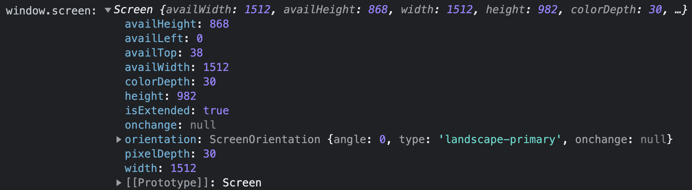

# Note 4

## 监听当前页面是否处于激活状态

- 方法一：监听 `visibilitychange` 事件

[`visibilitychange` 参考文档](https://developer.mozilla.org/zh-CN/docs/Web/API/Document/visibilitychange_event)

> 当其选项卡的内容变得可见或被隐藏时，会在文档上触发 `visibilitychange` (能见度更改) 事件。<br>该事件不包括文档的更新的可见性状态，但是您可以从文档的 `visibilityState` 属性中获取该信息。

::: tip 注意：
- 当 `visibleStateState` 属性的值转换为 `hidden` `时，Safari` 不会按预期触发 `visibilitychange`；因此，在这种情况下，您还需要包含代码以侦听 `pagehide` 事件。（**经测试目前最新版已无该问题**）
- 出于兼容性原因，请确保使用 `document.addEventListener` 而不是 `window.addEventListener` 来注册回调。`Safari < 14.0` 仅支持前者。
:::

`Document.onvisibilitychange` 是一个事件处理方法，它将在该对象的 `visibilitychange` 事件被触发时调用。

```js
// 本示例在文档可见时开始播放音乐曲目，在文档不再可见时暂停音乐。
document.addEventListener('visibilitychange', function () {
  console.log('visibilityState', document.visibilityState)
})
document.addEventListener('visibilitychange', function () {
  if (document.visibilityState === 'visible') {
    backgroundMusic.play()
  } else {
    backgroundMusic.pause()
  }
})
```

- 方法二：监听 `blur` 和 `focus` 事件

```js
window.onfocus = () => {
  console.log('激活状态')
  this.onStart()
}
window.onblur = () => {
  console.log('未激活状态')
  this.onStop()
}
```

## JS获取代码运行时间

```js
console.time('run time')
var arr = []
for (let i = 0; i < 1000000; i++) {
  arr.push(i)
}
console.timeEnd('run time')
```

## js字符串转数字

- `Number()`

  ```js
  Number('123') // 123
  Number('123.456') // 123.456
  Number('123.56') // 123.56
  ```

- `parseInt()`

  ```js
  parseInt('123') // 123
  parseInt('123.456') // 123
  parseInt('123.56') // 123
  ```

- `parseFloat()`

  ```js
  parseFloat('123') // 123
  parseFloat('123.456') // 123.456
  parseFloat('123.56') // 123.56
  ```

- `+`

  ```js
  +'123' // 123
  +'123.456' // 123.456
  +'123.56' // 123.56

- `*1`

  ```js
  '123'*1 // 123
  '123.456'*1 // 123.456
  '123.56'*1 // 123.56
  ```

- `~~`

  ```js
  ~~'123' // 123
  ~~'123.456' // 123
  ~~'123.56' // 123
  ```

## 浏览器窗口宽高和元素坐标，尺寸

- `el.getBoundingClientRect()`获取DOM元素的大小及其各边缘相对于浏览器可视窗口的位置（不包括滚动条）：
  
  ```js
  var docEl = document.documentElement // window.document.documentElement
  ```
  
  ```html
  <div id="animate" ref="animate"></div>
  ```

  ```js
  const el = document.getElementById('animate') // 获取DOM元素
  // 或者 const el = this.$refs.animate
  // 元素上边缘距浏览器窗口上边界的距离，可正，可负，可为0
  console.log('distance:', el.getBoundingClientRect().top) 
  // 元素下边缘距浏览器窗口上边界的距离，可正，可负，可为0
  console.log('distance:', el.getBoundingClientRect().bottom) 
  // 元素左边缘距浏览器窗口左边界的距离，可正，可负，可为0
  console.log('distance:', el.getBoundingClientRect().left) 
  // 元素右边缘距浏览器窗口左边界的距离，可正，可负，可为0
  console.log('distance:', el.getBoundingClientRect().right) 
  // 元素的宽度（包括内边距padding和边框border）
  console.log('distance:', el.getBoundingClientRect().width) 
  // 元素的高度（包括内边距padding和边框border）
  console.log('distance:', el.getBoundingClientRect().height)
  ```
  
- `clientWidth` 返回元素的像素宽度（**仅包含内边距padding，不包含边框border、外边距margin和滚动条**）：

  ```js
  document.body.clientWidth
  ```

- `clientHeight` 返回元素的像素高度（**仅包含内边距padding，不包含边框border、外边距margin和滚动条**）：
  
  ```js
  document.body.clientHeight
  ```
  
- `scrollWidth` 返回元素的像素宽度（**包含内边距padding，不包含边框border、外边距margin**）：
  
  ```js
  element.scrollWidth // 包括由于溢出滚动，而无法展示在可视窗口的不可见部分
  ```

- `scrollHeight` 返回元素的像素高度（**仅包含内边距padding，不包含边框border、外边距margin**）：
  
  ```js
  element.scrollHeight // 包括由于溢出滚动，而无法展示在可视窗口的不可见部分
  ```

- `scrollLeft` 可读取或设置元素滚动条到元素左边的距离
  
  ```js
  element.scrollLeft // 表示该元素内容水平滚动的像素数
  ```

- `scrollTop` 可读取或设置元素的内容垂直滚动的像素数
  
  ```js
  element.scrollTop // 表示该元素内容垂直滚动的像素数
  ```

  ```html
  <div id="app" ref="app" class="m-card" @scroll="onScroll">
    <div class="u-content"></div>
  </div>
  ```

  ```js
  onScroll () {
    const app = this.$refs.app
    console.log('app.scrollLeft:', app.scrollLeft) // 水平方向滚动像素数
    console.log('app.scrollTop:', app.scrollTop) // 垂直方向滚动像素数
  }
  ```

  ```css
  .m-card { width: 60px; height: 60px; overflow: auto; }
  .u-content { width: 300px; height: 300px; }
  ```

- `offsetWidth` 返回元素的像素宽度（**包含内边距padding和边框border，不包含外边距margin**）
  
  ```js
  document.body.offsetWidth
  // 如果元素被隐藏（例如：元素或者元素的祖先之一的元素的 style.display 被设置为 none），则返回 0。
  ```
  
- `offsetHeight` 返回元素的像素高度（**包含内边距padding和边框border，不包含外边距margin**）

  ```js
  document.body.offsetHeight
  // 如果元素被隐藏（例如：元素或者元素的祖先之一的元素的 style.display 被设置为 none），则返回 0。
  ```

- `offsetLeft` 返回当前元素相对于 `offsetParent` 节点左边界的偏移像素值：
  1. 包含元素向左偏移的像素值，元素的外边距 `margin`
  2. 包含 `offsetParent` 元素的左侧内边距 `padding`、边框 `border` 及滚动条
  3. `el.offsetParent` // 获取el被定位（设置position属性）的最近祖先元素
  4. 若祖先元素中没有设置定位的元素，则祖先元素为`<body>`
- `offsetTop` 返回当前元素相对于 `offsetParent` 节点顶部边界的偏移像素值：
  1. 包含元素顶部偏移的像素值，元素的外边距 `margin`
  2. 包含 `offsetParent` 元素的顶部内边距 `padding`、边框 `border` 及滚动条
  3. `el.offsetParent` // 获取el最近的祖先元素
- `clientX` 事件属性返回当事件被触发时鼠标指针相对于浏览器页面（即当前可视窗口）的水平坐标 **（相对于浏览器可视窗口）不计算水平滚动距离**
- `clientY` 事件属性返回当事件被触发时鼠标指针向对于浏览器页面（即当前可视窗口）的垂直坐标 **（相对于浏览器可视窗口）不计算垂直滚动距离**
- `pageX` 事件属性返回当事件被触发时鼠标指针相对于页面内容的水平坐标（包括滚动条）

  ```js
  // 浏览器横向滚动距离：
  const scrollLeft = window.pageXOffset || window.scrollX ||document.documentElement.scrollLeft ||  document.body.scrollLeft
  
  e.pageX = e.clientX + window.pageXOffset //（浏览器横向滚动距离）
  ```

  ::: tip
  所有主流浏览器都支持 `pageXOffset` 和 `pageYOffset`；IE8及更早IE版本不支持该属性，但可以使用: `document.documentElement.scrollLeft` 和 `document.documentElement.scrollTop`
  :::
  
- `pageY` 事件属性返回当事件被触发时鼠标指针相对于页面内容的垂直坐标

  ```js
  // 浏览器垂直滚动距离：
  const scrollTop = window.pageYOffset || window.scrollY || document.documentElement.scrollTop || document.body.scrollTop
  
  e.pageY = e.clientY+ window.pageYOffset //（浏览器垂直滚动距离）
  ```

  ::: tip
  所有主流浏览器都支持 `pageXOffset` 和 `pageYOffset`；IE8及更早IE版本不支持该属性，但可以使用 `document.documentElement.scrollLeft` 和`document.documentElement.scrollTop`
  :::

- `screenX` 事件属性返回事件发生时鼠标指针相对于屏幕的水平坐标 **相对于电脑屏幕**
- `screenY` 事件属性返回事件发生时鼠标指针相对于屏幕的垂直坐标 **相对于电脑屏幕**
- `screen` 对象包含有关客户端显示屏幕的信息
  1. `screen.availHeight`：返回屏幕可用的高度（**不包括窗口任务栏**）
  2. `screen.availWidth`：返回屏幕可用的宽度（**不包括窗口任务栏**）
  3. `screen.colorDepth`：返回目标设备或缓冲器上的调色板的比特深度
  4. `screen.pixelDepth`：返回屏幕的颜色分辨率（**每像素的位数**）
  5. `screen.height`：返回屏幕的总高度
  6. `screen.width`：返回屏幕的总宽度

  ```js
  window.screen === screen // true
  ```

  

## 使用变量生成动态正则表达式

1. 使用 `RegExp` 构造函数生成（常用）

  ```js
  const key = this.queryParams.keyword
  const keyReg = new RegExp(key, 'g')
  ```

2. 使用 `eval` 动态执行代码

  ```js
  const key = '你好'
  var keyReg = eval('/^' + key + '$/g')
  console.log(keyReg) // /^你好$/g
  ```

  ```html
  <p v-html="title"></p>
  ```

  ```js
  // 实际用例：在搜索结果中标识指定关键字
  item.title = '<p>' + item.title.replace(reg, `<span class="blue">${key}</span>`) + '</p>'
  ```

## 不使用滚动条，模拟滚动行为

> 使用场景：多个标签页可以滚动，同时又不显示滚动条，也不触发浏览器触摸板左右滑动时的快捷方式（例如后退和前进）

**实现方式：（触摸板滑动也会触发）监听滚轮事件，结合 transform: translate(${scrollLeft}px, 0) 模拟滚动效果**

[`Wheel Event` 参考文档](https://developer.mozilla.org/zh-CN/docs/Web/API/Element/wheel_event)

`WheelEvent` 事件属性：
- `WheelEvent.deltaX` 只读：返回一个浮点数（double），表示**水平方向的滚动量**。
- `WheelEvent.deltaY` 只读：返回一个浮点数（double），表示**垂直方向的滚动量**。
- `WheelEvent.deltaZ` 只读：返回一个浮点数（double）表示** z 轴方向的滚动量**。
- `WheelEvent.deltaMode` 只读：返回一个无符号长整型数（unsigned long），表示 **delta\* 值滚动量的单位**。

```html
<div @wheel.prevent="showWheel ? onWheel($event) : e => false"></div>
```

```js
function onWheel (e: WheelEvent) {
  // e.preventDefault() // 禁止浏览器捕获触摸板滑动事件
  const scrollX = e.deltaX * 1 // 滚轮的横向滚动量
  if (scrollLeft.value + scrollX > scrollMax.value) {
    scrollLeft.value = scrollMax.value
  } else if (scrollLeft.value + scrollX < 0) {
    scrollLeft.value = 0
  } else {
    scrollLeft.value += scrollX
  }
}
```
