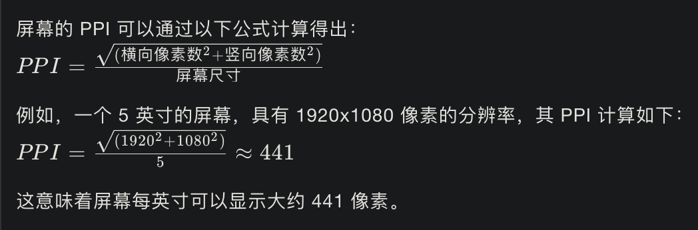

# Note 8

## [scrollHeight详情](/javascript/No.4.html#浏览器窗口宽高和元素坐标-尺寸)

### 判断元素是否有滚动条

<br/>
出现滚动条便意味着元素空间将大于其内容显示区域，根据这个现象便可以得到判断是否出现滚动条的规则

### 判断竖向滚动条

```js
if (el.scrollHeight > el.clientHeight) {
  // true
}
```

### 判断横向滚动条

```js
if (el.scrollWidth > el.clientWidth) {
  // true
}
```

[Node.parentElement](https://developer.mozilla.org/zh-CN/docs/Web/API/Node/parentElement) 返回当前节点的父元素节点，如果该元素没有父节点，或者父节点不是一个 `DOM 元素`，则返回 `null`。

- 语法 `parentElement = node.parentElement`
  <br/>`parentElement` 是当前节点的父元素。它永远是一个 `DOM 元素` 对象，或者 `null`。

### 实例

<br/>**监听距离当前元素最近的一个可竖向滚动的祖先节点**

```js
const target = getScrollParentElement(backtop.value.parentElement)
target && target.addEventListener('scroll', showScrollTop)

function getScrollParentElement (el: HTMLElement) {
  if (el.scrollHeight > el.clientHeight) {
    return el
  } else if (el.parentElement) {
    return getScrollParentElement(el.parentElement)
  } else {
    return null
  }
}
```

## [scrollTo](https://developer.mozilla.org/zh-CN/docs/Web/API/Element/scrollTo) 滚动到指定位置

Element 的 scrollTo() 方法可以使界面滚动到给定元素的指定坐标位置。

- 语法

  ```js
  scrollTo(x-coord, y-coord)
  scrollTo(options)
  ```

- 参数
  - `x-coord` 是你想要显示在左上角的元素沿水平轴的像素。
  - `y-coord` 是你想要显示在左上角的元素沿垂直轴的像素。

  或者
  - `options` 包含以下参数的对象：
    - `top`
      指定沿 `Y` 轴滚动窗口或元素的像素数。
    - `left`
      指定沿 `X` 轴滚动窗口或元素的像素数。

    - `behavior`
      `smooth` 表示平滑滚动并产生过渡效果、`instant` 表示滚动会直接跳转到目标位置，没有过渡效果。`auto` 或缺省值表示浏览器会自动选择滚动时的过渡效果。

### 示例

```js
element.scrollTo(0, 1000);
// 或者
element.scrollTo({
  top: 100,
  left: 100,
  behavior: 'smooth'
})
```

## 设备像素比[`Window.devicePixelRatio`](https://developer.mozilla.org/zh-CN/docs/Web/API/Window/devicePixelRatio)

`Window` 接口的 `devicePixelRatio` 返回**当前显示设备的物理像素分辨率与CSS 像素分辨率之比**。此值也可以解释为像素大小的比率：**一个 CSS 像素的大小与一个物理像素的大小**。简单来说，它告诉浏览器应使用多少屏幕实际像素来绘制单个 CSS 像素。

当处理标准显示器与 HiDPI 或 Retina 显示器之间的差异时，这很有用，后者使用更多的屏幕像素绘制相同的对象，从而获得更清晰的图像。

### 语法

```js
const devicePixelRatio = window.devicePixelRatio
```

### 值

一个双精度浮点值，**指示显示器的物理像素分辨率与 CSS 像素分辨率之比**。值 1 表示经典 96 DPI（在某些平台上为 76 DPI）显示，而对于 HiDPI / Retina 显示屏则期望值为 2。在异常低分辨率的显示器中，或更常见的是，当屏幕的像素深度比简单地将 96 或 76 DPI 的标准分辨率提高一倍时，可能还会返回其他值。

### 示例

在 `<canvas>` 中更正分辨率

`<canvas>`可能在视网膜屏幕上显得太模糊。使用 `window.devicePixelRatio` 确定应添加多少额外的像素密度以使图像更清晰。

```html
<canvas id="canvas"></canvas>
```

```js
var canvas = document.getElementById("canvas")
var ctx = canvas.getContext("2d")

// Set display size (css pixels).
var size = 200
canvas.style.width = size + "px" // canvas的 style.width 和 style.height 表示画布展示到浏览器中时，显示的大小
canvas.style.height = size + "px"

// Set actual size in memory (scaled to account for extra pixel density).
var scale = window.devicePixelRatio // Change to 1 on retina screens to see blurry canvas.
canvas.width = Math.floor(size * scale) // canvas的 width 和 height，表示画布真实大小，不可见
canvas.height = Math.floor(size * scale) // 不设定 width 和 height 时，默认 width: 300px; height: 150px

// Normalize coordinate system to use css pixels.
ctx.scale(scale, scale)

ctx.fillStyle = "#bada55"
ctx.fillRect(10, 10, 300, 300)
ctx.fillStyle = "#ffffff"
ctx.font = "18px Arial"
ctx.textAlign = "center"
ctx.textBaseline = "middle"

var x = size / 2
var y = size / 2

var textString = "I love MDN"
ctx.fillText(textString, x, y)
```

### `DPI` & `PPI`

`DPI`（**dots per inch**）和 `PPI`（**pixels per inch**）都是用来衡量图像分辨率的单位，它们分别代表了**每英寸长度内可打印的点数**和**每英寸长度内显示的像素数**。尽管它们的名称不同，但在很多情况下，这两个术语可以互换使用，尤其是在讨论屏幕显示设备的分辨率时。

- `DPI`（**每英寸点数**）
- **定义**：`DPI` 最初用于打印技术，表示打印头在每英寸纸张上可以打印的墨点数量。一个较高的 `DPI` 值意味着打印输出具有更高的细节和清晰度。
- **应用**：`DPI` 主要用于打印机、扫描仪和打印图像的质量讨论中。

- `PPI`（**每英寸像素**）
- **定义**：`PPI` 是显示技术中的一个术语，表示屏幕在每英寸长度内可以显示的像素数量。像素是构成数字图像的最小单元。
- **应用**：`PPI` 主要用于屏幕显示设备，如智能手机、平板电脑、电脑显示器和电视。

- `DPI` 和 `PPI` 的区别：
  1. **上下文**：`DPI` 通常与打印相关，而 `PPI` 与显示设备相关。
  2. **技术实现**：打印技术通过物理墨点来实现，而显示技术通过发光的像素来实现。
  3. **视觉感受**：在相同的物理尺寸下，`PPI` 越高，屏幕显示的图像就越清晰，细节也越丰富。

- 屏幕 PPI 的计算



- 总结

尽管 DPI 和 PPI 可以互换使用，但它们在技术上有不同的含义和应用领域。**在现代显示技术中，PPI 是更常用的术语**，而在打印和图像质量讨论中，DPI 仍然是一个重要指标。

## [空值合并运算符（??）](https://developer.mozilla.org/zh-CN/docs/Web/JavaScript/Reference/Operators/Nullish_coalescing)

空值合并运算符（`??`）是一个逻辑运算符，当左侧的操作数为 `null` 或者 `undefined` 时，返回其右侧操作数，否则返回左侧操作数。

与逻辑或运算符（`||`）不同，逻辑或运算符会在左侧操作数为假值时返回右侧操作数。也就是说，如果使用 `||` 来为某些变量设置默认值，可能会遇到意料之外的行为。比如为假值（例如，'' 或 0）时。

由于 `||` 是一个布尔逻辑运算符，左侧的操作数会被强制转换成布尔值用于求值。任何假值（`0`， `''`， `NaN1`， `null`， `undefined`）都不会被返回。这导致如果你使用`0`，`''`或`NaN`作为有效值，就会出现不可预料的后果。

```js
const foo = null ?? 'default string'
console.log(foo)
// Expected output: 'default string'

const baz = 0 ?? 42
console.log(baz)
// Expected output: 0

let count = 0
let text = ''

let qty = count || 42
let message = text || 'hi!'
console.log(qty) // 42，而不是 0
console.log(message) // 'hi!'，而不是 ''
```

## [可选链运算符（?.）](https://developer.mozilla.org/zh-CN/docs/Web/JavaScript/Reference/Operators/Optional_chaining)

可选链运算符（`?.`）允许读取位于连接对象链深处的属性的值，而不必明确验证链中的每个引用是否有效。`?.` 运算符的功能类似于 `.` 链式运算符，不同之处在于，在引用为空 (`nullish`) (`null` 或者 `undefined`) 的情况下不会引起错误，该表达式短路返回值是 `undefined`。与函数调用一起使用时，如果给定的函数不存在，则返回 `undefined`。

当尝试访问可能不存在的对象属性时，可选链运算符将会使表达式更短、更简明。在探索一个对象的内容时，如果不能确定哪些属性必定存在，可选链运算符也是很有帮助的。

```js
const adventurer = {
  name: 'Alice',
  cat: {
    name: 'Dinah'
  }
}

const dogName = adventurer.dog?.name
console.log(dogName)
// Expected output: undefined

console.log(adventurer.someNonExistentMethod?.())
// Expected output: undefined
```

### 可选链与函数调用

当尝试调用一个可能不存在的方法时也可以使用可选链。这将是很有帮助的，比如，当使用一个 API 的方法可能不可用时，要么因为实现的版本问题要么因为当前用户的设备不支持该功能。

函数调用时如果被调用的方法不存在，使用可选链可以使表达式自动返回 `undefined` 而不是抛出一个异常。

```js
let result = someInterface.customMethod?.()
```

:::tip 备注
如果存在一个属性名且不是函数，使用 `?.` 仍然会产生一个 TypeError 异常 (x.y is not a function).

如果 someInterface 自身是 `null` 或者 `undefined` ，异常 TypeError 仍会被抛出 someInterface is null 如果你希望允许 someInterface 也为 `null` 或者 `undefined` ，那么你需要像这样写 `someInterface?.customMethod?.()`
:::

## [Element.setAttribute()](https://developer.mozilla.org/zh-CN/docs/Web/API/Element/setAttribute)

设置指定元素上的某个属性值。如果属性已经存在，则更新该值；否则，使用指定的名称和值添加一个新的属性。

要获取某个属性当前的值，可使用 [getAttribute()](https://developer.mozilla.org/zh-CN/docs/Web/API/Element/getAttribute)；要删除某个属性，可使用 [removeAttribute()](https://developer.mozilla.org/zh-CN/docs/Web/API/Element/removeAttribute)

### 语法

```js
element.setAttribute(name, value)
```

### 参数

- `name`：表示属性名称的字符串
- `value`：属性的值/新值。A DOMString 包含了分配给这个属性的值。**任何非字符串的值都会被自动转换为字符串**

当在 `HTML` 文档中的 `HTML` 元素上调用 `setAttribute()` 方法时，该方法会将其属性名称（`attribute name`）参数**小写化**。
如果指定的属性已经存在，则其值变为传递的值。如果不存在，则创建指定的属性。

**布尔属性（原文是 Boolean attributes）只要出现在元素上就会被认为是 true，无论它的值是什么**; 一般来说，你**应该将 value 设置为空字符串 ("")** 。(一些人使用这个属性的名称作为值; 这不会出现什么问题，但这是不规范的). See the example below for a practical demonstration.

由于将指定的值转换为字符串，因此指定 null 不一定能达到你的期望。而不是删除属性或将其值设置为null，而是将属性的值设置为字符串“null”。如果要删除属性，请调用removeAttribute()。

### 返回值

- undefined

### 示例

```html
<button>Hello World</button>
```

```js
var b = document.querySelector("button")

b.setAttribute("name", "helloButton")
b.setAttribute("disabled", "") // 禁用按钮，要设置布尔属性的值（例如禁用），可以指定任何值。建议使用空字符串或属性名称
```

## [Element.getAttribute()](https://developer.mozilla.org/zh-CN/docs/Web/API/Element/getAttribute)

`getAttribute()` 返回元素上一个指定的属性值。如果指定的属性不存在，则返回 `null` 或 `""` （空字符串）

### 语法

```js
let attribute = element.getAttribute(attributeName)
```

- `attribute`：是一个包含 `attributeName` 属性值的字符串。
- `attributeName`：是你想要获取的属性值的属性名称

### 示例

```js
let div1 = document.getElementById("div1")
let align = div1.getAttribute("align")

alert(align)
// shows the value of align for the element with id="div1"
```

::: tip 备注
当在被标记为 `HTML` 文档中的一个 `HTML` 元素上调用此方法时，`getAttribute()` 会先**将其参数转换为小写形式**。

当指定的属性不存在于元素上时，所有浏览器（Firefox、Internet Explorer、Opera 最新版本、Safari、Konqueror 以及 iCab 等等）都返回 `null`，这也是当前 DOM 规范草案规定的。然而，旧的 DOM 3 Core specification 认为此时正确的返回值应该是一个空字符串，一些 DOM 实现环境实现了该行为（behavior）。在 XUL (Gecko) 中，getAttribute 的实现遵从 DOM 3 Core specification，返回一个空字符串。因此，如果一个属性可能不存在于指定的元素上，在调用 `getAttribute()` 之前，你应该使用 `element.hasAttribute()` 来检测该属性是否存在。
:::

## [Element.removeAttribute()](https://developer.mozilla.org/zh-CN/docs/Web/API/Element/removeAttribute)

元素方法 `removeAttribute()` 从指定的元素中删除一个属性。

### 语法

```js
element.removeAttribute(attrName)
```

### 参数

- `attrName`：DOMString指定要从元素中移除的属性的名称。如果指定的属性不存在，则 `removeAttribute()` 返回，但不会生成错误。

### 返回值

IE 返回 `boolean` 类型值，其他返回 `undefined`

### 示例

```js
// Given: <div id="div1" align="left" width="200px">
document.getElementById("div1").removeAttribute("align")
// Now: <div id="div1" width="200px">
```

## [CSSStyleDeclaration.setProperty()](https://developer.mozilla.org/zh-CN/docs/Web/API/CSSStyleDeclaration/setProperty)

`CSSStyleDeclaration.setProperty()` 方法接口为一个声明了 `CSS` 样式的对象设置一个新的值。

### 语法

```js
style.setProperty(propertyName, value, priority)
```

### 参数

- `propertyName` 是一个 `DOMString` ，代表被更改的 `CSS` 属性。
- `value` <Tag :bordered="false" color="cyan">可选</Tag> 是一个 `DOMString` ，含有新的属性值。如果没有指定，则当作空字符串。
  - 注意：`value` 不能包含 "**!important**" --那个应该使用 `priority` 参数。
- `priority` <Tag :bordered="false" color="cyan">可选</Tag> 是一个 `DOMString` 允许设置 "`important`" `CSS` 优先级。如果没有指定，则当作空字符串。

> `JavaScript` 有一个特别的，更简单的在 `CSSStyleDeclaration` 对象上设置 `CSS` 属性值的语法

```js
style.cssPropertyName = 'value'
```

### 示例

```js
var declaration = document.styleSheets[0].rules[0].style
declaration.setProperty('margin', '1px 2px')
// Equivalent to:
// declaration.margin = '1px 2px'
```
