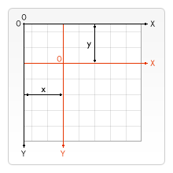
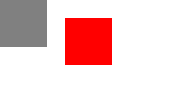

# Note 9

## [Element.append()](https://developer.mozilla.org/zh-CN/docs/Web/API/Element/append)

DOMString 即字符串
`Element.append` 方法在 `Element` 的最后一个子节点之后插入一组 `Node` 对象或 [`DOMString`](https://developer.mozilla.org/zh-CN/docs/Web/JavaScript/Reference/Global_Objects/String) 对象。被插入的 `DOMString` 对象等价为 `Text` 节点。
与 `Node.appendChild()` 的差异：

- `Element.append()` 允许追加 `DOMString` 对象，而 `Node.appendChild()` 只接受 `Node` 对象。
- `Element.append()` 没有返回值，而 `Node.appendChild()` 返回追加的 `Node` 对象。
- `Element.append()` 可以追加多个节点和字符串，而 `Node.appendChild()` 只能追加一个节点。

### 语法

```js
[Throws, Unscopable]
void Element.append((Node or DOMString)...nodes)
```

### 参数

- `nodes`：一组要插入的 Node 或 DOMString 对象。

### 示例

- 插入一个元素节点

```js
var parent = document.createElement("div")
var p = document.createElement("p")
parent.append(p)

console.log(parent.childNodes) // NodeList [ <p> ]
```

- 插入文本

```js
var parent = document.createElement("div")
parent.append("Some text")

console.log(parent.textContent) // "Some text"
```

- 插入一个节点，同时插入一些文本

```js
var parent = document.createElement("div")
var p = document.createElement("p")
parent.append("Some text", p)

console.log(parent.childNodes) // NodeList [ #text "Some text", <p> ]
```

## [CanvasRenderingContext2D.measureText()](https://developer.mozilla.org/zh-CN/docs/Web/API/CanvasRenderingContext2D/measureText)

`CanvasRenderingContext2D.measureText()` 方法返回一个关于被测量文本 `TextMetrics` 对象包含的信息（例如它的宽度）。

### 语法

```js
ctx.measureText(text)
```

### 参数

- `text`：需要测量的 `String` 。

### 返回值

`TextMetrics` 对象。

### 示例

给出 `<canvas>` 元素

```html
<canvas id="canvas"></canvas>
```

```js
var canvas = document.getElementById("canvas")
var ctx = canvas.getContext("2d")

var text = ctx.measureText("foo") // TextMetrics object
text.width // 16;
```

## [TextMetrics](https://developer.mozilla.org/zh-CN/docs/Web/API/TextMetrics)

在 `canvas` `中，TextMetrics` 接口表示文本的尺寸，通过 `CanvasRenderingContext2D.measureText()` 方法创建。

### 属性

- `TextMetrics.width` <Badge type="warning" text="只读" />

  `double` 类型，**使用 CSS 像素计算的内联字符串的宽度**。基于当前上下文字体考虑。

- `TextMetrics.actualBoundingBoxLeft` <Badge type="warning" text="只读" />

  `double` 类型，平行于基线，从CanvasRenderingContext2D.textAlign 属性确定的对齐点到文本矩形边界左侧的距离，使用 CSS 像素计算；正值表示文本矩形边界左侧在该对齐点的左侧。

- `TextMetrics.actualBoundingBoxRight` <Badge type="warning" text="只读" />

  `double` 类型，平行于基线，从CanvasRenderingContext2D.textAlign 属性确定的对齐点到文本矩形边界右侧的距离，使用 CSS 像素计算。

- `TextMetrics.fontBoundingBoxAscent` <Badge type="warning" text="只读" />

  `double` 类型，从CanvasRenderingContext2D.textBaseline 属性标明的水平线到渲染文本的所有字体的矩形最高边界顶部的距离，使用 CSS 像素计算。

- `TextMetrics.fontBoundingBoxDescent` <Badge type="warning" text="只读" />

  `double` 类型，从CanvasRenderingContext2D.textBaseline 属性标明的水平线到渲染文本的所有字体的矩形边界最底部的距离，使用 CSS 像素计算。

- `TextMetrics.actualBoundingBoxAscent` <Badge type="warning" text="只读" />

  `double` 类型，从CanvasRenderingContext2D.textBaseline 属性标明的水平线到渲染文本的矩形边界顶部的距离，使用 CSS 像素计算。

- `TextMetrics.actualBoundingBoxDescent` <Badge type="warning" text="只读" />

  `double` 类型，从CanvasRenderingContext2D.textBaseline 属性标明的水平线到渲染文本的矩形边界底部的距离，使用 CSS 像素计算。

- `TextMetrics.emHeightAscent` <Badge type="warning" text="只读" />

  `double` 类型，从CanvasRenderingContext2D.textBaseline 属性标明的水平线到线框中 em 方块顶部的距离，使用 CSS 像素计算。

- `TextMetrics.emHeightDescent` <Badge type="warning" text="只读" />

  `double` 类型，从CanvasRenderingContext2D.textBaseline 属性标明的水平线到线框中 em 方块底部的距离，使用 CSS 像素计算。

- `TextMetrics.hangingBaseline` <Badge type="warning" text="只读" />

  `double` 类型，从CanvasRenderingContext2D.textBaseline 属性标明的水平线到线框的 hanging 基线的距离，使用 CSS 像素计算。

- `TextMetrics.alphabeticBaseline` <Badge type="warning" text="只读" />

  `double` 类型，从CanvasRenderingContext2D.textBaseline 属性标明的水平线到线框的 alphabetic 基线的距离，使用 CSS 像素计算。

- `TextMetrics.ideographicBaseline` <Badge type="warning" text="只读" />

  `double` 类型，从 CanvasRenderingContext2D.textBaseline 属性标明的水平线到线框的 ideographic 基线的距离，使用 CSS 像素计算。

### 示例

- 测试文本宽度

当测量一段文本的水平宽度时，由于字母倾斜/斜体导致字符的宽度可能超出其预定的宽度，因此 actualBoundingBoxLeft 和 actualBoundingBoxRight 的总和可能会比内联盒子的宽度（width）更大。

因此，计算 `actualBoundingBoxLeft` 和 `actualBoundingBoxRight` 的总和是一种更准确地获取文本绝对宽度的方法：

```js
const canvas = document.getElementById("canvas")
const ctx = canvas.getContext("2d")
const text = "Abcdefghijklmnop"
ctx.font = "italic 50px serif"
const textMetrics = ctx.measureText(text)
console.log(textMetrics.width)
// 459.8833312988281
const actualWidth = textMetrics.actualBoundingBoxRight + textMetrics.actualBoundingBoxLeft
console.log(actualWidth)
// 462.8833333333333
```

## [CanvasRenderingContext2D.fillText()](https://developer.mozilla.org/zh-CN/docs/Web/API/CanvasRenderingContext2D/fillText)

`CanvasRenderingContext2D` 对象的方法 `fillText()` 是 `Canvas 2D API` 的一部分，它在指定的坐标上绘制文本字符串，并使用当前的 `fillStyle` 对其进行填充。存在一个可选参数，其指定了渲染文本的最大宽度，用户代理将通过压缩文本或使用较小的字体大小来实现。

此方法会直接绘制到画布上，而不会修改当前路径，因此任何后续的 `fill()` 或 `stroke()` 调用都不会对其产生影响。

文本根据 `font`、`textAlign`、`textBaseline` 和 `direction` 属性所定义的字体和文本布局来渲染。

### 语法

```js
fillText(text, x, y)
fillText(text, x, y, maxWidth)
```

### 参数

- `text`：要作为渲染上下文的文本字符串。使用当前的 `font`、`textAlign`、`textBaseline` 和 `direction` 设置值对文本进行渲染。

- `x`：开始绘制文本的点的 `X` 轴坐标，单位为像素。

- `y`：开始绘制文本的基线的 `Y` 轴坐标，单位为像素。

- `maxWidth` <Badge type="warning" text="可选" /> 文本渲染后的最大像素宽度。如果未指定，则文本宽度没有限制。但是，如果提供了该值，用户代理将调整字距，选择水平方向更紧凑的字体（如果有这种字体或可以在不降低质量的情况下生成这种字体），或缩小字体大小，以便在指定宽度内容纳文本。

### 返回值

无（undefined）

### 示例

绘制填充文本，这段代码使用 fillText() 方法绘制了“Hello World”字符串。

这段代码获取 `<canvas>` 的引用，然后获取其 2D 图形上下文的引用。
有了这些，我们将 `font` 设置为 `50` 像素高的“衬线体”（用户默认的衬线字体），然后调用 `fillText()` 从坐标 `(50, 90)` 开始绘制文本“Hello world”。

首先，我们需要一个画布来绘图。这段代码将创建一个宽 400 像素，宽 150 像素的背景。

```html
<canvas id="canvas" width="400" height="150"></canvas>
```

```js
const canvas = document.getElementById("canvas")
const ctx = canvas.getContext("2d")

ctx.font = "50px serif"
ctx.fillText("Hello world", 50, 90)
```

## [CanvasRenderingContext2D.translate()](https://developer.mozilla.org/zh-CN/docs/Web/API/CanvasRenderingContext2D/translate)

Canvas 2D API 的 `CanvasRenderingContext2D.translate()` 方法对当前网格添加平移变换的方法。

### 语法

```js
void ctx.translate(x, y)
```

translate() 方法，将 canvas 按原始 x 点的水平方向、原始的 y 点垂直方向进行平移变换


### 参数

- `x`：水平方向的移动距离。
- `y`：垂直方向的移动距离。

### 示例

移动形状
这是一段使用 translate 方法的简单的代码片段。

```html
<canvas id="canvas"></canvas>
```

```js
const canvas = document.getElementById("canvas")
const ctx = canvas.getContext("2d")

// Moved square
ctx.translate(110, 30)
ctx.fillStyle = "red"
ctx.fillRect(0, 0, 80, 80)

// Reset current transformation matrix to the identity matrix
ctx.setTransform(1, 0, 0, 1, 0, 0)

// Unmoved square
ctx.fillStyle = "gray"
ctx.fillRect(0, 0, 80, 80)
```

移动后的正方形是红色的，未移动的正方形是灰色的。

