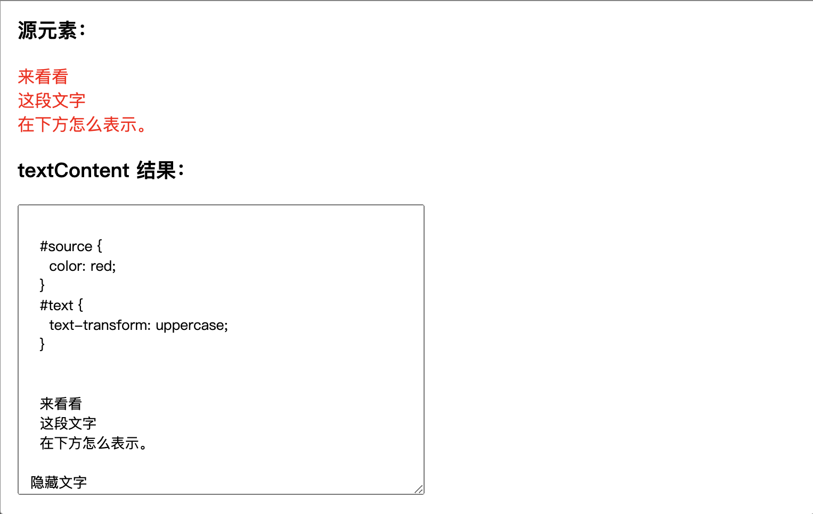

# Note 10

<BackTop />

## [innerText](https://developer.mozilla.org/zh-CN/docs/Web/API/HTMLElement/innerText)

`HTMLElement` 接口的 `innerText` 属性表示一个节点及其后代所渲染文本的内容。

- 作为一个 `getter`，它**近似于用户用光标突出该元素的内容，然后将其复制到剪贴板上所得到的文本**。
- 作为一个 `setter`，这将用给定的值替换该元素的子元素，并将任何换行符转换为 `<br>` 元素。

::: tip 备注
`innerText` 很容易与 `Node.textContent` 混淆，但这两个属性间实际上有很重要的区别。大体来说，`innerText` 知道文本的渲染外观，而 `textContent` 不知道。
:::

### 输出

一个字符串，代表元素的渲染文本内容。

如果元素本身没有被渲染（例如，从文档中分离出来或从视图中隐藏起来），返回值与 `Node.textContent` 属性相同。

### 示例

这个示例对比了 `innerText` 和 `Node.textContent`。请注意 `innerText` 是如何意识到像 `<br>` 这样的元素，并忽略了隐藏的元素的。

```html
<h3>源元素：</h3>
<p id="source">
  <style>
    #source {
      color: red;
    }
    #text {
      text-transform: uppercase;
    }
  </style>
  <span id="text">
    来看看<br />
    这段文字<br />
    在下方怎么表示。
  </span>
  <span style="display:none">隐藏文字</span>
</p>
<h3>textContent 结果：</h3>
<textarea id="textContentOutput" rows="6" cols="30" readonly>…</textarea>
<h3>innerText 结果：</h3>
<textarea id="innerTextOutput" rows="6" cols="30" readonly>…</textarea>
```

```js
const source = document.getElementById("source")
const textContentOutput = document.getElementById("textContentOutput")
const innerTextOutput = document.getElementById("innerTextOutput")

textContentOutput.value = source.textContent
innerTextOutput.value = source.innerText
```




## [Node.textContent](https://developer.mozilla.org/zh-CN/docs/Web/API/Node/textContent)

`Node` 接口的 `textContent` 属性表示一个节点及其后代的文本内容。

::: tip 备注
`textContent` 和 `HTMLElement.innerText` 容易混淆，但这两个属性在重要方面有不同之处 。
:::

### 语法

```js
let text = someNode.textContent
someOtherNode.textContent = string
```

### 返回值

一个字符串或 `null`.

### 描述

`textContent` 的值取决于具体情况：

- 如果节点是一个 `document`，或者一个 `DOCTYPE` ，则 `textContent` 返回 `null`。

  ::: tip 备注
  如果你要获取整个文档的文本以及 CDATA data ，可以使用 `document.documentElement.textContent`。
  :::

- 如果节点是个 CDATA section、注释、processing instruction (en-US) 或者 text node，`textContent` 返回节点内部的文本内容，例如 `Node.nodeValue`。
- 对于其他节点类型，`textContent` 将所有子节点的 `textContent` 合并后返回，除了注释和 processing instructions。（如果该节点没有子节点的话，返回一个空字符串。）
在节点上设置 `textContent` 属性的话，会删除它的所有子节点，并替换为一个具有给定值的文本节点。

### 与 innerText 的区别

不要对 `Node.textContent` 和 `HTMLElement.innerText` 之间的差异感到困惑。虽然名字看起来很相似，但有重要的不同之处：

- `textContent` 会获取所有元素的内容，包括 `<script>` 和 `<style>` 元素，然而 `innerText` 只展示给人看的元素。
- `textContent` 会返回节点中的每一个元素。相反，`innerText` 受 `CSS` 样式的影响，并且不会返回隐藏元素的文本，
  - 此外，由于 `innerText` 受 CSS 样式的影响，**它会触发回流（ reflow ）去确保是最新的计算样式**。（回流在计算上可能会非常昂贵，因此应尽可能避免。）
- 与 `textContent` 不同的是，在 Internet Explorer (小于和等于 11 的版本) 中对 innerText 进行修改，不仅会移除当前元素的子节点，而且还会永久性地破坏所有后代文本节点。在之后不可能再次将节点再次插入到任何其他元素或同一元素中。

### 与 innerHTML 的区别

正如其名称，`Element.innerHTML` 返回 `HTML`。通常，为了在元素中检索或写入文本，人们使用 `innerHTML`。但是，**textContent 通常具有更好的性能，因为文本不会被解析为 HTML**。

### 示例

给出这个 HTML 片段

```html
<div id="divA">This is <span>some</span> text!</div>
```

你可以使用 `textContent` 去获取该元素的文本内容：

```js
let text = document.getElementById("divA").textContent
// The text variable is now: 'This is some text!'
```

或者设置元素的文字内容：

```js
document.getElementById("divA").textContent = "This text is different!"
// The HTML for divA is now:
// <div id="divA">This text is different!</div>
```

## File对象转Blob

<input
  ref="upload"
  type="file"
  accept="image/*"
  @change="uploadFile" />

<script>
function uploadFile (e) { // 统一上传文件方法
  const files = e.target.files
  console.log('files:', files)
  if (files.length) {
    const file = files[0]
    console.log('file', file)
    const type = file.type
    const reader = new FileReader()
    reader.readAsArrayBuffer(file)
    reader.onload = () => {
      const blob = new Blob([ reader.result ], { type })
      console.log('blob:', blob)
    }
  }
}
</script>

```js
uploadFile (files) { // 统一上传文件方法
  console.log('files:', files)
  if (files.length) {
    const file = files[0]
    console.log('file', file)
    const type = file.type
    const reader = new FileReader()
    reader.readAsArrayBuffer(file)
    reader.onload = () => {
      const blob = new Blob([ reader.result ], { type })
      console.log('blob:', blob)
    }
  }
}
```

## js属性检测

```js
var boy = {
      name: 'curry'
    }

// ①检测对象属性是否存在
if ('age' in boy) { // 如果指定的属性在指定的对象或其原型链中，则 in 运算符返回 true
  console.log('age exist')
}

// ②检测是否为对象
if (Object.prototype.toString.call(boy.age) === '[object Object]') {
  console.log('boy.age is object')
}

// ③检测对象是否为空
if (JSON.stringify(boy.age) === '{}') {
  console.log('boy.age is {}')
}

// ④检测变量是否存在
// curry未声明 或者 声明未赋值 var/let curry
if (curry === 'undefined') {
  console.log('curry is undefined')
} else {
  console.log('curry is defined')
}

if (typeof curry === 'undefined') {
  console.log('curry is undefined')
} else {
  console.log('curry is defined')
}
```

## [Document.createDocumentFragment()](https://developer.mozilla.org/zh-CN/docs/Web/API/Document/createDocumentFragment)

创建一个新的空白的文档片段 ( `DocumentFragment` (en-US))。

- 语法

  ```js
  let fragment = document.createDocumentFragment() // fragment 是一个指向空DocumentFragment对象的引用
  ```

- 描述

  `DocumentFragments` (en-US) 是 DOM 节点。它们不是主 DOM 树的一部分。通常的用例是创建文档片段，将元素附加到文档片段，然后将文档片段附加到 DOM 树。在 DOM 树中，文档片段被其所有的子元素所代替。

  **因为文档片段存在于内存中，并不在 DOM 树中，所以将子元素插入到文档片段时不会引起页面回流（对元素位置和几何上的计算）。因此，使用文档片段通常会带来更好的性能。**

### 示例

```html
<ul id="ul"></ul>
```

```js
var element = document.getElementById('ul') // assuming ul exists
var fragment = document.createDocumentFragment()
var browsers = ['Firefox', 'Chrome', 'Opera', 'Safari', 'Internet Explorer']

browsers.forEach(function (browser) {
  var li = document.createElement('li')
  li.textContent = browser
  fragment.appendChild(li)
})

element.appendChild(fragment) // 一次性插入。可以避免每次插入时导致的回流和重绘
```

## [Web Worker](https://developer.mozilla.org/zh-CN/docs/Web/API/Web_Workers_API)

`Web Worker` 使得**在一个独立于 Web 应用程序主执行线程的后台线程中运行脚本**操作成为可能。这样做的好处是**可以在独立线程中执行费时的处理任务，使主线程（通常是 UI 线程）的运行不会被阻塞/放慢**。(解决javascript单线程执行的一些弊端)

### 语法

  ```js
  const myWorker = new Worker(aURL, options)
  ```

### 参数

<br/>

如果文档不允许启动 `worker`，则会引发 `SecurityError`
如果脚本之一的 `MIME` 类型为 `text/csv`, `image/*`, `video/*`或 `audio/*`, 则会引发 `NetworkError`。它应该始终是 `text/javascript`。
如果 `aURL` 无法解析，则引发 `SyntaxError`。

- `aURL`: 是一个DOMString 表示 **worker 将执行的脚本的 URL**。它**必须遵守同源策略**。
- `options` <Tag :bordered="false" color="cyan">可选</Tag>: 包含可在创建对象实例时设置的选项属性的对象。可用属性如下：
  - `type`：用以指定 `worker` 类型的 `DOMString` 值。该值可以是 `classic` 或 `module`. 如果未指定，将使用默认值 `classic`.
  - `credentials`：用以指定 `worker` 凭证的 `DOMString` 值。该值可以是 `omit`, `same-origin` 或 `include`。如果未指定，或者 `type` 是 `classic`, 将使用默认值 `omit` (不要求凭证)。
  - `name`：在 `DedicatedWorkerGlobalScope` 的情况下，用来表示 `worker` 的 `scope` 的一个 `DOMString` 值，**主要用于调试目的**。

`Web Worker` 是一种在浏览器中运行 `JavaScript` 代码的机制，它允许您在后台线程中执行一些任务，而不会阻塞主线程。主线程通常用于处理用户界面的交互和渲染，而 `Web Worker` 可以用于执行一些耗时的计算、网络请求、数据处理等任务，以提高应用的性能和响应速度。
它的主要特点是**能进行并行计算，他允许在后台同时运行多个线程，这些线程可以并行执行任务。这使得可以同时处理多个耗时的操作，而不会阻塞用户界面**。

### Web Worker 概念与用法

<br/>

`Worker` 是一个使用构造函数创建的对象（例如 `Worker()`），它运行一个具名 `JavaScript` 文件——该文件包含将在 `worker` 线程中运行的代码。

除了标准的 `JavaScript` 函数集（如 `String`、`Array`、`Object`、`JSON` 等），你可以在 worker 线程中运行任何你喜欢的代码，有一些例外：**你不能直接在 worker 线程中操作 DOM 元素，或使用 window 对象中的某些方法和属性**。有关你可以运行的代码的信息，请参见下面的 `Worker` 全局上下文和函数和支持的 Web API 。

**数据通过消息系统在 worker 和主线程之间发送**——双方都使用 `postMessage()` 方法发送消息，并通过 `onmessage` 事件处理程序响应消息（消息包含在 `message` 事件的 data 属性中）。**数据是复制的，而不是共享的**。

worker 可以依次生成新的 worker，只要这些 worker 与父页面托管在同一个 origin 中。此外，worker 可以通过 XMLHttpRequest 来访问网络，但 XMLHttpRequest 的 responseXML 和 channel 属性始终返回 null。

### Web Worker 使用场景

- 定时器场景，`setinterval`、`requestAnimationFrame`，需要在用户切换tab栏的时候仍然执行 `requestAnimationFrame` 或 `setinterval`

### 示例

*work.js 代码*

```js
// self.onmessage = (event) => { ... }
self.addEventListener('message', (e) => {
  console.log('web worker 收到来自主线程的消息:', e.data)
  const result = doSomeHeavyWork(e.data)
  self.postMessage(result) // 将操作结果发送到主线程
})
function doSomeHeavyWork (data) {
  // 执行耗时的计算或任务
  return data * 2
}

// ESModule模式
import doSomeHeavyWork from './utils.js' // 导入外部js
// utils.js
// export default doSomeHeavyWork = (a) => a * 2

self.addEventListener('message', e => { 
  const result = doSomeHeavyWork(e.data)
  postMessage(e.data)
})

export default self // 把顶级对象self暴露出去
```

*主线程代码*

```js
const myWorker = new Worker('worker.js')
// 发送消息到 Web Worker
myWorker.postMessage(66)
// 监听从 Web Worker 返回的结果
myWorker.addEventListener('message', (event) => {
  console.log('接收到 web worker 返回的信息:', event.data)
  myWorker.terminate() // 立即终止 web worker
})

// ESModule模式
const worker = new Worker('worker.js', {
  type: 'module' // 指定 worker.js 的类型
})
```

### [Worker.postMessage()](https://developer.mozilla.org/zh-CN/docs/Web/API/Worker/postMessage) <Tag :bordered="false" color="cyan">宏任务</Tag>

<br/>

`Worker` 接口的 `postMessage()` 方法可以向 `worker` 发送消息。第一个参数是要发送到 `worker` 的数据。该数据可以是任何可以被结构化克隆算法处理的 `JavaScript` 对象。

- 语法

```js
postMessage(message)
postMessage(message, transfer)
```

### [Worker：message 事件](https://developer.mozilla.org/zh-CN/docs/Web/API/Worker/message_event)

<br/>

当 `worker` 的父级接收到来自其 `worker` 的消息时（也就是说，当 `worker` 通过 DedicatedWorkerGlobalScope.postMessage() (en-US) 发送消息时），会在 `Worker` 对象上触发 `message` 事件。此事件不能取消，也不会冒泡。

- 语法

```js
addEventListener('message', (event) => {})
onmessage = (event) => {}
```

### [Worker.terminate()](https://developer.mozilla.org/zh-CN/docs/Web/API/Worker/terminate)

<br/>

`Worker` 接口中的 `terminate()` 方法用于**立即终止 Worker 的行为**。本方法并**不会等待 worker 去完成它剩余的操作；worker 将会被立刻停止**。

## [importScripts()](https://developer.mozilla.org/zh-CN/docs/Web/API/WorkerGlobalScope/importScripts)

`WorkerGlobalScope` 接口的 `importScripts()` 方法**将一个或多个脚本同步导入到工作者的作用域中**。

### 语法

```js
self.importScripts('foo.js') /* 只引入 "foo.js" */
self.importScripts('foo.js', 'bar.js', ...) /* 引入两个脚本 */
self.importScripts("//example.com/hello.js") /* 你可以从其他来源导入脚本 */
```

### 示例

如果你在一个名为 `foo.js` 的单独脚本中编写了一些你想在 `worker.js` 中使用的功能，则可以使用以下行导入它：

```js
importScripts('foo.js')
```

`importScripts()` 和 `self.importScripts()` 实际上是等效的 — 都表示从工作者的内部范围内调用的 `importScripts()`。

## [window.self](https://developer.mozilla.org/zh-CN/docs/Web/API/Window/self)

返回一个指向当前 `window` 对象的引用。

### 语法

```js
objRef = window.self
```

### 示例

```js
if (window.parent.frames[0] != window.self) {
  // 当前对象不是 frames 列表中的第一个时
}
```

::: tip 备注
`window.self` 几乎总是用于上面示例那样的比较，用来判断当前 `window` 是不是父 `frameset` 中的第一个 `frame`。
:::
