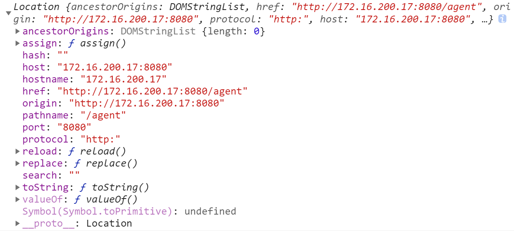
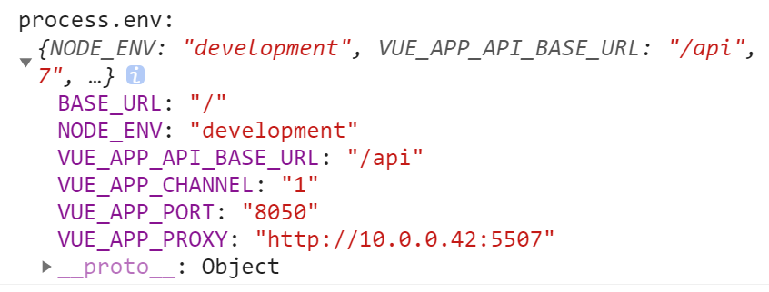
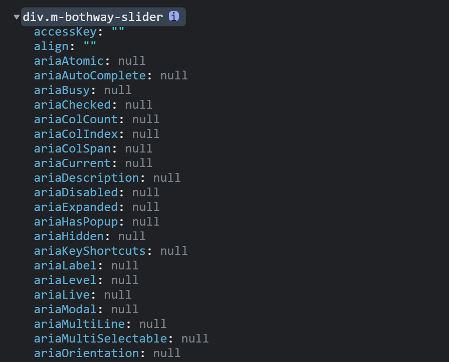

# Note 2

<BackTop />

## 向指定元素添加事件句柄（监听事件）[`EventTarget.addEventListener()`](https://developer.mozilla.org/zh-CN/docs/Web/API/EventTarget/addEventListener)

该方法将指定的监听器注册到 `EventTarget` 上，当该对象触发指定的事件时，指定的回调函数就会被执行。事件目标可以是一个文档上的元素 `Element`、`Document` 和 `Window`，也可以是任何支持事件的对象（比如 `XMLHttpRequest`）。

::: tip 备注
推荐使用 `addEventListener()` 来注册一个事件监听器，理由如下：

- 它允许为一个事件添加多个监听器。特别是对库、`JavaScript` 模块和其他需要兼容第三方库/插件的代码来说，这一功能很有用。
- 相比于 `onXYZ` 属性绑定来说，它提供了一种更精细的手段来控制 `listener` 的触发阶段。（即可以选择捕获或者冒泡）。
- 它对任何事件都有效，而不仅仅是 `HTML` 或 `SVG` 元素。
:::

`addEventListener()` 的工作原理是将实现 `EventListener` 的函数或对象添加到调用它的 `EventTarget` 上的指定事件类型的事件侦听器列表中。如果要绑定的函数或对象已经被添加到列表中，该函数或对象不会被再次添加。

::: tip 备注
如果先前向事件侦听器列表中添加过一个匿名函数，并且在之后的代码中调用 `addEventListener` 来添加一个功能完全相同的匿名函数，那么之后的这个匿名函数也会被添加到列表中。

实际上，即使使用完全相同的代码来定义一个匿名函数，这两个函数仍然存在区别，在循环中也是如此。在使用该方法的情况下，匿名函数的重复定义会带来许多麻烦，详见下文中的内存问题一节。
:::

当一个 `EventListener` 在 `EventTarget` 正在处理事件的时候被注册到 `EventTarget` 上，它不会被立即触发，但可能在事件流后面的事件触发阶段被触发，例如可能在捕获阶段添加，然后在冒泡阶段被触发。

- 语法：

```js
addEventListener(type, listener)
addEventListener(type, listener, options)
addEventListener(type, listener, useCapture)
```

- 参数：
  - `type`：表示监听事件类型的**大小写敏感**的字符串。
  - `listener`：当所监听的事件类型触发时，会接收到一个事件通知（实现了 `Event` 接口的对象）对象。`listener` 必须是一个实现了 `EventListener` 接口的对象，或者是一个函数。有关回调本身的详细信息，请参阅事件监听回调
  - `options` <Tag :bordered="false" color="cyan">可选</Tag>
    一个指定有关 `listener` 属性的可选参数对象。可用的选项如下：
    - `capture` <Tag :bordered="false" color="cyan">可选</Tag>

      一个布尔值，表示 `listener` 会在该类型的事件捕获阶段传播到该 `EventTarget` 时触发。
    - `once` <Tag :bordered="false" color="cyan">可选</Tag>

      一个布尔值，表示 `listener` 在添加之后最多只调用一次。如果为 `true`，`listener` 会在其被调用之后自动移除。
    - `passive` <Tag :bordered="false" color="cyan">可选</Tag>

      一个布尔值，设置为 `true` 时，表示 `listener` 永远不会调用 `preventDefault()`。如果 `listener` 仍然调用了这个函数，客户端将会忽略它并抛出一个控制台警告。查看使用 `passive` 改善滚屏性能以了解更多。
    - `signal` <Tag :bordered="false" color="cyan">可选</Tag>

      [`AbortSignal`](https://developer.mozilla.org/zh-CN/docs/Web/API/AbortSignal)，该 `AbortSignal` 的 `abort()` 方法被调用时，监听器会被移除。
  - `useCapture` <Tag :bordered="false" color="cyan">可选</Tag>
  
    一个布尔值，表示在 `DOM` 树中注册了 `listener` 的元素，是否要先于它下面的 `EventTarget` 调用该 `listener`。当 `useCapture`（设为 `true`）时，沿着 `DOM` 树向上冒泡的事件不会触发 `listener`。当一个元素嵌套了另一个元素，并且两个元素都对同一事件注册了一个处理函数时，所发生的事件冒泡和事件捕获是两种不同的事件传播方式。事件传播模式决定了元素以哪个顺序接收事件。进一步的解释可以查看 `DOM Level 3` 事件及 `JavaScript` 事件顺序文档。如果没有指定，`useCapture` 默认为 `false`。

`document.addEventListener()` 方法用于向文档添加事件句柄。

### `option` 支持的安全检测

<br/>

在旧版本的 `DOM` 的规定中，`addEventListener()` 的第三个参数是一个布尔值，表示是否在捕获阶段调用事件处理程序。随着时间的推移，很明显需要更多的选项。与其在方法之中添加更多参数（传递可选值将会变得异常复杂），倒不如把第三个参数改为一个包含了各种属性的对象，这些属性的值用来被配置删除事件侦听器的过程。

因为旧版本的浏览器（以及一些相对不算古老的）仍然假定第三个参数是布尔值，你需要编写一些代码来有效地处理这种情况。你可以对每一个你感兴趣的 `options` 值进行特性检测。

如果你想检测 `passive` 值，可以参考下面这个例子：

```js
let passiveSupported = false

try {
  const options = {
    get passive() {
      // 该函数会在浏览器尝试访问 passive 值时被调用。
      passiveSupported = true
      return false
    },
  }

  window.addEventListener("test", null, options)
  window.removeEventListener("test", null, options)
} catch (err) {
  passiveSupported = false
}
```

### 示例

添加一个可被移除的监听器

这个例子用来展示如何使用 `addEventListenter()` 添加一个可被 `AbortSignal` 移除的侦听器。

```html
<table id="outside">
  <tr>
    <td id="t1">one</td>
  </tr>
  <tr>
    <td id="t2">two</td>
  </tr>
</table>
```

```js
// 为 table 添加可被移除的事件监听器
const controller = new AbortController()
const el = document.getElementById("outside")
el.addEventListener("click", modifyText, { signal: controller.signal })

// 改变 t2 内容的函数
function modifyText() {
  const t2 = document.getElementById("t2")
  if (t2.firstChild.nodeValue === "three") {
    t2.firstChild.nodeValue = "two"
  } else {
    t2.firstChild.nodeValue = "three"
    controller.abort() // 当值变为 "three" 后，移除监听器
  }
}
```

::: tip 提示
可以使用 [document.removeEventListener()](https://developer.mozilla.org/zh-CN/docs/Web/API/EventTarget/removeEventListener) 方法来移除 `addEventListener()` 方法添加的事件句柄。
:::

::: tip 提示
使用 `element.addEventListener()` 方法为指定元素添加事件句柄。
:::

```js
// 禁用 H5 页面的下拉刷新
document.body.addEventListener('touchmove', this.touchMove, { passive: false })
touchMove (e) {
  e.preventDefault()
  // 自动清理自己，避免内存泄漏
  this.$once('hook:beforeDestroy', function () {
    removeEventListener('touchmove', this.touchMove)
  })
}
```

**事件冒泡和事件捕获分别由微软和网景公司提出，这两个概念都是为了解决页面中事件流（事件发生顺序）的问题。**

```html
<div id="parent">
  <p id="child">Click me!</p>
</div>
```

如果子元素 p 和父元素 div 都有一个 click 的处理函数，那么哪一个函数会首先被触发呢？

为了解决这个问题微软和网景提出了两种几乎完全相反的概念，微软提出了名为事件冒泡(`event bubbling`)的事件流，网景提出另一种事件流名为事件捕获(`event capturing`)。

- 事件冒泡可以理解为把一颗石头投入水中，泡泡会一直从水底冒出水面。也就是说，事件会从最内层的元素开始发生，一直向上传播，直到document对象。因此上面的例子在事件冒泡的概念下发生click事件的顺序应该是：`p -> div -> body -> html -> document`
- 事件捕获与事件冒泡相反，事件会从最外层开始发生，直到最内层的元素。上面的例子在事件捕获的概念下发生click事件的顺序应该是：`document -> html -> body -> div -> p`

::: tip 注
对于事件代理来说，在事件捕获或者事件冒泡阶段处理并没有明显的优劣之分，但是由于事件冒泡的事件流模型被所有主流的浏览器兼容，从兼容性角度来说还是建议大家使用事件冒泡模型。
:::

阻止事件冒泡：

- 给子级加 `event.stopPropagation()` 只阻止事件往上冒泡，不阻止事件本身（默认事件）

```js
const el = document.getElementById('child')
el.onclick (function (e) {
  const e = event || window.event
  event.stopPropagation()
})
```

- 在事件处理函数中 `return false` 不仅阻止了事件往上冒泡，而且阻止了事件本身（默认事件）

```js
el.onclick (function (event) {
  var e = e || window.event
  return false
})
```

- 让触发事件的元素等于绑定事件的元素，也可以阻止事件冒泡

```js
el.onclick = function (event) {
  if (event.target == event.currentTarget) {
    console.log('child')
  }
}
```

- 阻止默认事件（即事件本身）
  1. `event.preventDefault()`
  2. `return false`

## 移除事件监听器 [EventTarget.removeEventListener()](https://developer.mozilla.org/zh-CN/docs/Web/API/EventTarget/removeEventListener)

`EventTarget` 的 `removeEventListener()` 方法可以删除使用 `EventTarget.addEventListener()` 方法添加的事件。可以使用事件类型，事件侦听器函数本身，以及可能影响匹配过程的各种可选择的选项的组合来标识要删除的事件侦听器。参见下文的匹配要删除的事件监听器。

调用 `removeEventListener()` 时，若传入的参数不能用于确定当前注册过的任何一个事件监听器，该函数不会起任何作用。

如果一个 `EventTarget` 上的事件监听器在另一监听器处理该事件时被移除，那么它将不能被事件触发。不过，它可以被重新绑定。

::: warning 警告
如果同一个事件监听器分别为“事件捕获（`capture` 为 `true`）”和“事件冒泡（`capture` 为 `false`）”注册了一次，这两个版本的监听器需要分别移除。移除捕获监听器不会影响非捕获版本的相同监听器，反之亦然。
:::

### 语法

```js
removeEventListener(type, listener)
removeEventListener(type, listener, options)
removeEventListener(type, listener, useCapture)
```

### 参数

- `type`：一个字符串，表示需要移除的事件类型。
- `listener`：需要从目标事件移除的事件监听器函数。
- `options` <Tag :bordered="false" color="cyan">可选</Tag>：一个指定事件侦听器特征的可选对象。可选项有：
  - `capture`: 一个布尔值，指定需要移除的事件监听器函数是否为捕获监听器。如果未指定此参数，默认值为 `false`。
- `capture`: <Tag :bordered="false" color="cyan">可选</Tag>：一个布尔值，指定需要移除的事件监听器函数是否为捕获监听器。如果未指定此参数，默认值为 `false`。

### 示例

```js
const body = document.querySelector('body')
const clickTarget = document.getElementById('click-target')
const mouseOverTarget = document.getElementById('mouse-over-target')

let toggle = false
function makeBackgroundYellow() {
  body.style.backgroundColor = toggle ? 'white' : 'yellow'

  toggle = !toggle
}

clickTarget.addEventListener('click', makeBackgroundYellow, false)

mouseOverTarget.addEventListener('mouseover', () => {
  clickTarget.removeEventListener('click', makeBackgroundYellow, false)
})
```

## window.location对象

`Location` 接口表示其链接到的对象的位置（`URL`）。所做的修改反映在与之相关的对象上。 `Document` 和 `Window` 接口都有这样一个链接的 `Location`，分别通过 `Document.location` 和 `Window.location` 访问。

属性 | 描述
-- | --
`location.href` | 包含整个 `URL` 的一个 [`DOMString`](https://developer.mozilla.org/zh-CN/docs/Web/JavaScript/Reference/Global_Objects/String)
`location.protocol` | 包含 `URL` 对应协议的一个 `DOMString`，最后有一个":"
`location.host` | 包含了域名的一个 `DOMString`，可能在该串最后带有一个":"并跟上 `URL` 的端口号
`location.hostname` | 包含 `URL` 域名的一个 `DOMString`
`location.port` | 包含端口号的一个 `DOMString`
`location.pathname` | 包含 `URL` 中路径部分的一个 `DOMString`，开头有一个 /
`location.search` | 包含 `URL` 参数的一个 `DOMString`，开头有一个“?”
`location.hash` | 包含块标识符的 `DOMString`，开头有一个 #
`location.username` | 包含 `URL` 中域名前的用户名的一个 `DOMString`
`location.password` | 包含 `URL` 域名前的密码的一个 `DOMString`
`location.origin`<Tag :bordered="false" color="cyan">只读</Tag> | 包含页面来源的域名的标准形式 `DOMString`

假设当前网页路由：`http://172.16.200.17:8080/agent`



## `process.env`

[参考文档](http://nodejs.cn/api/process.html#process_process_env)

**process.env 属性返回包含用户环境的对象**

::: warning
`process` 对象是 `global` 对象的属性，是一个全局对象，`NODE_ENV` 不是 `process.env` 对象上原有的属性，它是我们自己添加上去的一个环境变量，用来确定当前所处的开发阶段。一般生产阶段设为 `production`，开发阶段设为`development`，然后在脚本中读取 `process.env.NODE_ENV`
:::

`process.env` 包含着关于系统环境的信息，但是 `process.env` 中并不存在 `NODE_ENV` 这个东西。
`NODE_ENV` 是一个用户自定义的变量，在 `webpack` 中它的用途是判断生产环境或开发环境。
`node` 中的 `process` 对象是一个全局对象，**表示当前的node进程，任何地方都能访问到它，通过这个对象提供的属性和方法，使我们可以对当前运行的程序的进程进行访问和控制。**

```js
console.log(process === global.process) // true
```

常用的一些属性：

- `process.env` `<Object>`：返回包含用户环境的对象。
- `process.platform` `<string>`：返回用于标识编译 Node.js 二进制文件的操作系统平台的字符串。
目前可能的值是：'aix'，'darwin'，'freebsd'，'linux'，'openbsd'，'sunos'，'win32'

```js
import { platform } from 'process'
console.log(`This platform is ${platform}`)
```

如果 `Node.js` 是在安卓操作系统上构建的，则也可能返回值 'android'。 但是，Node.js 中的安卓支持是实验的。

- `process.uptime()` `<number>`：返回当前 Node.js 进程已经运行的秒数。
返回值包括几分之一秒。 使用 Math.floor() 获得整秒。
- `process.version` `<string>`：返回包含Node.js版本字符串。

```js
import { version } from 'process'
console.log(`Version: ${version}`)
```

// Version: v14.8.0
要获取不带 v 的版本字符串，则使用 `process.versions.node`。

- `process.versions` `<Object>`：返回对象，其中列出Node.js的版本字符串及其依赖项。

```js
import { versions } from 'process'
console.log(versions)
```

- 开发环境下的配置文件 `.env.development`：

```bash
NODE_ENV=development
VUE_APP_API_BASE_URL=/api
```

- 生产环境下的配置文件 `.env.production`：

```bash
NODE_ENV=production
VUE_APP_API_BASE_URL=''
```

- 本地开发配置文件 `.env.local`：

```bash
VUE_APP_PROXY=http://10.0.0.42:5507
VUE_APP_PORT=8050
VUE_APP_CHANNEL=1  // 自定义全局变量，必须以VUE_APP开头
```



## DOM事件对象

```html
<div>
  <p>
    <span></span>
  </p>
</div>
```

事件名 | 说明
-- | --
`onmouseenter` | `onmouseenter` 事件在鼠标指针移动到元素上时触发。<br>只有当鼠标指针进入 div 元素时触发，内部移动不会再次触发。<br>**提示：该事件通常与 `onmouseleave` 事件一同使用, 在鼠标指针移出元素上时触发。**
`onmouseleave` | `onmouseleave` 事件在鼠标移出元素时触发。<br>**提示：该事件通常与 `onmouseenter` 事件一起使用， 该事件在鼠标移动到元素上时触发。**
`onmouseover` | `onmouseover` 事件会在鼠标指针移动到指定的元素上时发生。<br>当鼠标指针进入 div 元素时会触发，当指针进入子元素上时也会触发(p 和 span)。
`onmouseout` | `onmouseout` 事件会在鼠标指针移出指定的对象时发生。父元素进入子元素，或者子元素进入父元素都会触发。

::: tip 提示
`onmouseenter` 事件类似于 `onmouseover` 事件。 唯一的区别是 `onmouseenter` 事件不支持冒泡 。
提示: `onmouseleave` 事件类似于 `onmouseout` 事件。 唯一的区别是 `onmouseleave` 事件不支持冒泡 。
:::

鼠标事件 | 描述
-- | --
onclick | 当用户点击某个对象时调用的事件句柄
oncontextmenu | 在用户点击鼠标右键打开上下文菜单时触发
ondblclick | 当用户双击某个对象时调用的事件句柄
onmousedown | 鼠标按钮被按下
onmouseenter | 当鼠标指针移动到元素上时触发
onmouseleave | 当鼠标指针移出元素时触发
onmousemove | 鼠标被移动
onmouseover | 鼠标移到某元素之上
onmouseout | 鼠标从某元素移开
onmouseup | 鼠标按键被松开

## 简单倒计时 countDown

```html
<h1 ref="countdown">{{ countDown('2023-10-01 18:25:00') }}</h1>
```

```js
countDown (target) {
  let timestamp = new Date(target).getTime() - Date.now()
  var elapseTime = function (timestamp) {
    var h = parseInt(timestamp / 1000 / 60 / 60)
    var m = parseInt((timestamp / 1000 - h * 60 * 60) / 60)
    var s = parseInt(timestamp / 1000 - h * 60 * 60 - m * 60)
    return `还剩余${h}小时${m}分钟${s}秒`
  }
  setInterval(() => {
    timestamp = timestamp - 1000
    if (timestamp <= 0) {
      this.$refs.countdown.innerHTML = '下班了'
    } else {
      this.$refs.countdown.innerHTML = elapseTime(timestamp)
    }
  }, 1000)
}
```

## `console` 对象

[console MDN](https://developer.mozilla.org/zh-CN/docs/Web/API/console)

- `console.log()`
  对象占位符：`%o` 或 `%O`
  - 当打印普通的 `object` 对象时没有区别
  - 当打印 `DOM` 对象时

    ```html
    <div ref="slider"></div>
    ```

    - `%o`

    ```js
    console.log('%o', this.$refs.slider) // slider:%o
    ```

    

    - `%O`

    ```js
    console.log('%O', this.$refs.slider) // slider:%O
    ```

    

## js中 `href` 属性中变量连接符需要使用 `&amp;`

```js
href = '/user/login?type=0&amp;tab=-1'
this.$router.push('/register?type=0&tab=-1')
```
