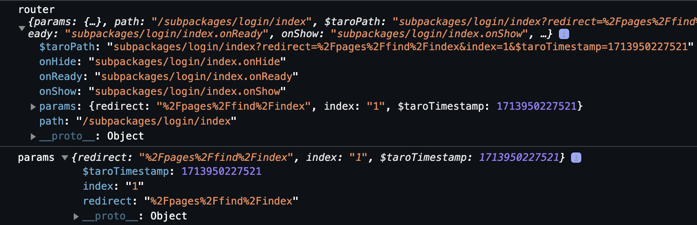
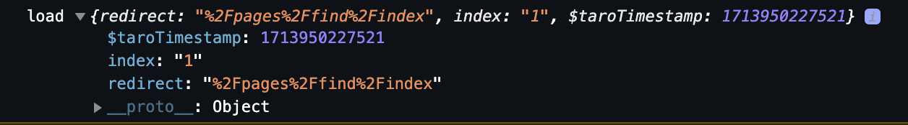

# `Taro3` & `Vue3` & `typescript` & `less`

## 参考文档

- [Taro官网](https://taro.zone/)
- [微信开发者工具](https://developers.weixin.qq.com/miniprogram/dev/devtools/download.html)
- [微信官方文档](https://developers.weixin.qq.com/miniprogram/dev/framework/)
- [微信公众平台](https://mp.weixin.qq.com/)
- [Nut UI](https://nutui.jd.com/taro/vue/4x/#/zh-CN/guide/start)

## [微信小程序自定义Tabbar](https://taro-docs.jd.com/docs/custom-tabbar)

- 在 `src/app.config.ts` 中的 tabBar 项指定 `custom: true` 字段，同时其余 `tabBar` 相关配置也补充完整。

```ts
export default defineAppConfig({
  tabBar: {
    custom: true,
    color: '#AAAAAA',
    selectedColor: '#000000',
    borderStyle: 'black',
    backgroundColor: '#ffffff',
    list: [
      {
        pagePath: 'pages/index/index',
        iconPath: 'images/home_unactive.png',
        selectedIconPath: 'images/home_active.png',
        text: 'Home'
      },
      {
        pagePath: 'pages/find/index',
        iconPath: 'images/home_unactive.png',
        selectedIconPath: 'images/home_active.png',
        text: 'Find'
      },
      {
        pagePath: 'pages/my/index',
        iconPath: 'images/home_unactive.png',
        selectedIconPath: 'images/home_active.png',
        text: 'My'
      }
    ]
  }
})
```

- 在 `src/` 下创建 `custom-tab-bar` 文件夹：


<br/>

`index.config.ts` 配置如下：

```ts
export default {
  component: true
}
```

`index.vue` 文件如下：

1. 自定义 `tabBar` 组件：

```vue
<script lang="ts">
  export default {
    options: {
      addGlobalClass: true // 解决tabbar样式隔离导致的<IconFont />图标无法显示问题
    }
  }
</script>
<script setup lang="ts">
import Taro from '@tarojs/taro'
import { IconFont } from '@nutui/icons-vue-taro'
import { storeToRefs } from 'pinia'
import { useSelectedStore } from '@/stores/selected'

const store = useSelectedStore()
const { selected } = storeToRefs(store)

const systemInfo = Taro.getSystemInfoSync() // 获取系统信息
const theme:'light'|'dark' = systemInfo.theme || 'light'
console.log('systemInfo', systemInfo)
console.log('theme', theme)

const themeStyle = {
  light: {
    color: '#AAAAAA',
    activeColor: '#000000',
    backgroundColor: '#F9F9F9'
  },
  dark: {
    color: '#AAAAAA',
    activeColor: '#F5F5F5',
    backgroundColor: 'rgba(0, 0, 0, .65)'
  }
}
const tabBarList = [
  {
    title: 'Home',
    icon: 'home',
    url: '/pages/index/index'
  },
  {
    title: 'Find',
    icon: 'find',
    url: '/pages/find/index'
  },
  {
    title: 'My',
    icon: 'my',
    url: '/pages/my/index'
  }
]
function switchTab (index: number, url: string) {
  const isAuthorized = Taro.getStorageSync('isAuthorized') || false
  const authorizeInterception = ['/pages/my/index']
  if (!isAuthorized && authorizeInterception.includes(url)) {
    Taro.navigateTo({
      url: `/subpackages/login/index?redirect=${encodeURIComponent(url)}&index=${index}`
    })
  } else {
    store.setSelected(index)
    Taro.switchTab({ url })
  }
}
</script>
<template>
  <view class="m-tab-bar" :style="`background-color: ${themeStyle[theme].backgroundColor};`">
    <view
      class="m-tab-bar-item"
      v-for="(tabBar, index) in tabBarList" :key="index"
      @tap="switchTab(index, tabBar.url)">
      <IconFont class="u-icon" :name="tabBar.icon" v-show="selected === index" :color="themeStyle[theme].activeColor" />
      <IconFont class="u-icon" :name="tabBar.icon" v-show="selected !== index" :color="themeStyle[theme].color" />
      <text class="u-view" :style="{ color: selected === index ? themeStyle[theme].activeColor : themeStyle[theme].color }">{{ tabBar.title }}</text>
    </view>
  </view>
</template>
<style lang="less">
.m-tab-bar {
  position: fixed;
  bottom: 0;
  left: 0;
  right: 0;
  height: calc(100px + env(safe-area-inset-bottom));
  background: #FFFFFF;
  display: flex;
  z-index: 999;
  .m-tab-bar-item {
    flex: 1;
    text-align: center;
    display: flex;
    align-items: center;
    flex-direction: column;
    .u-icon {
      font-size: 40px;
      width: 68px;
      height: 68px;
    }
    .u-view {
      font-weight: 400;
      font-size: 24px;
      line-height: 32px;
    }
  }
}
</style>
```

2. 使用 `<nut-tabbar/>` 组件

```vue
<script lang="ts">
  export default {
    options: {
      addGlobalClass: true // 解决tabbar样式隔离导致的<IconFont />图标无法显示问题
    }
  }
</script>
<script setup lang="ts">
import { h } from 'vue'
import { storeToRefs } from 'pinia'
import Taro from '@tarojs/taro'
import { useSelectedStore } from '@/stores/selected'
import { Home, Find, My } from '@nutui/icons-vue-taro'

const store = useSelectedStore()
const { selected } = storeToRefs(store)

const systemInfo = Taro.getSystemInfoSync() // 获取系统信息
const theme:'light'|'dark' = systemInfo.theme || 'light'
console.log('theme', theme)

const themeStyle = {
  light: {
    color: '#AAAAAA',
    activeColor: '#000000',
    backgroundColor: '#FFFFFF'
  },
  dark: {
    color: '#AAAAAA',
    activeColor: '#F5F5F5',
    backgroundColor: 'rgba(0, 0, 0, .65)'
  }
}
const tabBarList = [
  {
    title: 'Home',
    icon: h(Home),
    url: '/pages/index/index'
  },
  {
    title: 'Find',
    icon: h(Find),
    url: '/pages/find/index'
  },
  {
    title: 'My',
    icon: h(My),
    url: '/pages/my/index'
  }
]
function switchTab (index: number, url: string) {
  const isAuthorized = Taro.getStorageSync('isAuthorized') || false
  const authorizeInterception = ['/pages/my/index']
  if (!isAuthorized && authorizeInterception.includes(url)) {
    Taro.navigateTo({
      url: `/subpackages/login/index?redirect=${encodeURIComponent(url)}&index=${index}`
    })
  } else {
    store.setSelected(index)
    Taro.switchTab({ url })
  }
}
</script>
<template>
  <nut-tabbar
    :style="`--backgroundColor: ${themeStyle[theme].backgroundColor};`"
    :unactive-color="themeStyle[theme].color"
    :active-color="themeStyle[theme].activeColor"
    bottom
    safe-area-inset-bottom
    placeholder
    v-model="selected">
    <nut-tabbar-item
      v-for="(tabBar, index) in tabBarList" :key="index"
      :tab-title="tabBar.title"
      :icon="tabBar.icon"
      @tap="switchTab(index, tabBar.url)">
    </nut-tabbar-item>
  </nut-tabbar>
</template>
<style lang="less">
.nut-tabbar {
  background-color: var(--backgroundColor);
}
</style>
```

- 使用 `pinia` 进行全局 `selected` 状态管理，在 `src/stores/` 下创建 `selected.ts` 文件:

安装 `pinia`

```bash
pnpm i pinia
```

```ts
import { defineStore } from 'pinia'
import { ref } from 'vue'

// 你可以任意命名 `defineStore()` 的返回值，但最好使用 store 的名字，同时以 `use` 开头且以 `Store` 结尾。
// (比如 `useUserStore`，`useCartStore`，`useProductStore`)
// 第一个参数是你的应用中 Store 的唯一 ID。

// Setup Store
export const useSelectedStore = defineStore('selected', () => {
  const selected = ref<number>(0)
  function setSelected (value: number) {
    selected.value = value
  }
  return { selected, setSelected }
})
```

## 微信小程序授权 [Taro.authorize(option)](https://taro-docs.jd.com/docs/apis/open-api/authorize/)

提前向用户发起授权请求。调用后会立刻弹窗询问用户是否同意授权小程序使用某项功能或获取用户的某些数据，但不会实际调用对应接口。如果用户之前已经同意授权，则不会出现弹窗，直接返回成功。更多用法详见 用户授权。

## 微信小程序[手机号授权](https://developers.weixin.qq.com/miniprogram/dev/framework/open-ability/getPhoneNumber.html)

**目前该接口针对非个人开发者，且完成了认证的小程序开放**

```vue
<script setup lang="ts">
function getPhoneNumber (e) {
  console.log('e', e)
  console.log('detail', e.detail)
  console.log('code', e.detail.code)
  if (e.detail.code) { // 授权成功
    onLogin(e.detail) // 调用接口登录
  } else { // 授权失败
    Taro.showToast({
      title: '手机号授权失败',
      icon: 'error',
      mask: true
    })
  }
}
</script>
<template>
  <button open-type="getPhoneNumber" @getPhoneNumber="getPhoneNumber">微信一键登录</button>
</template>
```

## 微信小程序扫码 [Taro.scanCode(option)](https://taro-docs.jd.com/docs/apis/device/scan/scanCode)

调起客户端扫码界面，扫码成功后返回对应的结果

```vue
<script setup lang="ts">
function onScan () {
  // 通过 Taro.getSetting 先查询一下用户是否授权了 "scope.camera" 这个 scope
  Taro.getSetting({
    success: (res) => {
      console.log('getSetting', res)
      if (!res.authSetting['scope.camera']) {
        Taro.authorize({
          scope: 'scope.camera',
          success: () => {
            scanCode()
          },
          fail: () => {
            Taro.showToast({
              title: '摄像头授权失败',
              icon: 'error',
              mask: true,
              duration: 2000
            })
          }
        })
      } else {
        scanCode()
      }
    }
  })
}
function scanCode () {
  Taro.scanCode({
    // barCode（一维码） qrCode（二维码）datamatrix（Data Matrix 码）pdf417（PDF417 条码）
    scanType: ['barCode'],
    success: (res) => {
      // res.result 包含了扫描到的条形码信息
      console.log('scan res', res)
    },
    fail: (error) => {
      Taro.showToast({
        title: '扫码失败',
        icon: 'error',
        mask: true
      })
      console.error('扫码失败:', error)
    }
  })
}
</script>
<template>
  <button @tap="onScan">扫码</nut-button>
</template>
```

## 微信小程序生命周期 [Vue3 Composition APIs](https://taro-docs.jd.com/docs/composition-api#usedidshow)

```vue
<script setup lang="ts">
// 常用生命周期函数
import { useDidShow, useLoad, useUnload } from '@tarojs/taro'

// 每次页面显示时都会触发，页面显示/切入前台时均会触发
// 多用于页面的刷新、获取用户当前状态、更新页面显示信息等。
useDidShow(() => {
  console.log('show')
  // 每次显示页面时需要执行的操作
})
// 页面创建时执行，在页面加载时只触发一次，可以通过options访问页面路由参数
// 多用于调用接口进行数据的初始化，页面配置的设置等
useLoad((options) => {
  console.log('load', options)
  // 初始化操作
})
// 页面卸载时触发的钩子，当页面被关闭或切换到其他页面时触发
// 适合用来执行清理操作，比如取消网络请求、移除定时器、保存页面状态等，以避免资源泄露
onUnload(() => {
  console.log('unload')
  // 清理操作
})
</script>
```

## 微信小程序获取页面路由参数

- 使用 [useRouter](https://taro-docs.jd.com/docs/composition-api#userouter)



```vue
<script setup lang="ts">
import { useRouter } from '@tarojs/taro'

const router = useRouter()
console.log('router', router)
const params = router.params
console.log('params', params) // 页面路由参数
</script>
```

- 使用 [useLoad](https://taro-docs.jd.com/docs/composition-api#useload)



```vue
<script setup lang="ts">
import { useLoad } from '@tarojs/taro'

useLoad((options) => {
  console.log('load', options)
})
</script>
```

## 微信小程序配置`less`全局变量

在项目的通用配置 `config/index.ts` 写入相关配置

```ts
import { defineConfig, type UserConfigExport } from '@tarojs/cli'
import TsconfigPathsPlugin from 'tsconfig-paths-webpack-plugin'
import devConfig from './dev'
import prodConfig from './prod'
import Components from 'unplugin-vue-components/webpack'
import NutUIResolver from '@nutui/auto-import-resolver'
// import path from 'path'

// https://taro-docs.jd.com/docs/next/config#defineconfig-辅助函数
export default defineConfig(async (merge, { command, mode }) => {
  mini: {
    lessLoaderOption: { // 配置全局less变量
      lessOptions: {
        modifyVars: {
          themeColor: '#1677FF', // 主题色
          linkColor: '#008EEE' // 链接色
        }
      }
    }
  }
})
```

## 微信小程序使用 [env()](https://developer.mozilla.org/zh-CN/docs/Web/CSS/env) 函数

### 语法

<br/>

`env()`的第二个参数可选，如果环境变量不可用，该参数可让你设置备用值

```css
/* Using the four safe area inset values with no fallback values */
env(safe-area-inset-top)
env(safe-area-inset-right)
env(safe-area-inset-bottom)
env(safe-area-inset-left)

/* Using them with fallback values */
env(safe-area-inset-top, 20px)
env(safe-area-inset-right, 1em)
env(safe-area-inset-bottom, 0.5vh)
env(safe-area-inset-left, 1.4rem)
```

`env(safe-area-inset-bottom)` 是一种 CSS 环境变量，用于获取设备屏幕底部的安全区域大小，这通常是指屏幕底部可能被系统 UI（如状态栏、导航栏等）占据的空间。在微信小程序中，使用这种变量可以确保你的界面设计不会与系统 UI 重叠，从而提供更好的用户体验。

- `env(safe-area-inset-bottom)`: 获取屏幕**低部的安全区域大小**
- `env(safe-area-inset-top)`: 获取屏幕**顶部的安全区域大小**
- `env(safe-area-inset-left)`: 获取屏幕**左边的安全区域大小**
- `env(safe-area-inset-right)`: 获取屏幕**右边的安全区域大小**

这些环境变量允许开发者在设计小程序界面时，能够适应不同设备的屏幕形状和系统 UI 布局，避免内容被系统 UI 遮挡。

使用这些环境变量时，应该注意它们的支持情况，因为它们是 CSS 的较新特性，可能不是所有浏览器或环境中都可用。在微信小程序中，这些环境变量被用于适配不同的设备，确保小程序的 UI 设计能够适应各种屏幕形状和系统 UI 的布局。

## 微信小程序 [`<image/>`](https://taro-docs.jd.com/docs/components/media/image) 图片缩放 & 长按识别码

```vue
<template>
  <!--
    mode: 
    默认 scaleToFill: 缩放模式，不保持纵横比缩放图片，使图片的宽高完全拉伸至填满 image 元素
    aspectFit: 缩放模式，保持纵横比缩放图片，使图片的长边能完全显示出来。也就是说，可以完整地将图片显示出来。
    aspectFill: 缩放模式，保持纵横比缩放图片，只保证图片的短边能完全显示出来。也就是说，图片通常只在水平或垂直方向是完整的，另一个方向将会发生截取。
    widthFix: 缩放模式，宽度不变，高度自动变化，保持原图宽高比不变
    heightFix: 缩放模式，高度不变，宽度自动变化，保持原图宽高比不变

    show-menu-by-longpress: 长按图片显示发送给朋友、收藏、保存图片、搜一搜、打开名片/前往群聊/打开小程序（若图片中包含对应二维码或小程序码）的菜单。

    lazy-load: 图片懒加载，在即将进入一定范围（上下三屏）时才开始加载。Skyline 默认懒加载。只针对 page 与 scroll-view 下的 image 有效

    fade-in: 是否渐显，Skyline 特有属性

    onLoad: 当图片载入完毕时，发布到 AppService 的事件名，事件对象
  -->
  <image src="/path/logo.png" :mode="mode" show-menu-by-longpress fade-in @load="onLoad" />
</template>
```

::: tip Bug & Tip
tip：image组件默认宽度320px、高度240px
tip：image组件进行缩放时，计算出来的宽高可能带有小数，在不同webview内核下渲染可能会被抹去小数部分
:::

## 微信小程序富文本 [`<RichText>`](https://taro-docs.jd.com/docs/components/base/rich-text) 内容展示相关问题

```vue
<script setup lang="ts">
// 内容图片过大溢出问题
content = content.replace(/
<template>
  <rich-text :nodes="content"></rich-text>
</template>
```

## 微信小程序去掉 `<button>` 默认边框

在 `src/app.less` 中定义全局样式

```less
button {
  &::after {
    border: none;
  }
}
```
