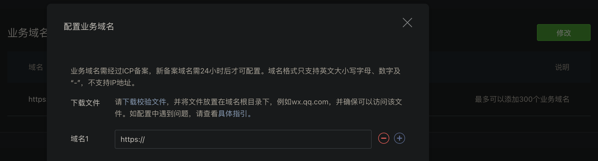

# `Taro3` & `Vue3` & `typescript` & `less`

<BackTop />

## 参考文档

- [Taro官网](https://taro.zone/)
- [微信官方文档](https://developers.weixin.qq.com/miniprogram/dev/framework/)
- [微信公众平台](https://mp.weixin.qq.com/)
- [Nut UI](https://nutui.jd.com/taro/vue/4x/#/zh-CN/guide/start)

## 微信小程序文本复制

- [Taro.setClipboardData(option)](https://taro-docs.jd.com/docs/apis/device/clipboard/setClipboardData)

```vue
<script setup lang="ts">
import Taro from '@tarojs/taro'
const text = '我是要复制的文本'
function onCopy () {
  Taro.setClipboardData({
    data: text,
    success: () => {
      Taro.showToast({
        title: '复制成功',
        icon: 'success'
      })
    },
    fail: () => {
      Taro.showToast({
        title: '复制失败',
        icon: 'none'
      })
    }
  })
}
</script>
<template>
  <button @tap="onCopy">复制文本</button>
</template>
```

## 微信小程序获取系统环境信息

- [Taro.getSystemInfo(res)](https://taro-docs.jd.com/docs/apis/base/system/getSystemInfo)

获取系统信息，支持 Promise 化使用

```vue
<script setup lang="ts">
import Taro from '@tarojs/taro'

Taro.getSystemInfo({
  success: (res) => {
    console.log('systemInfo', res)
    Taro.setStorageSync('platform', res.platform)
  },
  fail: () => {
    console.error('无法获取系统信息')
  }
})
</script>
```

## 微信小程序针对不同操作系统进行设置

```vue
<script setup lang="ts">
import { ref } from 'vue'
import Taro from '@tarojs/taro'

const isIOS = ref<boolean>()
const isAndroid = ref<boolean>()
Taro.getSystemInfo({
  success: (res) => {
    console.log('systemInfo', res)
    Taro.setStorageSync('platform', res.platform)
    isIOS.value = res.platform === 'ios'
    isAndroid.value = res.platform === 'android'
  },
  fail: () => {
    console.error('无法获取系统信息')
  }
})
</script>
```

## 微信小程序获取页面路由层级

- [Taro.getCurrentPages()](https://taro-docs.jd.com/docs/apis/framework/getCurrentPages)

获取当前页面栈。数组中第一个元素为首页，最后一个元素为当前页面。 注意：

- 不要尝试修改页面栈，会导致路由以及页面状态错误。
- 不要在 `App.onLaunch` 的时候调用 `getCurrentPages()`，此时 `page` 还没有生成。

```vue
<script setup lang="ts">
import { ref } from 'vue'
import Taro, { useLoad } from '@tarojs/taro'

const pages = ref<any[]>([])
useLoad(() => {
  pages.value = Taro.getCurrentPages()
})
</script>
```

## 微信小程序使用 `<web-view />` 组件

- [web-view](https://taro-docs.jd.com/docs/components/open/web-view)

`web-view` 组件是一个可以用来承载网页的容器，会自动铺满整个小程序页面。个人类型与海外类型的小程序暂不支持使用。

```vue
<template>
  <web-view src='https://mp.weixin.qq.com/' @message="handleMessage" />
</template>
```

在微信公众平台登录后，添加配置业务域名，然后下载校验文件放到嵌入项目的 `public` 目录下即可：



## [env()](https://developer.mozilla.org/zh-CN/docs/Web/CSS/env) CSS 函数

最初由 `iOS` 浏览器提供，用于允许开发人员将其内容放置在视口的安全区域中，该规范中定义的 `safe-area-inset-*` 值可用于确保内容即使在非矩形的视区中也可以完全显示。

### 语法

<br/>

`env()`的第二个参数可选，如果环境变量不可用，该参数可让你设置备用值

```css
/* Using the four safe area inset values with no fallback values */
env(safe-area-inset-top)
env(safe-area-inset-right)
env(safe-area-inset-bottom)
env(safe-area-inset-left)

/* Using them with fallback values */
env(safe-area-inset-top, 20px)
env(safe-area-inset-right, 1em)
env(safe-area-inset-bottom, 0.5vh)
env(safe-area-inset-left, 1.4rem)
```

### Values

<br/>

`safe-area-inset-top`, `safe-area-inset-right`, `safe-area-inset-bottom`, `safe-area-inset-left`
`safe-area-inset-*`由四个定义了视口边缘内矩形的 `top`, `right`, `bottom` 和 `left` 的环境变量组成，这样可以安全地放入内容，而不会有被非矩形的显示切断的风险。对于矩形视口，例如普通的笔记本电脑显示器，其值等于零。对于非矩形显示器（如圆形表盘，iPhoneX 屏幕），在用户代理设置的四个值形成的矩形内，所有内容均可见。

注意: 不同于其他的 `CSS` 属性，用户代理定义的属性名字对大小写敏感。

`env(safe-area-inset-bottom)` 是一种 `CSS` 环境变量，用于获取设备屏幕底部的安全区域大小，这通常是指屏幕底部可能被系统 `UI`（如状态栏、导航栏等）占据的空间。在微信小程序中，使用这种变量可以确保你的界面设计不会与系统 `UI` 重叠，从而提供更好的用户体验。

- `env(safe-area-inset-bottom)`: 获取屏幕**低部的安全区域大小**
- `env(safe-area-inset-top)`: 获取屏幕**顶部的安全区域大小**
- `env(safe-area-inset-left)`: 获取屏幕**左边的安全区域大小**
- `env(safe-area-inset-right)`: 获取屏幕**右边的安全区域大小**

这些环境变量允许开发者在设计小程序界面时，能够适应不同设备的屏幕形状和系统 `UI` 布局，避免内容被系统 `UI` 遮挡。

使用这些环境变量时，应该注意它们的支持情况，因为它们是 `CSS` 的较新特性，可能不是所有浏览器或环境中都可用。在微信小程序中，这些环境变量被用于适配不同的设备，确保小程序的 `UI` 设计能够适应各种屏幕形状和系统 `UI` 的布局。

## 微信小程序使用自定义导航栏（custom）

自定义导航栏/导航栏背景图；自定义导航标题操作图标；同时当页面向下滚动时，导航栏固定在顶部，背景自定义切换

- [wx.getWindowInfo()](https://developers.weixin.qq.com/miniprogram/dev/api/base/system/wx.getWindowInfo.html)
- [wx.getMenuButtonBoundingClientRect()](https://developers.weixin.qq.com/miniprogram/dev/api/ui/menu/wx.getMenuButtonBoundingClientRect.html)

```vue
<script setup lang="ts">
import { ref, computed } from 'vue'
// 获取状态栏的高度，单位 px
const { statusBarHeight } = Taro.getWindowInfo() // 获取窗口信息
// 获取胶囊按钮的高度，上边界坐标，单位 px
const { height, top } = Taro.getMenuButtonBoundingClientRect() // 获取菜单按钮（右上角胶囊按钮）的布局位置信息。坐标信息以屏幕左上角为原点。
const scrollTop = ref<number>(0)
const navStyle = computed(() => {
  return {
    paddingTop: `${statusBarHeight}px`, // 排除状态栏高度的影响
    height: `${statusBarHeight as number + height + (top - statusBarHeight as number) * 2}px`, // 导航栏 + 状态栏的整体高度
    lineHeight:`${height + (top - statusBarHeight as number) * 2}px` // 导航栏实际高度
  }
})
function onScroll (e: any) {
  scrollTop.value = e.detail.scrollTop
}
function onBack () {
  Taro.navigateBack()
}
</script>
<template>
  <scroll-view class="m-view" :scroll-y="true" @scroll="onScroll">
    <view class="nav-bar" :class="{ 'white-bg': scrollTop > 0 }" :style="navStyle">
      自定义的导航栏
      <view class="m-image" :style="imageStyle">
        <image class="back-arrow" @tap="onBack" src="@/images/arrow_back.png" />
      </view>
    </view>
  </scroll-view>
</template>
<style lang="less" scoped>
.m-view {
  position: relative;
  height: 100%;
  text-align: center;
  background: #F5F5F5 url('@/images/custom_bg.png') no-repeat top; // 自定义顶部背景图
  background-size: contain;
  .nav-bar {
    position: fixed;
    top: 0;
    z-index: 99;
    width: 100%;
    font-size: 34px;
    color: #000000;
    text-align: center;
    .m-image {
      position: absolute;
      left: 0;
      right: 0;
      bottom: 0;
      text-align: left;
      .back-arrow {
        margin-left: 16px;
        width: 56px;
        height: 56px;
        vertical-align: middle;
      }
    }
  }
  .white-bg { // 页面垂直滚动时，导航栏背景色变为白色
    background: #fff;
  }
}
</style>
```

## 微信小程序复制手机号或拨打电话

[wx.makePhoneCall(Object object)](https://developers.weixin.qq.com/miniprogram/dev/api/device/phone/wx.makePhoneCall.html)

```vue
<script setup lang="ts">
import { ref } from 'vue'
import Taro from '@tarojs/taro'
const mobile = ref('18866668888')
const showPhone = ref(false)
function onPhone () {
  showPhone.value = true
}
interface Item {
  name: string
  key: number
}
const menuItems: Item[] = [
  {
    name: '拨打该号码',
    key: 1
  },
  {
    name: '复制该号码',
    key: 2
  }
]
function onChoose (item: Item) {
  if (item.key === 1) {
    Taro.makePhoneCall({
      phoneNumber: mobile.value
    })
  } else {
    Taro.setClipboardData({
      data: mobile.value,
      success: () => {
        Taro.showToast({
          title: '号码已复制',
          icon: 'success'
        })
      },
      fail: () => {
        Taro.showToast({
          title: '复制失败',
          icon: 'none'
        })
      }
    })
  }
}
</script>
<template>
  <view>
    <nut-button type="primary" @click="onPhone">拨打电话</nut-button>
    <nut-action-sheet
      v-model:visible="showPhone"
      :menu-items="menuItems"
      cancel-txt="取消"
      @choose="onChoose"
    />
  </view>
</template>
```

## 微信小程序添加通讯录

[wx.addPhoneContact(Object object)](https://developers.weixin.qq.com/miniprogram/dev/api/device/contact/wx.addPhoneContact.html)

```vue
<script setup lang="ts">
import { ref } from 'vue'
import Taro from '@tarojs/taro'
const useInfo = ref({
  firstName: 'the Muse',
  lastName: 'Catcher',
  mobile: '18866668888',
  wechat: 'themusecatcher',
  email: 'themusecatcher@163.com',
  url: 'https://themusecatcher.github.io/vue-amazing-ui/'
})
function onContact () {
  Taro.addPhoneContact({
    firstName: useInfo.value.name, // 名字
    lastName: userInfo.value.lastName, // 姓氏
    mobilePhoneNumber: useInfo.value.mobile, // 手机号
    weChatNumber: useInfo.value.wechat, // 微信号
    email: useInfo.value.email, // 电子邮件
    url: useInfo.value.url // 网站
  })
}
</script>
<template>
  <view>
    <nut-button type="primary" @click="onContact">添加通讯录</nut-button>
  </view>
</template>
```
