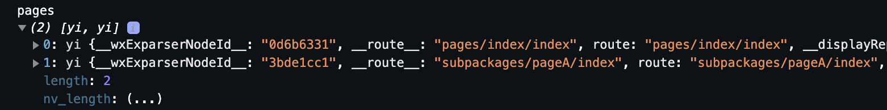

# `Taro3` & `Vue3` & `typescript` & `less`

<BackTop />

## 参考文档

- [Taro官网](https://taro.zone/)
- [微信官方文档](https://developers.weixin.qq.com/miniprogram/dev/framework/)
- [微信公众平台](https://mp.weixin.qq.com/)
- [Nut UI](https://nutui.jd.com/taro/vue/4x/#/zh-CN/guide/start)

## 微信小程序预览文件

- 需首先在[微信公众平台](https://mp.weixin.qq.com/) > 开发管理下 > 配置 `downloadFile`合法域名
- 使用 [`Taro.downloadFile(option)`](https://taro-docs.jd.com/docs/apis/network/download/downloadFile) 下载文件资源到本地。客户端直接发起一个 HTTPS GET 请求，返回文件的本地临时路径，单次下载允许的最大文件为 50MB。
- 然后使用 [`Taro.openDocument(option)`](https://taro-docs.jd.com/docs/apis/files/openDocument) 新开页面打开文档进行预览

```vue
<script setup lang="ts">
function onPDF (url: string) {
  Taro.showLoading({
    title: '加载中',
    mask: true
  })
  Taro.downloadFile({
    url: url,
    success: (res) => {
      console.log('result', res)
      Taro.openDocument({
        filePath: res.tempFilePath,
        success: (res) => {
          console.log('打开文档成功', res)
        },
        fail: () => {
          Taro.showToast({
            title: '打开文档失败',
            icon: 'error',
            mask: true
          })
        },
        complete: () => {
          Taro.hideLoading()
        }
      })
    },
    fail: () => {
      Taro.hideLoading()
      Taro.showToast({
        title: '下载文档失败',
        icon: 'error',
        mask: true
      })
    }
  })
}
</script>
<template>
  <button @tap="onPDF(url)">协议预览</nut-button>
</template>
```

## 微信小程序[下拉刷新](https://taro-docs.jd.com/docs/composition-api#usepulldownrefresh)

在页面的 `index.config.ts` 中写入配置：

```ts{3}
export default definePageConfig({
  navigationBarTitleText: '首页',
  enablePullDownRefresh: true
})
```

```vue
<script setup lang="ts">
import Taro, { usePullDownRefresh } from '@tarojs/taro'

usePullDownRefresh(() => {
  console.log('onPullDownRefresh')
  setTimeout(() => { // 模拟接口调用
    Taro.stopPullDownRefresh()
  }, 1000)
})
// 或者
usePullDownRefresh(async () => {
  await // 接口调用
  Taro.stopPullDownRefresh()
})
</script>
```

## 微信小程序上拉加载分页数据

监听用户上拉触底事件。

可以在全局配置的 `window` 选项中或页面配置中设置触发距离 `onReachBottomDistance`
在触发距离内滑动期间，本事件只会被触发一次

`onReachBottomDistance` 默认 `50`，页面上拉触底事件触发时距页面底部距离，单位为 `px`

```vue
<script setup lang="ts">
import { useReachBottom } from '@tarojs/taro'

useReachBottom(() => {
  console.log('onReachBottom')
  // 调用接口获取新数据
})
</script>
```

## 微信小程序[使用分包](https://developers.weixin.qq.com/miniprogram/dev/framework/subpackages/basic.html)

### 打包原则

- 声明 `subpackages` 后，将按 `subpackages` `配置路径进行打包，subpackages` 配置路径外的目录将被打包到主包中
- 主包也可以有自己的 `pages`，即最外层的 `pages` 字段。
- `subpackage` 的根目录不能是另外一个 `subpackage` 内的子目录
- `tabBar` 页面必须在主包内

### 引用原则

- `packageA` 无法 `require` `packageB` `JS` 文件，但可以 `require` 主包、`packageA` 内的 `JS` 文件；使用 分包异步化 时不受此条限制
- `packageA` 无法 `import` `packageB` 的 `template`，但可以 `require` 主包、`packageA` 内的 `template`
- `packageA` 无法使用 `packageB` 的资源，但可以使用主包、`packageA` 内的资源

在 `src/app.config.ts` 的 `subpackages` 字段中加入相关配置：

```ts{7-21}
export default defineAppConfig({
  pages: [ // tabBar 页面必须在主包内
    'pages/index/index',
    'pages/find/index',
    'pages/my/index'
  ],
  subpackages: [
    {
      root: 'packageA', // 分包根目录
      pages: [ // 分包页面路径
        'login/index'
      ]
    },
    {
      root: 'packageB',
      pages: [
        'apple/index'
      ]
    }
  ],
})
```

## 微信小程序转发分享 [useShareAppMessage](https://taro-docs.jd.com/docs/composition-api#useshareappmessage)

[onShareAppMessage](https://developers.weixin.qq.com/miniprogram/dev/platform-capabilities/miniapp/component/onShareAppMessage.html)

监听用户点击页面内转发按钮（`Button` 组件 `openType='share'`）或右上角菜单“转发”按钮的行为，并自定义转发内容。

::: tip 注意：
- 使用时，必须为页面配置 `enableShareAppMessage: true`。（**修改配置文件后请重新编译项目**）
- 当 `onShareAppMessage` 没有触发时，请在页面配置中设置 `enableShareAppMessage: true`
- 只有定义了此事件处理函数，右上角菜单才会显示“转发”按钮
:::

### 1. 全局转发分享

<br/>

在 `src/app.ts` 中加入以下配置：

```ts
import LOGO from './images/logo.jpg'

interface ShareType {
  from: 'button'|'menu' // 页面内转发按钮 | 右上角转发菜单
  target: object
}
// @ts-ignore
const originPage = Page
console.log('originPage', originPage)
// @ts-ignore
Page = function (pageConfig) {
  console.log('pageConfig', pageConfig)
  // 设置全局默认分享
  const globalShareConfig = {
    onShareAppMessage: (res: ShareType) => {
      console.log('index share', res)
      if (res.from === 'button') {
        // 来自页面内转发按钮
        console.log(res.target)
      }
      return {
        title: '纵横命运之上', // 转发时的描述文字 默认为当前小程序名称
        // path: '/pages/index/index', // 转发路径，当前页面 path ，必须是以 / 开头的完整路径
        // 使用默认截图 设置转发显示的图片，可以使用网络图片 自定义图片路径，可以是本地文件路径、代码包文件路径或者网络图片路径。支持 PNG 及 JPG 。显示图片长宽比是 5:4
        imageUrl: LOGO, // 相对路径图片
        // imageUrl: 'https://image-path.png' // 网络图片
      }
    }
  }
  // 将全局分享配置合并到当前页面的配置中
  const newPageConfig = Object.assign({}, globalShareConfig, pageConfig)
  // 使用原始Page函数创建页面实例
  return originPage(newPageConfig)
}
```

### 2. 单个页面自定义转发分享

<br/>

#### 例如：在首页设置自定义转发分享

<br/>

在 `pages/index/index.config.ts` 加入相关配置:

```ts
export default definePageConfig({
  navigationBarTitleText: '首页',
  enableShareAppMessage: true
})
```

在 `pages/index/index.vue` 自定义转发分享:

```vue
<script setup lang="ts">
import { useShareAppMessage } from '@tarojs/taro'

useShareAppMessage((res) => {
  console.log('share', res)
  if (res.from === 'button') {
    // 来自页面内转发按钮
    console.log(res.target)
  }
  return {
    title: '纵横命运之上',
    path: '/pages/index/index'
  }
})
</script>
<template>
  <button open-type="share">分享</button>
</template>
```

## 微信小程序监听页面返回，跳转指定页面

- [Taro.getCurrentPages()](https://taro-docs.jd.com/docs/apis/framework/getCurrentPages)

获取当前页面栈。数组中第一个元素为首页，最后一个元素为当前页面。

::: tip 注意：
- 不要尝试修改页面栈，会导致路由以及页面状态错误。
- 不要在 `App.onLaunch` 的时候调用 `getCurrentPages()`，此时 `page` 还没有生成。
:::



```vue
<script setup lang="ts">
import Taro, { useUnload } from '@tarojs/taro'

const pages: any[] = Taro.getCurrentPages()
console.log('pages', pages)
useUnload(() => {
  if (!['subpackages/order/index'].includes(pages[1].route)) {
    Taro.redirectTo({
      url: '/subpackages/order/index'
    })
  }
})
</script>
```

## 微信小程序网络请求封装[Taro.request(option)](https://taro-docs.jd.com/docs/apis/network/request/)

- 在 `src/http` 下创建 `request.ts`, 写入如下配置：

```ts
import Taro from '@tarojs/taro'
import { encryptData } from './encrypt' // 请求数据加密，可选

console.log('NODE_ENV', process.env.NODE_ENV)
console.log('TARO_APP_PROXY', process.env.TARO_APP_PROXY)
const baseUrl = process.env.TARO_APP_PROXY

interface RequestParams {
  url: string
  method: 'OPTIONS'|'GET'|'HEAD'|'POST'|'PUT'|'PATCH'|'DELETE'|'TRACE'|'CONNECT'
  data: any
  header?: any
  timeout?: number
  loadingTitle?: string
  [key: string]: any
}
export function request (params: RequestParams) {
  const { url, method, data, header, args: { timeout = 6000, loadingTitle = '', toastDuration = 1500 } } = params
  Taro.showLoading({
    title: loadingTitle,
    mask: true
  })
  return new Promise(resolve =>{
    Taro.request({
      data: encryptData(data, method),
      url: baseUrl + url,
      method: method,
      timeout: timeout,
      header: {
        'content-type': 'application/json;charset=UTF-8,text/plain,*/*',
        ...header
      },
      success: (res) => { // 接口调用成功的回调函数
        Taro.hideLoading()
        console.log('success', res)
        if (res.data.message.code === 0) { // 具体参考接口响应的数据结构定义
          if (Array.isArray(res.data.data)) {
            resolve(res.data.data)
          } else {
            resolve({...res.data.data, success: true })
          }
        } else {
          console.log('message', res.data.message.message)
          resolve({ message: res.data.message.message, success: false })
          showError(res.data.message.message, toastDuration)
        }
      },
      fail: (res) => {
        Taro.hideLoading()
        console.log('fail', res)
        resolve({ message: res, success: false })
        showError('请求失败', toastDuration)
      },
      complete: (res: any) => { // 接口调用结束的回调函数（调用成功、失败都会执行）
        console.log('complete', res)
      }
    }).catch(e => {
      Taro.hideLoading()
      console.log('catch err', e)
      resolve({ message: e.errMsg, success: false })
      showError(e.errMsg, toastDuration)
    })
  })
}
function showError (message: string, duration = 1500) {
  Taro.showToast({
    title: message,
    icon: 'none', // 'error' 'success' 'loading' 'none'
    duration: duration
  })
}
```

- 在 `src/http` 下创建 `index.ts` 并导出通用请求：

```ts
import { request } from '@/http/request'

export function getAction (url: string, parameter = {}, args = {}) {
  return request({
    url: url,
    method: 'GET',
    data: parameter,
    args: args
  })
}
export function postAction (url: string, parameter = {}, args = {}) {
  return request({
    url: url,
    method: 'POST',
    data: parameter,
    args: args,
    header: {
      'Content-Type': 'application/x-www-form-urlencoded'
    }
  })
}
```

- 在页面内进行网络请求

```vue
<script setup lang="ts">
import { ref } from 'vue'
import Taro, { useLoad, usePullDownRefresh } from '@tarojs/taro'
import { getAction } from '@/http'

const url = {
  detail: '/api/detail'
}
const detailData = ref()
useLoad(() => {
  getDetail()
})
usePullDownRefresh(async () => {
  await getDetail()
  Taro.stopPullDownRefresh()
})
function getDetail () {
  getAction(url.detail, { id: 1 }).then((res: any) => {
    console.log('detail', res)
    if (res.success) {
      detailData.value = res.data
    } else {
      console.log('fail message', res.message)
    }
  })
}
</script>
```
