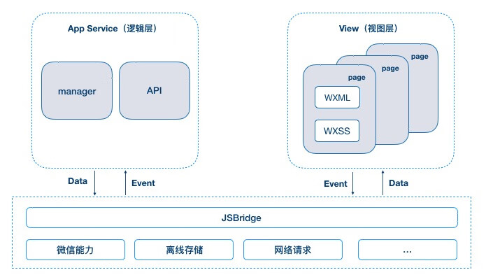

# `Taro3` & `Vue3` & `typescript` & `less`

<BackTop />

## 参考文档

- [Taro官网](https://taro.zone/)
- [微信官方文档](https://developers.weixin.qq.com/miniprogram/dev/framework/)
- [微信公众平台](https://mp.weixin.qq.com/)
- [Nut UI](https://nutui.jd.com/taro/vue/4x/#/zh-CN/guide/start)

## `Taro` 中的 `JSBridge`

- [参考文档](https://docs.taro.zone/blog/2020-01-02-gmtc#%E5%B0%8F%E7%A8%8B%E5%BA%8F%E8%B7%A8%E6%A1%86%E6%9E%B6%E5%BC%80%E5%8F%91%E7%9A%84%E6%8E%A2%E7%B4%A2)

微信小程序主要分为 **逻辑层** 和 **视图层**，以及在他们之下的原生部分。逻辑层主要负责 `JS` 运行，视图层主要负责页面的渲染，它们之间主要通过 `Event` 和 `Data` 进行通信，同时通过 `JSBridge` 调用原生的 `API`。这也是以微信小程序为首的大多数小程序的架构。

 

 

由于原生部分对于前端开发者来说就像是一个黑盒，因此，整个架构图的原生部分可以省略。同时，我们我们对 **逻辑层** 和 **视图层** 也做一下简化，最后可以得到小程序架构图的极简版：

 

 

也就是说，只需要在逻辑层调用对应的 `App()`/`Page()` 方法，且在方法里面处理 `data`、提供生命周期/事件函数等，同时在视图层提供对应的模版及样式供渲染就能运行小程序了。这也是大多数小程序开发框架重点考虑和处理的部分。

`Taro` 框架中的 `JSBridge` 是实现跨端开发的核心技术之一，它通过构建 `JavaScript` 与原生环境之间的通信通道，解决多端适配问题。以下从原理、实现机制、应用场景等方面详细解析：

### 一、`JSBridge` 的核心作用

 

`JSBridge` 是 **JavaScript 与 Native 代码双向通信的桥梁**，主要功能包括：

1. **JavaScript 调用 Native**：访问摄像头、地理位置、支付等原生功能。
2. **Native 调用 JavaScript**：传递回调结果、推送消息或状态更新。
3. **跨端适配**：统一不同平台（如微信、支付宝小程序）的 `API` 差异，实现代码复用。

### 二、`Taro` 中 `JSBridge` 的实现原理

#### 1. **基于 WebView 和 JSBridge 的运行时架构**

- **WebView 渲染层**：`Taro` 将 `React/Vue` 代码编译为标准 `Web` 代码，由 `WebView` 渲染页面。
- **JSBridge 通信层**：通过注入全局对象或拦截 `URL Scheme`，实现 `JavaScript` 与原生环境的交互。

#### 2. **双向通信机制**

- **JavaScript → Native**：
  - **注入 API**：通过 `WebView` 接口（如 `addJavascriptInterface`）向全局对象注入 `Native` 方法，前端直接调用（如 `Taro.navigateTo`）。
  - **拦截 URL Scheme**：前端通过 `iframe.src` 发送自定义协议请求（如 `jsbridge://showToast`），`Native` 拦截并解析执行对应逻辑。
- **Native → JavaScript**：直接执行拼接的 `JavaScript` 代码（如 `evaluateJavaScript`），要求目标方法挂载在全局 `window` 上。

#### 3. **消息管理与回调处理**

- **RPC 模型**：将每次通信视为远程过程调用（`RPC`），前端发送请求时生成唯一 `ID`，`Native` 处理完成后通过 `ID` 匹配回调。
- **JSONP 机制**：通过全局回调函数处理异步结果，例如将回调函数暂存于 `window`，`Native` 执行后触发。

### 三、`Taro` 中 `JSBridge` 的跨端适配策略

1. **统一 API 设计**：
   - `Taro` 封装了各平台小程序的原生 `API`（如 `wx.request`、`my.alert`），提供统一的调用接口（如 `Taro.request`）。
   - 运行时根据当前平台动态切换底层实现。

2. **组件与生命周期映射**：
   - 将 `React/Vue` 生命周期（如 `componentDidMount`）映射到小程序生命周期（如 `onLoad`、`onShow`）。
   - 通过 `JSBridge` 同步状态，例如页面显示/隐藏时触发 `componentDidShow` 或 `componentDidHide`。

3. **多端差异化处理**：
   - 针对不同平台的特性（如微信的 `openSetting`、支付宝的 `getAuthCode`），在 `JSBridge` 层做兼容性封装。
   - 例如，调用 `Taro.getLocation` 时，`JSBridge` 自动适配微信的 `wx.getLocation` 或支付宝的 `my.getLocation`。

### 四、`JSBridge` 在 `Taro` 中的优势与局限性

#### **优势**：

- **跨端适配性强**：一套代码适配微信、支付宝、百度等小程序及 `H5`、`React Native`。
- **开发效率高**：避免重复编写多端逻辑，减少维护成本。
- **性能优化**：通过预编译和运行时优化，降低通信开销（如减少 `URL Scheme` 拦截频率）。

#### **局限性**：

- **平台特性差异**：部分原生功能（如微信小程序的订阅消息）需单独处理。
- **通信性能瓶颈**：频繁的 `JavaScript-Native` 调用可能影响流畅度，需合理设计通信频率。

### 五、实际应用案例

1. **饿了么小程序**：通过 `Taro` 实现多端统一，`JSBridge` 处理订单、支付等原生功能调用。
2. **网易云音乐小程序**：利用 `JSBridge` 同步播放状态，跨端保持一致的音频控制逻辑。

### 总结

`Taro` 的 `JSBridge` 通过 **WebView 渲染+原生通信** 的架构，结合 **API 注入、URL 拦截、RPC 回调** 等机制，实现了高效的跨端开发。其核心价值在于屏蔽底层差异，让开发者专注于业务逻辑，同时通过运行时适配保障多端一致性。实际开发中需注意平台特性与性能优化，以充分发挥其优势。
