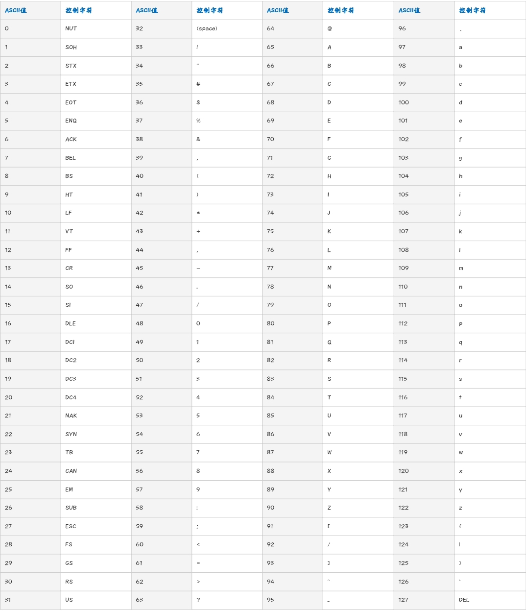

# Note 1

## 数组去重

```js
var values = [1, 1, 2, 3, 3, 4]
var mySet = new Set(values)
values = [...mySet]
console.log(values) // [1, 2, 3, 4]
```

## 非CJK脚本的换行规则 <Badge type="tip" text="长字母和数字" />

*CJK脚本是中国，日本和韩国（"中日韩"）脚本*

- `word-wrap` 属性：允许长的内容可以自动换行。
- `word-break`<Badge type="tip" text="推荐" /> 属性：指定非CJK脚本的换行规则。

```css
.content {
  text-align: justify;
  overflow: hidden;
  word-break: break-all; // 允许在单词内换行，会折断单词
  word-wrap: break-word; // 在长单词或 URL 地址内部进行换行，其中单词会另起一行换行
}
```

## `$nextTick()`

- 在下次 DOM 更新循环结束之后执行延迟回调。**在修改数据之后立即使用这个方法，获取更新后的 DOM**。
- 将回调延迟到下次 DOM 更新循环之后执行。在修改数据之后立即使用它，然后等待 DOM 更新。它跟全局方法 `Vue.nextTick` 一样，不同的是回调的 this 自动绑定到调用它的实例上。

::: tip 提示
Vue 实现响应式并不是数据发生变化之后 DOM 立即变化，而是按一定的策略进行 DOM 的更新
简单来说，Vue 在修改数据后，视图不会立刻更新，而是等同一事件循环中的所有数据变化完成之后，再统一进行视图更新。
Vue 中 data 的数据变化是同步的，更新完就能拿到；但是 dom `的更新是异步的，需要用nextTick` 去即时获取

因为 Vue 是异步执行 DOM 更新的，想立即操作更新后的 DOM 就需要使用 `$nextTick`
:::

```js
// 修改数据
this.message = 'changed'
// DOM 还没有更新
this.$nextTick(() => {
  // DOM 现在更新了
  // `this` 绑定到当前实例
  this.doSomethingElse()
})

mounted () {
  this.$nextTick(() => {
    // Code that will run only after the
    // entire view has been rendered
  })
}
```

::: tip 用途
在 `created` 和 `mounted` 阶段，如果需要操作渲染后的视图，也要使用 `nextTick` 方法。<br>
官方文档说明：<br>
**注意 mounted 不会承诺所有的子组件也都一起被挂载。如果你希望等到整个视图都渲染完毕，可以用 vm.$nextTick 替换掉 mounted**
:::

### 异步更新队列

- Vue 在更新 DOM 时是异步执行的。只要侦听到数据变化，Vue 将开启一个队列，并缓冲在同一事件循环中发生的所有数据变更。如果同一个 watcher 被多次触发，只会被推入到队列中一次。这种在缓冲时去除重复数据对于避免不必要的计算和 DOM 操作是非常重要的。然后，在下一个的事件循环“tick”中，Vue 刷新队列并执行实际 (已去重的) 工作。Vue 在内部对异步队列尝试使用原生的 `Promise.then``、MutationObserver` 和 `setImmediate，如果执行环境不支持，则会采用` setTimeout(fn, 0) 代替。
- 例如，当你设置 vm.someData = 'new value'，该组件不会立即重新渲染。当刷新队列时，组件会在下一个事件循环“tick”中更新。多数情况我们不需要关心这个过程，但是如果你想基于更新后的 DOM 状态来做点什么，这就可能会有些棘手。虽然 Vue.js 通常鼓励开发人员使用“数据驱动”的方式思考，避免直接接触 DOM，但是有时我们必须要这么做。为了在数据变化之后等待 Vue 完成更新 DOM，可以在数据变化之后立即使用 `Vue.nextTick(callback)`。这样回调函数将在 DOM 更新完成后被调用。
- 因为 `$nextTick()` 返回一个 Promise 对象，所以你可以使用新的 ES2017 `async/await` 语法完成相同的事情：

```js
updateMessage: async function () {
  this.message = '已更新'
  console.log(this.$el.textContent) // => '未更新'
  await this.$nextTick()
  console.log(this.$el.textContent) // => '已更新'
}
```

## 监听滚动条变化

```js
mounted () {
  // 防抖
  function throttle (fn, delay = 300) {
    var valid = true
    return function () {
      if (valid) {
        valid = false // 将函数置为无效
        setTimeout(() => {
          fn()
          valid = true
        }, delay)
      }
      return false // valid为false时，函数不执行
    }
  }
  function showTop () {
    var scrollTop = document.body.scrollTop || document.documentElement.scrollTop
    console.log('滚动条位置：' + scrollTop)
  }
  window.onscroll = throttle(showTop, 300)
}
```

## `v-html` 使用

- `v-html`：更新元素的 innerHTML
- `v-text`：更新元素的内部文本

### 使用 `v-html` 并限制内容图片最大宽度

```html
<div class="content" v-html="content"></div>
```

1. 去掉 `scoped`

```less
<style lang="less">
.content {
  width: 600px;
  img {
    max-width: 100%;
  }
}
</style>
```

2. 使用 `>>>`

```less
<style scoped>
.u-content >>> img { max-width: 100%; } // 如果图片宽度超出600px，则会将其缩放到600px，宽度也会等比例进行缩小
</style>
```

3. 字符串全局替换 `replace` <Badge type="tip" text="推荐" />

```js
// 全局替换 

```less
<style lang="less" scoped>
.content {
  /deep/ img {
    max-width: 100%;
  }
}
</style>
```

### 使用 `v-html` 对关键字进行标注

```js
// 关键字标蓝
const reg = new RegExp(this.keyword, 'g')
for (const data of this.resultData) {
  data.name = data.name.replace(reg, `<span class="blue">${key}</span>`)
  console.log('data:', data)
}
```

## 题目和题干类样式

```html
<div class="m-ques">
  <p class="u-head">题目1：</p>
  <p class="u-info">题干内容，题干内容，题干内容…</p>
</div>
```

- 使用 `calc()`

```less
.m-ques {
  // width: 240px;
  width: 100%;
  font-size: 16px;
  color: #333;
  line-height: 24px;
  min-height: 24px; // 防止多题目，内容为空时样式塌陷
  .u-head {
    width: 48px;
  }
  .u-info {
    margin-top: -24px;
    margin-left: 48px;
    width: calc(100% - 48px);
  }
}
```

- 使用 `display: flex; flex-shrink: 0;` <Badge type="tip" text="推荐" />

*`flex-shrink` 属性指定了 flex 元素的收缩规则。flex 元素仅在默认宽度之和大于容器的时候才会发生收缩，其收缩的大小是依据 `flex-shrink` 的值。*

*如果所有项目的 `flex-shrink` 属性都为1，当空间不足时，都将等比例缩小*

*如果一个项目的 `flex-shrink` 属性为0，其他项目都为1，则空间不足时，前者不缩小。*

```less
.m-ques {
  display: flex;
  font-size: 16px;
  color: #333;
  line-height: 24px;
  .u-head {
    flex-shrink: 0; // 该项目不缩小。默认1. 即空间不足时，项目将缩小
  }
}
```

- 使用 `display: inline-block`

```less
.m-ques {
  width: 600px;
  .u-head {
    display: inline-block;
    width: 20px;
    vertical-align: top;
  }
  .u-info {
    display: inline-block;
    max-width: 580px;
  }
}
```

## 复制文本到剪切板

```html
<p id="text">待复制文本</p>
<a @click="onCopy">{{ copyText }}</a>
```

```js
var copyText = 'copy'
onCopy () {
  const text = document.getElementById('text')
  navigator.clipboard.writeText(text.innerText || '').then(() => {
    /* clipboard successfully set */
    copyTxt = 'Copied'
  }, (err) => {
    /* clipboard write failed */
    copyTxt = err
  })
}
```

[Clipboard API](https://developer.mozilla.org/zh-CN/docs/Web/API/Clipboard_API)

剪贴板 `Clipboard API` 提供了响应剪贴板命令（剪切、复制和粘贴）与异步读写系统剪贴板的能力。从权限 Permissions API 获取权限之后，才能访问剪贴板内容；如果用户没有授予权限，则不允许读取或更改剪贴板内容。

- 访问剪贴板

  除了在实例化中创建一个 Clipboard 对象，你还可以使用全局的 `Navigator.clipboard` 来访问系统剪贴板。

- `read()`

  从剪贴板读取数据（比如图片），返回一个 Promise 对象。在检索到数据后，promise 将兑现一个 `ClipboardItem` 对象的数组来提供剪切板数据。
- `Clipboard.readeText()`

  从操作系统读取文本；返回一个 Promise，在从剪切板中检索到文本后，promise 将兑现一个包含剪切板文本数据的 DOMString。<br>
  解析系统剪贴板的文本内容返回一个Promise 。

  ```js
  // 粘贴（读取剪贴板）
  // 检索剪贴板的文本内容，并将返回的文本插入元素的内容中
  navigator.clipboard.readText().then(
    clipText => document.querySelector('.editor').innerText += clipText
  )
  ```

  上述代码提取了剪贴板的文本并将其附在 class 为 editor 的第一个元素后面。因为当剪贴板中不是文本时， readText() (and read(), for that matter) 会返回一个空字符串，所以这段代码是安全的。

- `write()`

  写入任意数据至操作系统剪贴板。这是一个异步操作，在操作完成后，返回的 promise 的将被兑现。<br>
  写入图片等任意的数据到剪贴板。这个方法可以用于实现剪切和复制的功能。

  ```js
  // 这个例子展示了如何将当前剪贴板的内容替换为给定的内容。
  function setClipboard(text) {
    let data = new DataTransfer()

    data.items.add("text/plain", text)
    navigator.clipboard.write(data).then(() => {
        /* success */
      }, () => {
        /* failure */
      })
  }
  ```

- `Clipboard.writeText()`

  写入文本至操作系统剪贴板。返回一个 Promise，在文本被完全写入剪切板后，返回的 promise 将被兑现。<br>
  可以写入特定字符串到操作系统的剪切板

  ```js
  // 复制（写入剪贴板）
  // 此示例将剪贴板的内容设置为字符串“<empty clipboard>”
  navigator.clipboard.writeText('<empty clipboard>').then(() => {
      /* clipboard successfully set */
    }, () => {
      /* clipboard write failed */
    })
  ```

## 父组件调用子组件的属性或方法

```html
<div class="parent">
  <child ref="child"></child>
</div>
```

```js
this.$refs.child[attribute] // 即可调用子组件所有属性和方法
```

## 等边三角形

```html
<div class="triangle"></div>
```

```less
.triangle { // 等边三角形
  display: inline-block;
  height: 0;
  width: 0;
  border-bottom: calc(50px * sqrt(3)) solid @themeColor;
  border-left: 50px solid transparent;
  border-right: 50px solid transparent;
}
```

## `<video>` 标签相关事件

```js
mounted () {
  const video = document.getElementById('veo')
  video.addEventListener('pause', () => { // 播放暂停时触发，视频播放完时也会触发
    this.vplay = true
    var current = Math.floor(video.currentTime) // 播放暂停时获取已播放时长并向下取整
    console.log('播放暂停时的已播放时长:', current)
  })
  video.addEventListener('playing', () => { // 开始播放时触发，包括暂停重新播放，快进到某个时间点开始播放
    this.vplay = false
    var current = Math.floor(video.currentTime) // 开始播放时获取已播放时长并向下取整
    console.log('开始播放时的已播放时长:', current)
  })
  video.addEventListener('timeupdate', () => { // 播放时触发，即与视频播放同步触发，播放时大约1s内触发4次
    var current = Math.floor(video.currentTime) // 播放时获取已播放时长并向下取整
    console.log('播放时的已播放时长:', current)
  })
  video.addEventListener('ended', () => { // 播放完成时触发
    var current = Math.floor(video.currentTime) // 播放完成时获取已播放时长并向下取整
    console.log('播放完成时的已播放时长:', current)
  })
  console.log('视频时长:', video.duration)
  // 设置视频的播放开始时间点，单位 s
  video.currentTime = 10
  video.play() // 播放
  video.pause() // 暂停
}
```

## 字母和ASCII码转换

- ASCII码转字符

```js
String.fromCharCode(65) // 'A'
String.fromCharCode(97) // 'a'
```

- 字符转ASCII码

```js
var str1 = 'A'
str1.charCodeAt() // 65
var str2 = 'a'
str2.charCodeAt() // 97
```

- ASCII表



## CSS函数

`calc()` 函数用于动态计算长度值:

- 运算符前后都需要保留一个空格，例如：`width: calc(100% - 10px);`
- 任何长度值都可以使用 `calc()` 函数进行计算；
- `calc()` 函数支持 "+", "-", "*", "/" 运算；
- `calc()` 函数使用标准的数学运算优先级规则；

## 将指定元素滚动到浏览器窗口的可视区域

*`scrollIntoView()` 可以在所有HTML元素上调用，通过滚动浏览器窗口或某个容器元素，调用元素就可以出现在视口中。*

- 传入 `true` 参数或者不传入参数：窗口滚动之后会让调用元素的顶部与视口顶部尽可能平齐。
- 传入 `false` 作为参数：调用元素会尽可能全部出现在视口中，（可能的话，调用元素的底部会与视口底部平齐。）不过顶部不一定平齐。

### 场景1：将 id 为 content 的元素，滚动到可视窗口

```html
<a @click="onScroll"></a>
```

```js
onScroll () {
  const el = document.getElementById('content')
  el.scrollIntoView()
}
```

### 场景2：滚动到指定锚点

```html
<!-- (必须用id选择器) -->
<a href="#content"></a>
```

### 场景3：进入页面后，将指定元素显示在视口中

```html
<div id="content"></div>
```

```js
mounted () {
  this.goTop()
},
methods: {
  goTop () {
    const el = document.getElementById('content')
    el.scrollIntoView()
  }
}
```
