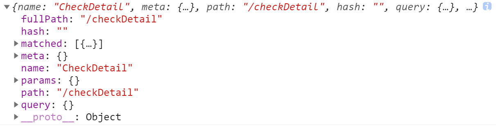

# Note 2

## 定义全局 CSS 变量

*vue.config.js*

```js
css: {
  loaderOptions: {
    less: {
      modifyVars: {
        // less vars，customize ant design theme，可以带单引号也可以不带
        themeColor: '#1677FF', // 定义全局变量，所有文件均可直接使用
      },
      // 等价于
      // globalVars: {
      // 可以带单引号也可以不带
      //  themeColor: '#D93844'
      // },
      // DO NOT REMOVE THIS LINE
      javascriptEnabled: true
    }
  }
}
```

## 全局注册组件

*在 `main.js` 中进行全局注册*

```js
import Page from '@/components/Button'
Vue.component('Button', Button) // 全局注册 Button 组件
```

## `<a>` 标签使用

- 取消默认行为

```html
<!-- 什么也不执行，去掉a标签的默认行为，跟href="javascript:void(0)"一样，void 是JavaScript 的一个运算符，void(0)就是什么也不做 -->
<a href="javascript:;"></a>
```

- 在有滚动的页面定位到页面最顶端

```html
<a href="#"></a>
```

- 定位到页面中 `id="anchor"` 的锚点

```html
<a href="#anchor"></a>
```

- 刷新当前页面

```html
<a href=""></a>
```

- 跳转到首页

```html
<a href="/"></a>
```

## CSS3 filter（滤镜）属性

*filter 属性定义了元素(通常是``)的可视效果(例如：模糊与饱和度)*

```html

```

语法：
```css
filter: none | blur() | brightness() | contrast() | drop-shadow() | grayscale() | hue-rotate() | invert() | opacity() | saturate() | sepia() | url();
```

- 使用高斯模糊效果：

```css
img {
  -webkit-filter: blur(5px); /* Chrome, Safari, Opera */
  filter: blur(5px);
}
```

- 使图片变亮:

```css
img {
  -webkit-filter: brightness(200%); /* Chrome, Safari, Opera */
  filter: brightness(200%);
}
```

- 调整图像的对比度:

```css
img {
  -webkit-filter: contrast(200%); /* Chrome, Safari, Opera */
  filter: contrast(200%);
}
```

- 设置一个阴影效果:

```css
img {
  -webkit-filter: drop-shadow(8px 8px 10px red); /* Chrome, Safari, Opera */
  filter: drop-shadow(8px 8px 10px red);
}
```

- 将图像转换为灰度图像:

```css
img {
  -webkit-filter: grayscale(50%); /* Chrome, Safari, Opera */
  filter: grayscale(50%);
}
```

- 转化图像的透明程度:

```css
img {
  -webkit-filter: opacity(30%); /* Chrome, Safari, Opera */
  filter: opacity(30%);
}
```

- 转换图像饱和度:

```css
img {
  -webkit-filter: saturate(800%); /* Chrome, Safari, Opera */
  filter: saturate(800%);
}
```

- 使用多个滤镜，每个滤镜使用空格分隔：

*注意: 顺序是非常重要的 (例如使用 grayscale() 后再使用 sepia()将产生一个完整的灰度图片)。*

```css
img {
  -webkit-filter: contrast(200%) brightness(150%);  /* Chrome, Safari, Opera */
  filter: contrast(200%) brightness(150%);
}
```

## 原生js相关BOM和DOM操作

- 获取DOM元素

```html
<input
  id="upload"
  class="upload"
  name="upload"
  ref="upload"
  type="file"
  accept="image/*" />
```

`getElementBy...` 获取DOM元素：

```js
const el = document.getElementById('upload') // 返回DOM对象
const el = document.getElementsByClassName('upload') // 返回key为0，1，2…的object，value为DOM对象
const el = document.getElementsByTagName('div') // 返回key为0，1，2…的object，value为DOM对象
const el = document.getElementsByName('upload') // NodeList对象，key为0，1，2…，value为DOM对象
console.log('upload:', this.$refs.upload) // vue的ref模板引用获取DOM元素
```

`querySelector` 使用 `CSS选择符` 获取DOM元素

```js
var upType = document.querySelector('input[type="file"]')
var upName = document.querySelector('input[name="upload"]')
var upId = document.querySelector('#upload')
var upClass = document.querySelector('.upload')
```

- 设置DOM元素的样式style

```html

```

```js
// 使用ref修改特定元素的样式：
this.$refs.animateRef.style.top = 0
this.$refs.animateRef.style.opacity = 1
// 等价于使用原生JS修改：
const el = document.getElementById('animate')
el.style.top = 0
el.style.opacity = 1
```

- 获取DOM元素各边缘距离浏览器可视窗口的距离（不包括滚动条）

[`Element.getBoundingClientRect()`](https://developer.mozilla.org/zh-CN/docs/Web/API/Element/getBoundingClientRect) 方法

```js{1,4,6,8,10-11}
const el = document.getElementById('animate') // 获取DOM元素
// 或者 const el = this.$refs.animateRef
// 元素上边缘距浏览器窗口上边界的距离，可正，可负，可为0
console.log('distance:', el.getBoundingClientRect().top) 
// 元素下边缘距浏览器窗口上边界的距离，可正，可负，可为0
console.log('distance:', el.getBoundingClientRect().bottom) 
// 元素左边缘距浏览器窗口左边界的距离，可正，可负，可为0
console.log('distance:', el.getBoundingClientRect().left) 
// 元素右边缘距浏览器窗口左边界的距离，可正，可负，可为0
console.log('distance:', el.getBoundingClientRect().right) 
console.log('distance:', el.getBoundingClientRect())
// x，y：即元素左上角的像素点相对于浏览器显示窗口左上角点的坐标
```



- [`window`](https://developer.mozilla.org/zh-CN/docs/Web/API/Window) 对象表示一个包含 DOM 文档的窗口，其 document 属性指向窗口中载入的 DOM 文档

```js{2,4,6,8,13,18}
// 浏览器窗口可视区域的高度
window.innerHeight
// 浏览器窗口可视区域的宽度
window.innerWidth
// 获取/设置当前页面地址（URL）或把浏览器重定向到新页面
window.location
// 打开一个新的页面
window.open()
/*
  window.scrollX的别名，
  页面的水平滚动距离，即浏览器窗口左边界离页面左端的距离（页面水平滚动的距离）
*/
window.pageXOffset
/*
  window.scrollY的别名，
  页面的垂直滚动距离，即浏览器窗口上边界离页面顶端的距离（页面垂直滚动的距离）
*/
window.pageYOffset
```

- 判断一个元素是否在浏览器视口中：

```html
<div id="slider" ref="slider"></div>
```

```js
isInViewport () {
  const el = this.$refs.slider
  const rect = el.getBoundingClientRect()
  const viewWidth = window.innerWidth || document.documentElement.clientWidth
  const viewHeight = window.innerHeight || document.documentElement.clientHeight
  if (rect.right < 0 || rect.bottom < 0 || rect.left > viewWidth || rect.top > viewHeight) {
    return false
  }
  return true
}
```

## 向指定元素添加事件句柄（监听事件）

[`EventTarget.addEventListener()`](https://developer.mozilla.org/zh-CN/docs/Web/API/EventTarget/addEventListener)方法将指定的监听器注册到 EventTarget 上，当该对象触发指定的事件时，指定的回调函数就会被执行。事件目标可以是一个文档上的元素 Element、Document 和 Window，也可以是任何支持事件的对象（比如 XMLHttpRequest）。

::: info 备注
推荐使用 addEventListener() 来注册一个事件监听器，理由如下：

- 它允许为一个事件添加多个监听器。特别是对库、JavaScript 模块和其他需要兼容第三方库/插件的代码来说，这一功能很有用。
- 相比于 onXYZ 属性绑定来说，它提供了一种更精细的手段来控制 listener 的触发阶段。（即可以选择捕获或者冒泡）。
- 它对任何事件都有效，而不仅仅是 HTML 或 SVG 元素。
:::

`addEventListener()` 的工作原理是将实现 EventListener 的函数或对象添加到调用它的 EventTarget 上的指定事件类型的事件侦听器列表中。如果要绑定的函数或对象已经被添加到列表中，该函数或对象不会被再次添加。

::: info 备注
如果先前向事件侦听器列表中添加过一个匿名函数，并且在之后的代码中调用 addEventListener 来添加一个功能完全相同的匿名函数，那么之后的这个匿名函数也会被添加到列表中。

实际上，即使使用完全相同的代码来定义一个匿名函数，这两个函数仍然存在区别，在循环中也是如此。在使用该方法的情况下，匿名函数的重复定义会带来许多麻烦，详见下文中的内存问题一节。
:::

当一个 EventListener 在 EventTarget 正在处理事件的时候被注册到 EventTarget 上，它不会被立即触发，但可能在事件流后面的事件触发阶段被触发，例如可能在捕获阶段添加，然后在冒泡阶段被触发。

- 语法：

```js
addEventListener(type, listener);
addEventListener(type, listener, options);
addEventListener(type, listener, useCapture);
```

- 参数：
  - type：表示监听事件类型的大小写敏感的字符串。
  - listener：当所监听的事件类型触发时，会接收到一个事件通知（实现了 Event 接口的对象）对象。listener 必须是一个实现了 EventListener 接口的对象，或者是一个函数。有关回调本身的详细信息，请参阅事件监听回调
  - options <Badge type="tip" text="可选" /> 一个指定有关 listener 属性的可选参数对象。可用的选项如下：
    - capture <Badge type="tip" text="可选" /> 一个布尔值，表示 listener 会在该类型的事件捕获阶段传播到该 EventTarget 时触发。
    - once <Badge type="tip" text="可选" /> 一个布尔值，表示 listener 在添加之后最多只调用一次。如果为 true，listener 会在其被调用之后自动移除。
    - passive <Badge type="tip" text="可选" /> 一个布尔值，设置为 true 时，表示 listener 永远不会调用 preventDefault()。如果 listener 仍然调用了这个函数，客户端将会忽略它并抛出一个控制台警告。查看使用 passive 改善滚屏性能以了解更多。
    - signal <Badge type="tip" text="可选" /> AbortSignal，该 AbortSignal 的 abort() 方法被调用时，监听器会被移除。
  - useCapture <Badge type="tip" text="可选" />
  一个布尔值，表示在 DOM 树中注册了 listener 的元素，是否要先于它下面的 EventTarget 调用该 listener。当 useCapture（设为 true）时，沿着 DOM 树向上冒泡的事件不会触发 listener。当一个元素嵌套了另一个元素，并且两个元素都对同一事件注册了一个处理函数时，所发生的事件冒泡和事件捕获是两种不同的事件传播方式。事件传播模式决定了元素以哪个顺序接收事件。进一步的解释可以查看 DOM Level 3 事件及 JavaScript 事件顺序文档。如果没有指定，useCapture 默认为 false。

`document.addEventListener()` 方法用于向文档添加事件句柄。

::: tip 提示
可以使用 document.removeEventListener() 方法来移除 addEventListener() 方法添加的事件句柄。
:::

::: tip 提示
使用 element.addEventListener() 方法为指定元素添加事件句柄。
:::

- 语法：document.addEventListener(event, function, useCapture)
- 参数值：

参数 | 描述
-- | --
event <Badge type="tip" text="必需" /> | 描述事件名称的字符串<br>注意： 不要使用 "on" 前缀。例如，使用 "click" 来取代 "onclick"。<br>提示： 所有 HTML DOM 事件，可以查看我们完整的 HTML DOM Event 对象参考手册。
function <Badge type="tip" text="必需" /> | 描述了事件触发后执行的函数。<br>当事件触发时，事件对象会作为第一个参数传入函数。事件对象的类型取决于特定的事件。<br>例如，`click` 事件属于 MouseEvent(鼠标事件) 对象。
useCapture <Badge type="tip" text="可选" /> | 布尔值，指定事件是否在捕获或冒泡阶段执行。<br>可能值：<ul><li>true：事件句柄在捕获阶段执行</li><li>false：默认。事件句柄在冒泡阶段执行</li></ul>

```js
// 禁用H5页面的下拉刷新
document.body.addEventListener('touchmove', this.touchMove, { passive: false })
touchMove (e) {
  e.preventDefault()
  // 自动清理自己，避免内存泄漏
  this.$once('hook:beforeDestroy', function () {
    removeEventListener('touchmove', this.touchMove)
  })
}
```

**事件冒泡和事件捕获分别由微软和网景公司提出，这两个概念都是为了解决页面中事件流（事件发生顺序）的问题。**

```html
<div id="parent">
  <p id="child">Click me!</p>
</div>
```

如果子元素p和父元素div都有一个click的处理函数，那么哪一个函数会首先被触发呢？

为了解决这个问题微软和网景提出了两种几乎完全相反的概念，微软提出了名为事件冒泡(`event bubbling`)的事件流，网景提出另一种事件流名为事件捕获(`event capturing`)。
- 事件冒泡可以理解为把一颗石头投入水中，泡泡会一直从水底冒出水面。也就是说，事件会从最内层的元素开始发生，一直向上传播，直到document对象。因此上面的例子在事件冒泡的概念下发生click事件的顺序应该是：`p -> div -> body -> html -> document`
- 事件捕获与事件冒泡相反，事件会从最外层开始发生，直到最内层的元素。上面的例子在事件捕获的概念下发生click事件的顺序应该是：`document -> html -> body -> div -> p`

::: tip 注
对于事件代理来说，在事件捕获或者事件冒泡阶段处理并没有明显的优劣之分，但是由于事件冒泡的事件流模型被所有主流的浏览器兼容，从兼容性角度来说还是建议大家使用事件冒泡模型。
:::

阻止事件冒泡：
- 给子级加 `event.stopPropagation()` 只阻止事件往上冒泡，不阻止事件本身（默认事件）

```js
const el = document.getElementById('child')
el.onclick (function (e) {
  const e = event || window.event
  event.stopPropagation()
})
```

- 在事件处理函数中 `return false` 不仅阻止了事件往上冒泡，而且阻止了事件本身（默认事件）

```js
el.onclick (function (event) {
  var e = e || window.event
  return false
})
```

- 让触发事件的元素等于绑定事件的元素，也可以阻止事件冒泡

```js
el.onclick = function (event) {
  if (event.target == event.currentTarget) {
    console.log('child')
  }
}
```

- 阻止默认事件（即事件本身）
  1. event.preventDefault()
  2. return false
