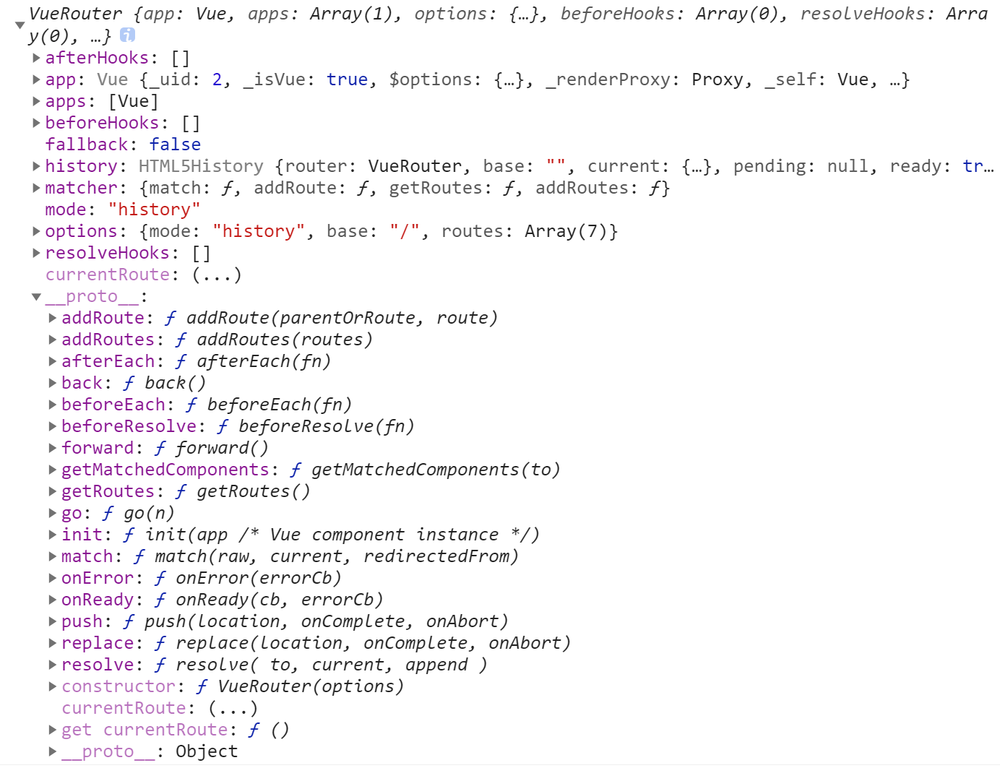
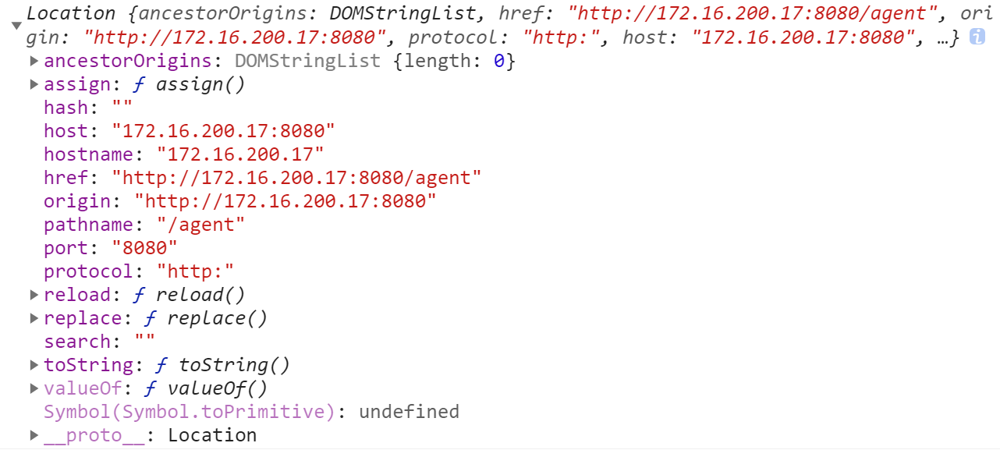

# Note 3

## `ref` & `$refs`

ref用来给元素或子组件注册引用信息。

- 如果在普通的 DOM 元素上使用，引用指向的就是 DOM 元素
- 如果用在子组件上，引用就指向组件实例

```vue
<ComponentName ref="child" />
```

### 父组件引用子组件的属性和方法：

```js
this.$refs.child.属性
this.$refs.child.方法
```

### 子组件调用父组件的属性和方法：

```js
this.$parent.属性
this.$parent.方法
```

## CSS `writing-mode` 属性

定义了文本在水平或垂直方向上如何排布

```css
.u-font {
  writing-mode: vertical-rl;
  -webkit-writing-mode: vertical-rl;
  -ms-writing-mode: vertical-rl;
}
```

*语法格式如下：writing-mode: horizontal-tb | vertical-rl | vertical-lr | sideways-rl | sideways-lr*

- `horizontal-tb`：水平方向自上而下的书写方式。即 `left-right-top-bottom`
- `vertical-rl`：垂直方向自右而左的书写方式。即 `top-bottom-right-left`
- `vertical-lr`：垂直方向内内容从上到下，水平方向从左到右
- `sideways-rl`：内容垂直方向从上到下排列
- `sideways-lr`：内容垂直方向从下到上排列

## 网站整体灰度转换

*在项目入口文件App.vue中进行设置：*

- 当 `filter` 不为 `none` 的时候，如果该元素或者其子元素具有 `absolute` 或 `fixed` 属性，那么它会为其创建一个新的包含块/容器，会造成该 `absolute` 或 `fixed` 元素的定位发生变化（就是改变了 `absolute` 或 `fixed` 元素的定位父元素，变成新创建的元素）。
- 例如：当在 `body` 标签中使用了 `filter` 属性后 `body { filter: grayscale(100%);`， `filter` 就会生成一个新的包含块，其位置大小和 body 一样，然后 `fixed` 元素就会根据这个包含块进行定位，导致定位出现问题。
- 如果 `filter` 设置在根元素上 `html { filter: grayscale(100%);`，**它是不会为 absolute 或 fixed 子元素创建新的包含块的**，因此我们可以通过将 `filter` **设置在根元素（html）上来避免定位问题**。

```js
created () {
  this.getMournDate()
},
methods: {
  getGrayDate () {
    // 调用接口获取后台设置的追悼日期范围（起始日~截止日）
    this.mournDate = {
      start: 1669824000000, // 2022-12-01
      end: 1670601600000 // 2022-12-10
    }
    this.checkGray(this.mournDate)
  },
  checkGray (mournDate) {
    var now = new Date().getTime()
    if (mournDate.start <= now && now <= mournDate.end) {
      // 追悼日只有设置在html元素上才不会影响fixed和absolute定位
      this.setGray()
      setTimeout(() => { // 自动取消黑白
        this.cancelGray()
      }, mournDate.end - now)
    } else {
      this.cancelGray()
      if (now < mournDate.start) { // 自动变为黑白
        setTimeout(() => {
          this.setGray()
        }, mournDate.start - now)
      }
    }
  },
  setGray () {
    document.documentElement.style.filter = 'grayscale(100%)'
  },
  cancelGray () {
    document.documentElement.style.filter = 'none'
  }
}
```

## `$route` & `$router`

假设当前路由：`http://localhost:8080/checkDetail`

- this.$route：是当前路由对象，是一个局部的对象，里面包含`name`、`path`、`query`和`params`等属性，如下图：



- this.$router：是全局路由对象，可以在任意页面实现路由跳转，任何页面都可以调用其 `push()`, `back()`、`replace()`, `go()` 等方法

```html
<router-link :to="{path:'/listingService', query: {tab: 1}}" target="_blank">路由跳转</router-link>
<!-- <router-link> 等同于调用 router.push() -->
```

```js
// 字符串
this.$router.push('/result')
// 对象
this.$router.push({ path: '/result' })
// 命名的路由
this.$router.push({ name: 'Result', params: { tag: 1 } })
// 带查询参数即：/result?tag=1
this.$router.push({ path: '/result', query: { tag: 1 } })
// 在新页面打开路由
let route = this.$router.resolve({
  path: '/list',
  query: { id:96 }
})
window.open(route.href, '_blank')
```


## window.location对象

`Location` 接口表示其链接到的对象的位置（`URL`）。所做的修改反映在与之相关的对象上。 `Document` 和 `Window` 接口都有这样一个链接的 `Location`，分别通过 `Document.location` 和 `Window.location` 访问。

属性 | 描述
-- | --
`Location.href` | 包含整个 `URL` 的一个 `DOMString`
`Location.protocol` | 包含 `URL` 对应协议的一个 `DOMString`，最后有一个":"
`Location.host` | 包含了域名的一个 `DOMString`，可能在该串最后带有一个":"并跟上 `URL` 的端口号
`Location.hostname` | 包含 `URL` 域名的一个 `DOMString`
`Location.port` | 包含端口号的一个 `DOMString`
`Location.pathname` | 包含 `URL` 中路径部分的一个 `DOMString`，开头有一个 /
`Location.search` | 包含 `URL` 参数的一个 `DOMString`，开头有一个“?”
`Location.hash` | 包含块标识符的 `DOMString`，开头有一个 #
`Location.username` | 包含 `URL` 中域名前的用户名的一个 `DOMString`
`Location.password` | 包含 `URL` 域名前的密码的一个 `DOMString`
`Location.origin`<Badge type="tip" text="只读" /> | 包含页面来源的域名的标准形式 `DOMString`

假设当前网页路由：`http://172.16.200.17:8080/agent`



## 过渡效果

```html
<transition name="fade">
  <router-view />
</transition>
```

```css
.fade-enter-active, .fade-leave-active {
  transition: opacity .3s;
}
.fade-enter, .fade-leave-to /* .fade-leave-active below version 2.1.8 */ {
  opacity: 0;
}
```

## 文本溢出显示省略号

```html
<p class="u-text" :title="title">{{ title }}</p>
```

```css
/* 单行文本溢出，多行文本无效 */
.u-text {
  width: 480px;
  overflow: hidden;
  text-overflow: ellipsis;
  white-space: nowrap;
}
```

```html
<p class="u-text">{{ text }}</p>
```

```css
/* 多行文本溢出 */
.u-text {
  width: 480px;
  overflow: hidden;
  text-overflow: ellipsis;
  display: -webkit-box;
  -webkit-box-orient: vertical;
  -webkit-line-clamp: 2;
}
```

## `process.env`

[参考文档](http://nodejs.cn/api/process.html#process_process_env)

**process.env 属性返回包含用户环境的对象**

`process`对象是（global）全局变量，`NODE_ENV` 不是 `process.env` 对象上原有的属性，它是我们自己添加上去的一个环境变量，用来确定当前所处的开发阶段。一般生产阶段设为 `production`，开发阶段设为 `development`，然后在脚本中读取 `process.env.NODE_ENV`

- 开发环境下的配置文件 `.env.development`：

```bash
NODE_ENV=development
VUE_APP_API_BASE_URL=/api
```

- 生产环境下的配置文件 `.env.production`：

```bash
NODE_ENV=production
VUE_APP_API_BASE_URL=''
```

- 本地开发配置文件 `.env.local`：

```bash
VUE_APP_PROXY=http://10.0.0.42:5507
VUE_APP_PORT=8050
VUE_APP_CHANNEL=1  // 自定义全局变量，必须以VUE_APP开头
```


## 计算属性 computed

- 计算属性缓存 vs 方法

在表达式中调用方法可以达到同样的效果：

```html
<p>Reversed message: "{{ reversedMessage() }}"</p>
```

我们可以将同一函数定义为一个方法而不是一个计算属性。两种方式的最终结果确实是完全相同的。然而，不同的是**计算属性是基于它们的响应式依赖进行缓存的**。**只在相关响应式依赖发生改变时它们才会重新求值**。这就意味着**只要 message 还没有发生改变，多次访问 reversedMessage 计算属性会立即返回之前的计算结果，而不必再次执行函数。**

**相比之下，每当触发重新渲染时，调用方法将总会再次执行函数**。

::: tip 提示
我们为什么需要缓存？假设我们有一个性能开销比较大的计算属性 A，它需要遍历一个巨大的数组并做大量的计算。然后我们可能有其他的计算属性依赖于 A。如果没有缓存，我们将不可避免的多次执行 A 的 getter！如果你不希望有缓存，请用方法来替代。
:::

- 计算属性 vs 侦听属性

当你有一些数据需要随着其它数据变动而变动时，你很容易滥用 watch——特别是如果你之前使用过 AngularJS。然而，通常更好的做法是使用计算属性而不是命令式的 watch 回调。

```html
<div id="demo">{{ fullName }}</div>
```

```js
var vm = new Vue({
  el: '#demo',
  data: {
    firstName: 'Foo',
    lastName: 'Bar',
    fullName: 'Foo Bar'
  },
  watch: {
    firstName: function (val) {
      this.fullName = val + ' ' + this.lastName
    },
    lastName: function (val) {
      this.fullName = this.firstName + ' ' + val
    }
  }
})
```

上面代码是命令式且重复的。将它与计算属性的版本进行比较，使用计算属性将会好得多：

```js
var vm = new Vue({
  el: '#demo',
  data: {
    firstName: 'Foo',
    lastName: 'Bar'
  },
  computed: {
    fullName: function () {
      return this.firstName + ' ' + this.lastName
    }
  }
})
```

- 计算属性的 `setter`，计算属性默认只有 `getter`，不过在需要时你也可以提供一个 `setter`：

```js
computed: {
  // 类似于双向绑定v-model
  fullName: {
    // getter 相当于firstName和lastName的改变会更新到fullName上
      get: function () {
        return this.firstName + ' ' + this.lastName
      },
    // setter 相当于把fullName的改变更新到firstName和lastName上
    set: function (newValue) {
      var names = newValue.split(' ')
      this.firstName = names[0]
      this.lastName = names[names.length - 1]
    }
  }
}
```

## `<keep-alive></keep-alive>`

- Props：
  - `include` - 字符串或正则表达式。只有名称（组件的name）匹配的组件会被缓存。
  - `exclude` - 字符串或正则表达式。任何名称（组件的name）匹配的组件都不会被缓存。
  - `max` - 数字。最多可以缓存多少组件实例。
- 用法：
  <br>`<keep-alive>` **包裹动态组件时，会缓存不活动的组件实例，而不是销毁它们**。<br>
  和 `<transition>` 相似，`<keep-alive>` 是一个抽象组件：**它自身不会渲染一个 DOM 元素，也不会出现在组件的父组件链中**。

当组件在 `<keep-alive>` 内被切换，它的 `activated` 和 `deactivated` 这两个生命周期钩子函数将会被对应执行。
在 2.2.0 及其更高版本中，`activated` 和 `deactivated` 将会在 `<keep-alive>` 树内的所有嵌套组件中触发。

**主要用于保留组件状态或避免重新渲染。**

```html
<!-- 基本 -->
<keep-alive>
  <component :is="view"></component>
</keep-alive>

<!-- 多个条件判断的子组件 -->
<keep-alive>
  <comp-a v-if="a > 1"></comp-a>
  <comp-b v-else></comp-b>
</keep-alive>

<!-- 和 `<transition>` 一起使用 -->
<transition>
  <keep-alive>
    <component :is="view"></component>
  </keep-alive>
</transition>
```

::: tip 注意
`<keep-alive>` 是用在其一个直属的子组件被开关的情形。如果你在其中有 v-for 则不会工作。如果有上述的多个条件性的子元素，`<keep-alive>` 要求同时只有一个子元素被渲染。
:::

- `include` and `exclude`（2.1.0 新增）
**include 和 exclude prop 允许组件有条件地缓存。二者都可以用逗号分隔字符串、正则表达式或一个数组来表示：**

```html
<!-- 逗号分隔字符串 -->
<keep-alive include="a,b">
  <component :is="view"></component>
</keep-alive>
<!-- 正则表达式 (使用 `v-bind`) -->
<keep-alive :include="/a|b/">
  <component :is="view"></component>
</keep-alive>
<!-- 数组 (使用 `v-bind`) -->
<keep-alive :include="['a', 'b']">
  <component :is="view"></component>
</keep-alive>
```

匹配首先检查组件自身的 name 选项，如果 name 选项不可用，则匹配它的局部注册名称 (父组件 components 选项的键值)。匿名组件不能被匹配。

- `max`（2.5.0 新增）

最多可以缓存多少组件实例。一旦这个数字达到了，在新实例被创建之前，已缓存组件中最久没有被访问的实例会被销毁掉。

```html
<!-- 不会在函数式组件中正常工作，因为它们没有缓存实例。 -->
<keep-alive :max="10">
  <component :is="view"></component>
</keep-alive>
<keep-alive>
```

## CSS变量

- 在CSS中定义变量：
  1. 定义全局变量：

  ```css
  :root {
    --themeColor: #3A79EE;
  }
  ```
  
  2. 定义某元素下的变量：

  ```css
  .m-main-area {
  `--themeColor: #3A79EE;
  }
  ```

  3. 定义媒体查询下的变量：

  ```css
  @media screen and (min-width: 1000px) {
    :root {
      --themeColor: #3A79EE;
    }
  }
  ```

  使用：

  ```css
  .m-theme {
    background: var(--themeColor);
  }
  ```

- 在 `less` 中定义变量：

  定义：

  ```less
  @themeColor: #3A79EE;
  ```

  使用：

  ```less
  .m-theme {
    // background: var(@themeColor);
    background: @themeColor;
  }
  ```

- 在`sass` 中定义变量：

  定义：

  ```sass
  $themeColor: #3A79EE;
  ```
  
  使用：

  ```sass
  .m-theme {
    background: var($themeColor);
  }
  ```
  