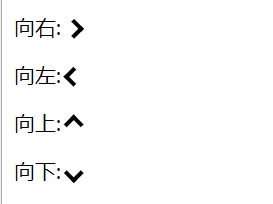
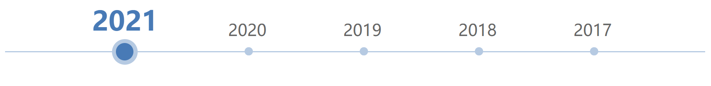

# Note 4

## 父组件监听子组件生命周期


1. hook监听
    - 在父组件 `Parent.vue` 中

    ```html
    <Child @hook:mounted="onMounted" />
    ```

    ```js
    onMounted () {
      console.log('父组件监听到子组件触发mounted！！！')
    }
    ```

    - 在子组件 `Child.vue` 中

    ```js
      mounted () {
        console.log('子组件Child触发mounted！！！')
      }
    ```

2. $emit触发：
    - 在父组件 `Parent.vue` 中

    ```html
    <Child @childMounted="onMounted" />
    ```

    ```js
    onMounted () {
      console.log('父组件监听到子组件触发mounted！！！')
    }
    ```

    - 在子组件 `Child.vue` 中

    ```js
    mounted () {
      console.log('子组件Child触发mounted！！！')
      this.$emit('childMounted')
    }
    ```

## DOM事件对象

```html
<div>
  <p>
    <span></span>
  </p>
</div>
```

事件名 | 说明
-- | --
`onmouseenter` | `onmouseenter` 事件在鼠标指针移动到元素上时触发。<br>只有当鼠标指针进入 div 元素时触发，内部移动不会再次触发。<br>**提示：该事件通常与 `onmouseleave` 事件一同使用, 在鼠标指针移出元素上时触发。**
`onmouseleave` | `onmouseleave` 事件在鼠标移出元素时触发。<br>**提示：该事件通常与 `onmouseenter` 事件一起使用， 该事件在鼠标移动到元素上时触发。**
`onmouseover` | `onmouseover` 事件会在鼠标指针移动到指定的元素上时发生。<br>当鼠标指针进入 div 元素时会触发，当指针进入子元素上时也会触发(p 和 span)。
`onmouseout` | `onmouseout` 事件会在鼠标指针移出指定的对象时发生。父元素进入子元素，或者子元素进入父元素都会触发。

::: tip 提示
`onmouseenter` 事件类似于 `onmouseover` 事件。 唯一的区别是 `onmouseenter` 事件不支持冒泡 。
提示: `onmouseleave` 事件类似于 `onmouseout` 事件。 唯一的区别是 `onmouseleave` 事件不支持冒泡 。
:::

鼠标事件 | 描述
-- | --
onclick | 当用户点击某个对象时调用的事件句柄
oncontextmenu | 在用户点击鼠标右键打开上下文菜单时触发
ondblclick | 当用户双击某个对象时调用的事件句柄
onmousedown | 鼠标按钮被按下
onmouseenter | 当鼠标指针移动到元素上时触发
onmouseleave | 当鼠标指针移出元素时触发
onmousemove | 鼠标被移动
onmouseover | 鼠标移到某元素之上
onmouseout | 鼠标从某元素移开
onmouseup | 鼠标按键被松开

## 水平垂直居中

```html
<div class="parent">
  <div class="child"></div>
<div>
```

- 弹性布局 `display: flex; justify-content: center; align-items: center;`

```less
.parent {
  display: flex;
  justify-content: center;
  align-items: center;
  width: 300px;
  height: 300px;
  background: lightgray;
  .child {
    width: 30px;
    height: 30px;
    background: forestgreen;
  }
}
```

- 绝对定位 `position: absolute; inset: 0; margin: auto;`

```less
.parent {
  position: relative;
  width: 300px;
  height: 300px;
  background: lightgray;
  .child {
    position: absolute;
    right: 0;
    left: 0;
    top: 0;
    bottom: 0;
    margin: auto;
    width: 30px;
    height: 30px;
    background: forestgreen;
  }
}
```

- 绝对定位 `position: absolute; transform: translate(-50%, -50%);`

```less
.parent {
  position: relative;
  width: 300px;
  height: 300px;
  background: lightgray;
  .child {
    position: absolute;
    left: 50%;
    top: 50%;
    transform: translate(-50%, -50%);
    width: 30px;
    height: 30px;
    background: forestgreen;
  }
}
```

## 简单倒计时 countDown

```html
<h1 ref="countdown">{{ countDown('2023-10-01 18:25:00') }}</h1>
```

```js
countDown (target) {
  let timestamp = new Date(target).getTime() - Date.now()
  var elapseTime = function (timestamp) {
    var h = parseInt(timestamp / 1000 / 60 / 60)
    var m = parseInt((timestamp / 1000 - h * 60 * 60) / 60)
    var s = parseInt(timestamp / 1000 - h * 60 * 60 - m * 60)
    return `还剩余${h}小时${m}分钟${s}秒`
  }
  setInterval(() => {
    timestamp = timestamp - 1000
    if (timestamp <= 0) {
      this.$refs.countdown.innerHTML = '下班了'
    } else {
      this.$refs.countdown.innerHTML = elapseTime(timestamp)
    }
  }, 1000)
}
```

## 消除 `` 标签底部的5px

```html
<div class="p-img">
  
</div>
```

- 给父元素设置 `font-size: 0;`（消除元素空隙）

```css
.p-img {
  font-size: 0;
}
.c-img {
  width: 100%;
}
```

- 将 `` 设置为 `display: block;`

```css
.c-img {
	width: 100%;
	display: block;
}
```

- 给父元素设置 `line-height: 5px;`

```css
.p-img {
  line-height: 5px;
}
```

- 将 `` 设置 `vertical-align: bottom;`

```css
.c-img {
  width: 100%;
  vertical-align: bottom;
}
```

## 视口单位

根据CSS3规范，视口单位主要包括以下4个：

- `vw`：`1vw` 等于视口宽度的 1%
- `vh`：`1vh` 等于视口高度的 1%
- `vmin`：选取 `vw` 和 `vh` 中最小的那个
- `vmax`：选取 `vw` 和 `vh` 中最大的那个

:::tip 提示
`vh` & `vw`：相对于视口的高度和宽度，而不是父元素的（CSS百分比是相对于包含它的最近的父元素的高度和宽度）。
:::

```html
<div class="parent">
  <div class="child"></div>
</div>
```

```css
.child {
  width: 100%;
  height: 100vh;
}
```

## 三角形

- 普通三角形

```html
<div class="triangle bottom"></div>
<div class="triangle top"></div>
<div class="triangle left"></div>
<div class="triangle right"></div>
```

```css
/* 基础样式 */
.triangle {
  display: inline-block;
  border: solid 30px transparent;
}
/* 朝下 */
.bottom {
  border-top-color: #0097a7;
}
/* 朝上 */
.top {
  border-bottom-color: #b2ebf2;
}
/* 朝左 */
.left {
  border-right-color: #00bcd4;
}
/* 朝右 */
.right {
  border-left-color: #009688;
}
```

- 等边三角形

```html
<div class="triangle"></div>
```

```css
.triangle {
  display: inline-block;
  height: 0;
  width: 0;
  border-bottom: calc(30px * sqrt(3)) solid #1677FF;
  border-left: 30px solid transparent;
  border-right: 30px solid transparent;
}
```

## 箭头



[在线预览](https://c.runoob.com/codedemo/3151/)

```html
<p>向右: <i class="right"></i></p>
<p>向左: <i class="left"></i></p>
<p>向上: <i class="up"></i></p>
<p>向下: <i class="down"></i></p>
```

```css
i {
  border: solid black;
  border-width: 0 3px 3px 0;
  display: inline-block;
  padding: 3px;
}
.right {
  transform: rotate(-45deg);
  -webkit-transform: rotate(-45deg);
}
.left {
  transform: rotate(135deg);
  -webkit-transform: rotate(135deg);
}
.up {
  transform: rotate(-135deg);
  -webkit-transform: rotate(-135deg);
}
.down {
  transform: rotate(45deg);
  -webkit-transform: rotate(45deg);
}
```

## 表格`<table>`标签设置`height`属性无效

```html
<!-- 添加 display: block / inline-block; -->
<table :style="`display: block; height: 600px; overflow: hidden;`" cellspacing="0"></table>
```

## `flex` 布局各种水平等分居中排列

[justify-content MDN](https://developer.mozilla.org/zh-CN/docs/Web/CSS/justify-content)

- 均匀排列每个元素，**每个元素周围分配相同的空间**

```css
display: flex;
justify-content: space-around;
```


- 均匀排列每个元素，**首个元素放置于起点，末尾元素放置于终点**

```css
display: flex;
justify-content: space-between;
```


- 均匀排列每个元素，**每个元素之间的间隔相等**

```css
display: flex;
justify-content: space-evenly;
```



## `Vue.use(plugin)`

- 参数：{Object | Function} plugin
- 用法：安装 Vue.js 插件。如果**插件是一个对象，必须提供 install 方法**。如果**插件是一个函数，它会被作为 install 方法**。install 方法调用时，会将 Vue 作为参数传入。

::: tip 提示
该方法需要在调用 new Vue() 之前被调用。
**当 install 方法被同一个插件多次调用，插件将只会被安装一次**。
:::
