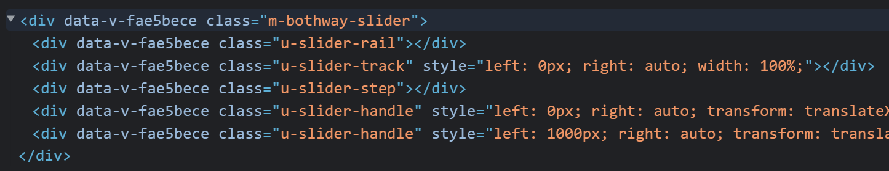
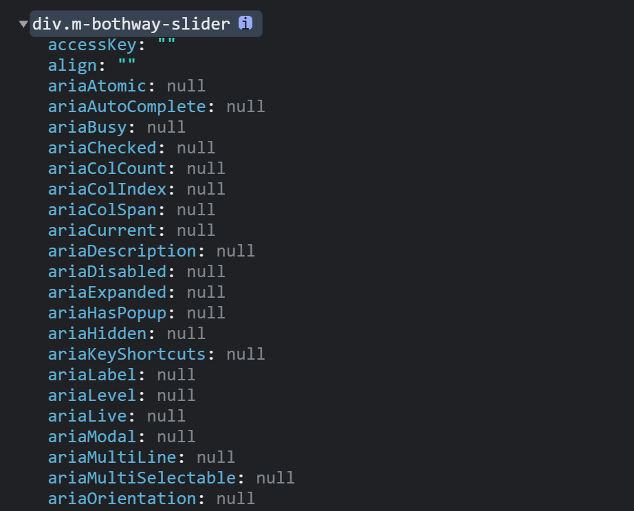

# Note 5

## `console` 对象

[console MDN](https://developer.mozilla.org/zh-CN/docs/Web/API/console)

- `console.log()`
  对象占位符：`%o` 或 `%O`
  - 当打印普通的 `object` 对象时没有区别
  - 当打印 `DOM` 对象时

    ```html
    <div ref="slider"></div>
    ```

    - `%o`

    ```js
    console.log('%o', this.$refs.slider)
    ```

    

    - `%O`

    ```js
    console.log('%O', this.$refs.slider)
    ```

    

## js中 `href` 属性中变量连接符需要使用 `&amp;`

```js
href = '/user/login?type=0&amp;tab=-1'
this.$router.push('/register?type=0&tab=-1')
```

## CSS网格排列布局

- [`display: grid;`](https://www.runoob.com/cssref/css-pr-grid.html)

```html
<div class="m-area">
  <div class="m-card" v-for="(data, index) in cardData" :key="index"></div>
</div>
```

```less
.m-area {
  width: 1200px;
  margin: 0 auto;
  display: grid;
  grid-template-columns: 360px 360px 360px; // 列宽度，3列各360px宽
  grid-template-rows: 400px; // 行高度
  grid-gap: 60px; // 行间距 列间距
  .m-card {
    width: 360px;
    height: 400px;
  }
}
```

- `display: inline-table;`

```less
.m-area {
  width: 1200px;
  margin: 0 auto;
  .m-card:not(:nth-child(3n)) { // 除去第3个及3的倍数的child，其余右边距均为60
    margin-right: 60px;
  }
  .m-card {
    display: inline-table;
    width: 360px;
    height: 400px;
  }
}
```

## `<input type="password" />` 密码显示和隐藏

```html
<input :type="visible ? 'text' : 'password'" />
```

## `display` & `float`

样式 | 说明
-- | --
`display: inline;` | <ol><li>使元素变成行内元素，拥有行内元素的特性，即**可以与其他行内元素共享一行，不会独占一行**.</li><li>不能更改元素的 `height`，`width` 的值，大小由内容撑开. </li><li>可以使用 `padding`，`margin` 的 `left` 和 `right` 产生边距效果，但是 `top` 和 `bottom` 就不行.</li></ol>
`display: block;` | <ol><li>使元素变成块级元素，**独占一行**，在不设置自己的宽度的情况下，块级元素会默认填满父级元素的宽度.</li><li>能够改变元素的 `height`，`width` 的值.</li><li>可以设置 `padding`，`margin` 的各个属性值，`top`，`left`，`bottom`，`right` 都能够产生边距效果.</li></ol>
`display: inline-block;` | <ol><li>结合了 `inline` 与 `block` 的一些特点，结合了上述 `inline` 的第1个特点和 `block` 的第2，3个特点.</li><li>用通俗的话讲，就是**不独占一行的块级元素**。</li></ol>
`display: inline-block;` 和 `float` | <ol><li>不同之处：**设置 `display：inline-block;` 的元素不会脱离文本流**，而 **`float` 会使得元素脱离文本流，且还有父元素高度坍塌的效果**</li><li>相同之处：能在某程度上达到一样的效果</li></ol>
