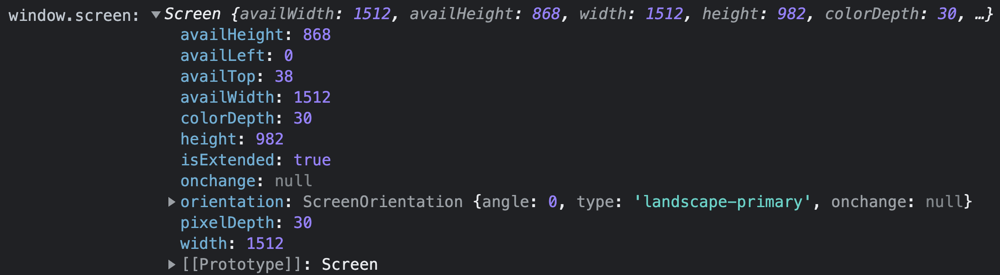

# Note 9

## 禁用鼠标点击事件

- js阻止鼠标点击事件

  在事件处理函数中返回 false \<不仅阻止了事件往上冒泡，而且阻止了事件本身（默认事件）>

  ```html
  <div @click="disabled ? () => false : onClick()"></div>
  <!-- 或者 -->
  <div @click="disabled ? e => e.preventDefault() : onClick()"></div>
  ```

- css阻止鼠标点击事件
  - `pointer-events: auto;`（默认）

    设置元素是否对鼠标事件做出反应

    - `auto`：默认值，设置该属性链接可以正常点击访问
    - `none`：元素不能对鼠标事件做出反应

    ```less
    .disabled {
      user-select: none; // 禁止选中文本
      pointer-events: none; // 设置元素是否对鼠标事件做出反应，设置该属性后，标签的title属性将不生效
      // auto（默认值）：设置该属性链接可以正常点击访问。
      // none：元素不能对鼠标事件做出反应，但背后元素可以正常响应点击事件
      cursor: not-allowed; // 定义鼠标指针放在一个元素边界范围内时所用的光标形状，鼠标禁用样式
    }
    ```

## 如何让div具有 `focus` 和 `blur` 事件

[tabindex](https://developer.mozilla.org/zh-CN/docs/Web/HTML/Global_attributes/tabindex)

`tabindex` 全局属性 指示其元素是否可以聚焦，以及它是否/在何处参与顺序键盘导航（通常使用Tab键，因此得名）。
div设置样式时，可正常使用 `:hover` 设置悬浮样式，但无法使用 `:focus` 设置聚焦样式
`<div>` 本身没有 `@blur` 和 `@focus` 事件，可以通过添加 `tabindex` 属性：

```html
<div tabindex="-1"></div>
```

::: tip
可以使用在任何元素上，不管元素默认是否支持聚焦
:::

`tabindex` 接受一个整数作为值，具有不同的结果，具体取决于整数的值：

- **tabindex = 负值（通常是tabindex = "-1"）**

  表示元素是可聚焦的，但是不能通过键盘导航来访问到该元素，用 JS （例如：@focus）做页面小组件内部键盘导航的时候非常有用。
- **tabindex="0"**

  表示元素是可聚焦的，并且可以通过键盘导航来聚焦到该元素，它的相对顺序是当前处于的 DOM 结构来决定的。（访问的顺序是按照元素在文档中的顺序来focus，即使采用浮动改变了页面中显示的顺序，依然是按照html文档中的顺序来定位。）
- **tabindex = 正值**

  - 表示元素是可聚焦的，并且可以通过键盘导航来访问到该元素；它的相对顺序按照 `tabindex` 的数值递增而滞后获焦。如果多个元素拥有相同的 `tabindex`，它们的相对顺序按照他们在当前 DOM 中的先后顺序决定。
  - 优先级大于 `tabindex=0`，在 `tabindex>=1` 时，数字越小，优先级越低。

`tabindex` 的聚焦顺序：

- 在可聚焦元素中，正整数数值越大，顺序越往后，正整数数值的节点顺序比0值的节点靠前。
- 在可聚焦元素中，相同 `tabindex` 数值的节点，根据 DOM节点的先后顺序决定聚焦顺序。

::: tip
如果我们在 `<div>` 上设置了 `tabindex` 属性，它的子元素内容不能使用箭头键来滚动，
除非我们在内容上也设置 `tabindex`。[查看这篇 fiddle 来理解 tabindex 的滚动影响](https://jsfiddle.net/jainakshay/0b2q4Lgv/)
:::

> 元素 element 分为 `focusable` 和 `非focusable`，使用 `tabindex` 可以改变元素相关的行为

在HTML中有6个元素默认支持聚焦：

1. 带 `href` 属性的 `<a>` 标签
2. 带 `href` 属性的 `<link>` 标签
3. `<button></button>` 标签
4. `<input />` 标签 (排除带有 `type="hidden"` 属性的)
5. `<select></select>` 标签
6. `<textarea></textarea>` 标签

以上的元素默认都可以使用 Tab 键，以及 JS focus() 方法聚焦
例如：

```js
document.querySelector('a').focus()
```

如何设置div元素的focus样式？ 使用 CSS伪类 [`:focus-within`](https://developer.mozilla.org/zh-CN/docs/Web/CSS/:focus-within)

`:focus-within` 是一个CSS 伪类 ，表示一个元素获得焦点 或 该元素的后代元素获得焦点。换句话说，元素自身或者它的某个后代匹配 :focus 伪类。

```css
/* 当 <div> 的某个后代获得焦点时，匹配 <div> */
div:focus-within {
  background: cyan;
}
```

## 浏览器窗口宽高和元素坐标，尺寸

- `el.getBoundingClientRect()`获取DOM元素的大小及其各边缘相对于浏览器可视窗口的位置（不包括滚动条）：
  
  ```js
  var docEl = document.documentElement // window.document.documentElement
  ```
  
  ```html
  <div id="animate" ref="animate"></div>
  ```

  ```js
  const el = document.getElementById('animate') // 获取DOM元素
  // 或者 const el = this.$refs.animate
  // 元素上边缘距浏览器窗口上边界的距离，可正，可负，可为0
  console.log('distance:', el.getBoundingClientRect().top) 
  // 元素下边缘距浏览器窗口上边界的距离，可正，可负，可为0
  console.log('distance:', el.getBoundingClientRect().bottom) 
  // 元素左边缘距浏览器窗口左边界的距离，可正，可负，可为0
  console.log('distance:', el.getBoundingClientRect().left) 
  // 元素右边缘距浏览器窗口左边界的距离，可正，可负，可为0
  console.log('distance:', el.getBoundingClientRect().right) 
  // 元素的宽度（包括内边距padding和边框border）
  console.log('distance:', el.getBoundingClientRect().width) 
  // 元素的高度（包括内边距padding和边框border）
  console.log('distance:', el.getBoundingClientRect().height)
  ```
  
- `clientWidth` 返回元素的像素宽度（**仅包含内边距padding，不包含边框border、外边距margin和滚动条**）：

  ```js
  document.body.clientWidth
  ```

- `clientHeight` 返回元素的像素高度（**仅包含内边距padding，不包含边框border、外边距margin和滚动条**）：
  
  ```js
  document.body.clientHeight
  ```
  
- `scrollWidth` 返回元素的像素宽度（**包含内边距padding，不包含边框border、外边距margin**）：
  
  ```js
  element.scrollWidth // 包括由于溢出滚动，而无法展示在可视窗口的不可见部分
  ```

- `scrollHeight` 返回元素的像素高度（**仅包含内边距padding，不包含边框border、外边距margin**）：
  
  ```js
  element.scrollHeight // 包括由于溢出滚动，而无法展示在可视窗口的不可见部分
  ```

- `scrollLeft` 可读取或设置元素滚动条到元素左边的距离
  
  ```js
  element.scrollLeft // 表示该元素内容水平滚动的像素数
  ```

- `scrollTop` 可读取或设置元素的内容垂直滚动的像素数
  
  ```js
  element.scrollTop // 表示该元素内容垂直滚动的像素数
  ```

  ```html
  <div id="app" ref="app" class="m-card" @scroll="onScroll">
    <div class="u-content"></div>
  </div>
  ```

  ```js
  onScroll () {
    const app = this.$refs.app
    console.log('app.scrollLeft:', app.scrollLeft) // 水平方向滚动像素数
    console.log('app.scrollTop:', app.scrollTop) // 垂直方向滚动像素数
  }
  ```

  ```css
  .m-card { width: 60px; height: 60px; overflow: auto; }
  .u-content { width: 300px; height: 300px; }
  ```

- `offsetWidth` 返回元素的像素宽度（**包含内边距padding和边框border，不包含外边距margin**）
  
  ```js
  document.body.offsetWidth
  // 如果元素被隐藏（例如：元素或者元素的祖先之一的元素的 style.display 被设置为 none），则返回 0。
  ```
  
- `offsetHeight` 返回元素的像素高度（**包含内边距padding和边框border，不包含外边距margin**）

  ```js
  document.body.offsetHeight
  // 如果元素被隐藏（例如：元素或者元素的祖先之一的元素的 style.display 被设置为 none），则返回 0。
  ```

- `offsetLeft` 返回当前元素相对于 `offsetParent` 节点左边界的偏移像素值：
  1. 包含元素向左偏移的像素值，元素的外边距 `margin`
  2. 包含 `offsetParent` 元素的左侧内边距 `padding`、边框 `border` 及滚动条
  3. `el.offsetParent` // 获取el被定位（设置position属性）的最近祖先元素
  4. 若祖先元素中没有设置定位的元素，则祖先元素为`<body>`
- `offsetTop` 返回当前元素相对于 `offsetParent` 节点顶部边界的偏移像素值：
  1. 包含元素顶部偏移的像素值，元素的外边距 `margin`
  2. 包含 `offsetParent` 元素的顶部内边距 `padding`、边框 `border` 及滚动条
  3. `el.offsetParent` // 获取el最近的祖先元素
- `clientX` 事件属性返回当事件被触发时鼠标指针相对于浏览器页面（即当前可视窗口）的水平坐标 **（相对于浏览器可视窗口）不计算水平滚动距离**
- `clientY` 事件属性返回当事件被触发时鼠标指针向对于浏览器页面（即当前可视窗口）的垂直坐标 **（相对于浏览器可视窗口）不计算垂直滚动距离**
- `pageX` 事件属性返回当事件被触发时鼠标指针相对于页面内容的水平坐标（包括滚动条）

  ```js
  // 浏览器横向滚动距离：
  const scrollLeft = window.pageXOffset || window.scrollX ||document.documentElement.scrollLeft ||  document.body.scrollLeft
  
  e.pageX = e.clientX + window.pageXOffset //（浏览器横向滚动距离）
  ```

  ::: tip
  所有主流浏览器都支持 `pageXOffset` 和 `pageYOffset`；IE8及更早IE版本不支持该属性，但可以使用: `document.documentElement.scrollLeft` 和 `document.documentElement.scrollTop`
  :::
  
- `pageY` 事件属性返回当事件被触发时鼠标指针相对于页面内容的垂直坐标

  ```js
  // 浏览器垂直滚动距离：
  const scrollTop = window.pageYOffset || window.scrollY || document.documentElement.scrollTop || document.body.scrollTop
  
  e.pageY = e.clientY+ window.pageYOffset //（浏览器垂直滚动距离）
  ```

  ::: tip
  所有主流浏览器都支持 `pageXOffset` 和 `pageYOffset`；IE8及更早IE版本不支持该属性，但可以使用 `document.documentElement.scrollLeft` 和`document.documentElement.scrollTop`
  :::

- `screenX` 事件属性返回事件发生时鼠标指针相对于屏幕的水平坐标 **相对于电脑屏幕**
- `screenY` 事件属性返回事件发生时鼠标指针相对于屏幕的垂直坐标 **相对于电脑屏幕**
- `screen` 对象包含有关客户端显示屏幕的信息
  1. `screen.availHeight`：返回屏幕可用的高度（**不包括窗口任务栏**）
  2. `screen.availWidth`：返回屏幕可用的宽度（**不包括窗口任务栏**）
  3. `screen.colorDepth`：返回目标设备或缓冲器上的调色板的比特深度
  4. `screen.pixelDepth`：返回屏幕的颜色分辨率（**每像素的位数**）
  5. `screen.height`：返回屏幕的总高度
  6. `screen.width`：返回屏幕的总宽度

  ```js
  window.screen === screen // true
  ```

  

## vue监听动画开始和动画结束事件

```html
<span class="u-dot" @animationstart="startCallback" @animationend="endCallback"></span>
```

```js
startCallback () {
  console.log('动画开始')
},
endCallback () {
  console.log('动画结束')
}
```

```less
.u-dot-item {
  width: 10px;
  height: 10px;
  animation: spinMove 2s ease-in-out;
  -webkit-animation: spinMove 2s ease-in-out;
}
@keyframes spinMove {
  to {
    transform: rotate(360deg);
  } // from: 0%  to: 100%
}
```

## 向DOM树中添加元素（标签）

- [`Node.appendChild`](https://developer.mozilla.org/zh-CN/docs/Web/API/Node/appendChild)

  `Node.appendChild()` 方法将一个节点附加到指定父节点的子节点列表的末尾处。如果将被插入的节点已经存在于当前文档的文档树中，那么 `appendChild()` 只会将它从原先的位置移动到新的位置（不需要事先移除要移动的节点）。

  这意味着，一个节点不可能同时出现在文档的不同位置。所以，如果某个节点已经拥有父节点，在被传递给此方法后，它首先会被移除，再被插入到新的位置。若要保留已在文档中的节点，可以先使用 [`Node.cloneNode()`](https://developer.mozilla.org/zh-CN/docs/Web/API/Node/cloneNode) 方法来为它创建一个副本，再将副本附加到目标父节点下。请注意，用 `cloneNode` 制作的副本不会自动保持同步。
  如果给定的子节点是 `DocumentFragment`，那么 `DocumentFragment` 的全部内容将转移到指定父节点的子节点列表中。

  - 语法：`element.appendChild(aChild)` // achild：要追加给父节点（通常为一个元素）的节点。
  - 返回值：返回追加后的子节点（`aChild`），除非 `aChild` 是一个文档片段（DocumentFragment），这种情况下将返回空文档片段（`DocumentFragment`）。
  
  示例：

  ```js
  // 创建一个新的段落元素 <p>，然后添加到 <body> 的最尾部
  var p = document.createElement('p')
  document.body.appendChild(p)
  ```

- [`element.innerHTML`](https://developer.mozilla.org/zh-CN/docs/Web/API/Element/innerHTML)（**常用于替换内容**）

  `Element.innerHTML` 属性设置或获取 `HTML` 语法表示的元素的后代

  ::: tip
  备注： 如果一个 `<div>`, `<span>`, 或 `<noembed>` 节点有一个文本子节点，该节点包含字符 (&), (\<), 或 (>), innerHTML 将这些字符分别返回为 &amp;, &lt; 和 &gt;。使用Node.textContent 可获取一个这些文本节点内容的正确副本。
  :::

- [`element.insertAdjacentHTML`](https://developer.mozilla.org/zh-CN/docs/Web/API/Element/insertAdjacentHTML)

  `insertAdjacentHTML()` 方法将指定的文本解析为 `Element` 元素，并将结果节点插入到 `DOM` 树中的指定位置。它不会重新解析它正在使用的元素，因此它不会破坏元素内的现有元素。这避免了额外的序列化步骤，使其比直接使用 `innerHTML` 操作更快。

  - 语法：`element.insertAdjacentHTML(position, text);`
  - `position`

    一个 DOMString，表示插入内容相对于元素的位置，并且必须是以下字符串之一：
    - `beforebegin`：元素自身的前面。
    - `afterbegin`：插入元素内部的第一个子节点之前。
    - `beforeend`：插入元素内部的最后一个子节点之后。
    - `afterend`：元素自身的后面。
  - `text`
  
    是要被解析为 HTML 或 XML 元素，并插入到 DOM 树中的 DOMString。

  ### 位置名称的可视化：

  ```html
  <!-- beforebegin -->
  <p>
    <!-- afterbegin -->
    foo
    <!-- beforeend -->
  </p>
  <!-- afterend -->
  ```

  示例：

  ```js
  // 原为 <div id="one">one</div>
  var d1 = document.getElementById('one');
  d1.insertAdjacentHTML('afterend', '<div id="two">two</div>')
  // 此时，新结构变成：
  // <div id="one">one</div><div id="two">two</div>
  ```

  ::: warning
  安全问题
  使用 `insertAdjacentHTML` 插入用户输入的 `HTML` 内容的时候，需要转义之后才能使用。
  如果只是为了插入文本内容（而不是 `HTML` 节点），不建议使用这个方法，建议使用 `node.textContent` 或者 `node.insertAdjacentText()`。因为这样不需要经过 `HTML` 解释器的转换，性能会好一点。
  :::

- [`Element.insertAdjacentText()`](https://developer.mozilla.org/zh-CN/docs/Web/API/Element/insertAdjacentText)

  `insertAdjacentText()` 方法将一个给定的文本节点插入在相对于被调用的元素给定的位置。
  句法：element.insertAdjacentText(position, element);

- [`Element.insertAdjacentElement()`](https://developer.mozilla.org/zh-CN/docs/Web/API/Element/insertAdjacentElement)

  `insertAdjacentElement()` 方法将一个给定的元素节点插入到相对于被调用的元素的给定的一个位置。
  语法：`element.insertAdjacentElement(position, element);`
  参数：
  - `position`

    DOMString 表示相对于该元素的位置；必须是以下字符串之一：
    - `beforebegin`: 在该元素本身的前面。
    - `afterbegin`:只在该元素当中，在该元素第一个子孩子前面。
    - `beforeend`:只在该元素当中，在该元素最后一个子孩子后面。
    - `afterend`: 在该元素本身的后面。

  - `element`
  要插入到树中的元素。
  - 返回值：插入的元素，插入失败则返回 null.
  
  位置名称的可视化展示：

  ```html
  <!-- beforebegin -->
  <p>
  <!-- afterbegin -->
  foo
  <!-- beforeend -->
  </p>
  <!-- afterend -->
  ```

  示例：

  ```js
  beforeBtn.addEventListener('click', function () {
    var tempDiv = document.createElement('div')
    tempDiv.style.backgroundColor = randomColor()
    activeElem.insertAdjacentElement('beforebegin', tempDiv)
    setListener(tempDiv)
  })
  afterBtn.addEventListener('click', function () {
    var tempDiv = document.createElement('div')
    tempDiv.style.backgroundColor = randomColor()
    activeElem.insertAdjacentElement('afterend', tempDiv)
    setListener(tempDiv)
  })
  ```
