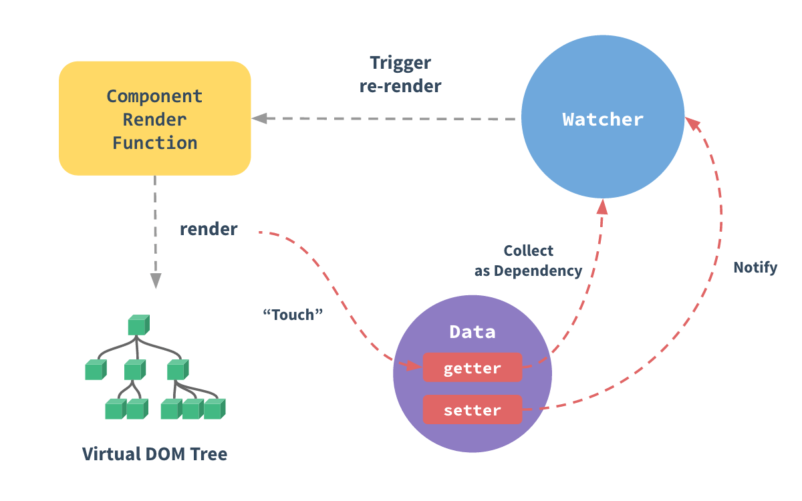

# Note 4

<BackTop />

## `Vue`登录后，无操作半小时后自动清除登录状态

> 在项目的页面入口文件 `App.vue` 文件中监听用户最后一次操作鼠标、键盘或滚动事件

```js
import storage from 'store'
computed: {
  token () {
    return storage.get('TOKEN')
  },
  uid () {
    return storage.get('UID')
  },
  userInfo () {
    return storage.get('USER_INFO')
  }
},
mounted () { // 使用防抖debounce，对于短时间内连续触发的事件（上面的滚动事件），防抖就是让某个时间期限（如上面的1000毫秒）内，事件处理函数只执行一次
  document.onmousemove = this.debounce(this.resetStatus, 3000)
  document.onkeydown = this.debounce(this.resetStatus, 3000)
  document.onscroll = this.debounce(this.resetStatus, 3000)
},
methods: {
  debounce (fn, delay) {
    let timer = null
    return function () {
      if (timer) {
        clearTimeout(timer)
      }
      timer = setTimeout(fn, delay)
    }
  },
  resetStatus () {
    if (this.token) {
      storage.set('TOKEN', this.token, new Date().getTime() + 30 * 60 * 1000)
      storage.set('UID', this.uid, new Date().getTime() + 30 * 60 * 1000)
      storage.set('USER_INFO', this.userInfo, new Date().getTime() + 30 * 60 * 1000)
    }
  }
}
```

## Vue创建全局函数或变量

1. 在 `index.js` 中创建 `getAction` 函数，并全局使用

```js
export function getAction (url, parameter) {
  return request({
    url: url,
    method: 'get',
    params: parameter
  })
}
```

2. 创建 `globalUse.js`：

```js
import { getAction } from './index'

// 方式一挂载到Vue.prototype：
import Vue from 'vue'
Vue.getAction = getAction // 使用时需先引入Vue，然后调用：Vue.getAction
Vue.prototype.$getAction = getAction // 使用：this.$getAction

// 方式二使用全局混入Vue.mixin：
Vue.mixin({ data () { return { getAction } } }) // 全局混入到data中，使用：this.getAction
// Vue.mixin({ methods: { getAction } }) // 全局混入到methods中，使用：this.getAction
```

3. 在 `main.js` 中引入：

```js
import Vue from 'vue'
import App from './App.vue'
import './utils/globalUse'
new Vue({
  render: h => h(App)
}).$mount('#app')
```

## Vue表单页监听浏览器回退

> 拦截并提示用户，点击确定执行返回，点击取消阻止返回

```js
// 这个离开守卫通常用来禁止用户在还未保存修改前突然离开。该导航可以通过 next(false) 来取消。
beforeRouteLeave (to, from, next) {
  const answer = window.confirm('Do you really want to leave? you have unsaved changes!')
  if (answer) {
    next()
  } else {
    next(false)
  }
}
```

## `$router` 新页面打开路由

```js
onDetail (id) {
  const routeUrl = this.$router.resolve({
    path: '/show/detail',
    query: { id }
  })
  window.open(routeUrl.href, '_blank')
}
```

## [npm link](https://npm.nodejs.cn/cli/v10/commands/npm-link)

- 没有参数的包文件夹中的 `npm link` 将在全局文件夹 `{prefix}/lib/node_modules/<package>` 中创建一个符号链接，该符号链接链接到执行 `npm link` 命令的包。它还将封装中的任何垃圾箱链接到 `{prefix}/bin/{name}`。 请注意，`npm link` 使用全局前缀（参见 `npm prefix -g` 的值）

- 在某个其他位置，`npm link package-name` 将创建一个从全局安装的 `package-name` 到当前文件夹的 `node_modules/` 的符号链接。

::: tip
注意，`package-name` 取自 `package.json`，而不是目录名称。

包名称可以选择以范围为前缀。 见 scope。 范围必须以 `@` 符号开头，后跟斜杠
:::

### 例如：

```bash
cd ~/projects/node-redis    # go into the package directory
npm link                    # creates global link
cd ~/projects/node-bloggy   # go into some other package directory.
npm link redis              # link-install the package
```

现在，对 `~/projects/node-redis` 的任何更改都将反映在 `~/projects/node-bloggy/node_modules/node-redis/` 中。 请注意，**链接应该指向包名称，而不是该包的目录名称**。

你也可以将这两个步骤合二为一。 例如，以更短的方式执行上述用例：

```bash
cd ~/projects/node-bloggy  # go into the dir of your main project
npm link ../node-redis     # link the dir of your dependency
```

第二行相当于做：

```bash
(cd ../node-redis; npm link)
npm link redis
```

即它首先创建一个全局链接，然后将全局安装目标链接到你项目的 `node_modules` 文件夹中。

请注意，**在这种情况下，你指的是目录名称 node-redis，而不是包名称 redis**。

如果你的链接包有范围（参见 scope），你的链接命令必须包含该范围，例如

```bash
npm link @myorg/privatepackage
```

## [npm uninstall](https://npm.nodejs.cn/cli/v10/commands/npm-uninstall)

```bash
npm uninstall [<@scope>/]<pkg>...

aliases: unlink, remove, rm, r, un
```

这将卸载一个包，完全删除代表它安装的所有 npm。

它还会从 `package.json` 中的 `dependencies`、`devDependencies`、`optionalDependencies` 和 `peerDependencies` 对象中删除包。

此外，如果你有 `npm-shrinkwrap.json` 或 `package-lock.json`，`npm` 也会更新这些文件。

`--no-save` 会告诉 `npm` 不要从你的 `package.json`、`npm-shrinkwrap.json` 或 `package-lock.json` 文件中删除包。

`--save` 或 `-S` 将告诉 `npm` 从你的 `package.json`、`npm-shrinkwrap.json` 和 `package-lock.json` 文件中删除该包。 这是默认设置，但如果你的 `npmrc` 文件中有例如 `save=false`，你可能需要使用它

在全局模式下（即，将 `-g` 或 `--global` 附加到命令中），它将当前包上下文作为全局包卸载。 在这种情况下，`--no-save` 被忽略。

范围是可选的，并遵循 `scope` 的通常规则。

## 监听键盘事件，绑定Enter按键

- 输入框监听键盘事件(`Enter`)

```vue
<a-input v-model="text" @keydown.enter="onClick" placeholder="请输入"/>
```

- 在当前页面监听键盘事件(`Enter`)

  - `onkeydown`：会在用户按下一个键盘按键时发生
  - `onkeypress`：会在键盘按键被按下并释放时发生。
  - `onkeyup`：会在键盘按键被松开时发生。
  事件发生次序为：
    1. onkeydown
    2. onkeypress
    3. onkeyup

    在所有浏览器中 `onkeypress` 事件不是适用于所有按键(如： ALT, CTRL, SHIFT, ESC)。
    监听一个用户是否按下按键请使用 `onkeydown` 事件,所有浏览器都支持 `onkeydown` 事件。

    ```js
    // 当前页面监听键盘确认键
    // 等价于window.onkeydown = function (e) { … }
    window.addEventListener('keydown', (e) => {
      if (e.key === 'Enter') {
        // doing something
      }
    })
    ```

## Vue2响应式原理

当你把一个普通的 `JavaScript` 对象传入 `Vue` 实例作为 `data` 选项，`Vue` 将遍历此对象所有的 `property`，并使用 `Object.defineProperty` 把这些 `property` 全部转为 `getter/setter`。`Object.defineProperty` 是 `ES5` 中一个无法 `shim` 的特性，这也就是 `Vue` 不支持 `IE8` 以及更低版本浏览器的原因。

这些 `getter/setter` 对用户来说是不可见的，但是在内部它们让 `Vue` 能够追踪依赖，在 `property` 被访问和修改时通知变更。

### Vue 中的 template 是如何渲染成页面的：

- `template`解析成抽象语法树`Abstract Syntax Tree`；
- `AST`编译成`render`函数；
- `render`函数构造成`Virtual Dom`；
- `Virtual Dom`转换成真实`Dom`。

每个组件实例都对应一个 `watcher` 实例，它会在组件渲染的过程中把“接触”过的数据 `property` 记录为依赖。之后当依赖项的 `setter` 触发时，会通知 `watcher`，从而使它关联的组件重新渲染。



### Vue 无法检测 property 的添加或移除

<br/>

由于 `Vue` 会在初始化实例时对 `property` 执行 `getter/setter` 转化，所以 `property` 必须在 `data` 对象上存在才能让 `Vue` 将它转换为响应式的。

对于已经创建的实例，`Vue` 不允许动态添加根级别的响应式 `property`。但是，可以使用 `Vue.set(object, propertyName, value)` 方法向嵌套对象添加响应式 `property`。

### Vue 不能检测以下数组的变动

- 当你利用索引直接设置一个数组项时，例如：`vm.items[indexOfItem] = newValue`
- 当你修改数组的长度时，例如：`vm.items.length = newLength`

### 声明响应式 property

<br/>

由于 `Vue` 不允许动态添加根级响应式 `property`，所以你**必须在初始化实例前声明所有根级响应式 property，哪怕只是一个空值**

### 异步更新队列（vue.$nextTick()）

<br/>

`Vue` 在更新 `DOM` 时是异步执行的。只要侦听到数据变化，`Vue` 将开启一个队列，并缓冲在同一事件循环中发生的所有数据变更。如果同一个 `watcher` 被多次触发，只会被推入到队列中一次。这种在缓冲时去除重复数据对于避免不必要的计算和 `DOM` 操作是非常重要的。然后，在下一个的事件循环`“tick”`中，`Vue` 刷新队列并执行实际 (已去重的) 工作。`Vue` 在内部对异步队列尝试使用原生的 `Promise.then`、`MutationObserver` 和 `setImmediate`，如果执行环境不支持，则会采用 `setTimeout(fn, 0)` 代替。

例如，当你设置 `vm.someData = 'new value'`，该组件不会立即重新渲染。当刷新队列时，组件会在下一个事件循环`“tick”`中更新。多数情况我们不需要关心这个过程，但是如果你想基于更新后的 `DOM` 状态来做点什么，这就可能会有些棘手。虽然 `Vue.js` 通常鼓励开发人员使用“数据驱动”的方式思考，避免直接接触 `DOM`，但是有时我们必须要这么做。为了在数据变化之后等待 `Vue` 完成更新 `DOM`，可以在数据变化之后立即使用 `Vue.nextTick(callback)`。这样回调函数将在 `DOM` 更新完成后被调用。

## 监听滚动事件

```vue
<script>
export default {
  name: 'Scroll',
  data () {
    return {
      // 可以在这里定义数据
    }
  },
  mounted () {
    window.addEventListener('scroll', this.handleScroll)
  },
  beforeDestroy () {
    window.removeEventListener('scroll', this.handleScroll)
  },
  methods: {
    handleScroll (event) {
      // 处理滚动事件
      console.log('The page has been scrolled')
      // 你可以在这里访问 event 对象，比如 event.target.scrollTop
    }
  }
}
</script>
```

## Vue2 使用事件总线

以下是一个 `Vue2` 事件总线（Event Bus）的完整示例，用于实现非父子组件间的通信：

### 1. 创建事件总线

```js
// event-bus.js
import Vue from 'vue'
export const EventBus = new Vue()
// 或者使用 Vue.prototype 作为全局事件总线
// Vue.prototype.$eventBus = new Vue()
```

### 2. 发送事件的组件

```vue
<!-- ComponentA.vue -->
<template>
  <div>
    <button @click="sendMessage">发送消息</button>
  </div>
</template>
<script>
import { EventBus } from './event-bus.js'
export default {
  methods: {
    sendMessage() {
      EventBus.$emit('message-event', {
        text: '来自ComponentA的消息',
        time: new Date()
      })
    }
  }
}
</script>
```

### 3. 接收事件的组件

```vue
<!-- ComponentB.vue -->
<template>
  <div>
    <p>收到消息: {{ receivedMessage }}</p>
  </div>
</template>
<script>
import { EventBus } from './event-bus.js'
export default {
  data() {
    return {
      receivedMessage: null
    }
  },
  created() {
    EventBus.$on('message-event', this.handleMessage)
  },
  beforeDestroy() {
    EventBus.$off('message-event', this.handleMessage)
  },
  methods: {
    handleMessage(payload) {
      this.receivedMessage = `${payload.text} @ ${payload.time.toLocaleTimeString()}`
    }
  }
}
</script>
```

### 4. 在父组件中使用

```vue
<!-- App.vue -->
<template>
  <div id="app">
    <component-a/>
    <component-b/>
  </div>
</template>
<script>
import ComponentA from './ComponentA.vue'
import ComponentB from './ComponentB.vue'
export default {
  components: {
    ComponentA,
    ComponentB
  }
}
</script>
```

### 关键点说明

1. **事件总线创建**：通过创建新的 `Vue` 实例作为中央事件总线
2. **发送（发布）事件**：使用 `$emit(eventName, payload)` 发送事件
3. **接收（订阅）事件**：使用 `$on(eventName, callback)` 监听事件
4. **移除（取消订阅）监听**：在组件销毁前使用 `$off()` 移除事件监听，避免内存泄漏

### 注意事项

- 事件名称建议使用常量，避免拼写错误
- 对于复杂应用，建议使用 `Vuex` 进行状态管理
- 组件销毁时务必移除事件监听
- 事件总线适合小型应用或简单场景，大型项目建议使用更正式的状态管理方案

### 其他用法

**一次性监听**

```js
EventBus.$once('one-time-event', () => {
  console.log('这个监听只会触发一次')
})
```

**移除所有监听**

```js
EventBus.$off() // 移除所有事件监听
```

**发送无参数事件**

```js
EventBus.$emit('notification')
```

这个模式实现了发布-订阅模式，使得任意组件之间都可以进行通信，但需要注意合理使用以避免代码变得难以维护。
